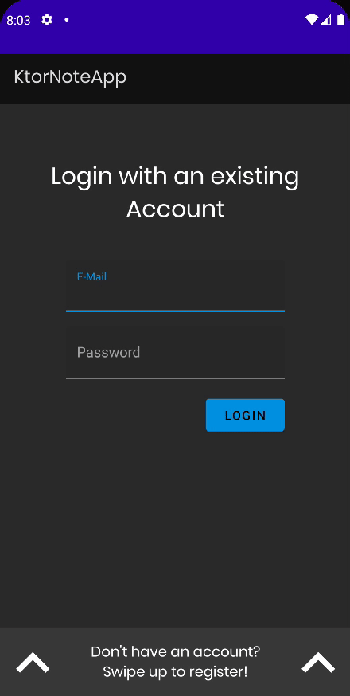

# Encrypting HTTP traffic

`Constants` 파일에서 `BASE_URL`을 `sslPort`로 변경해준다.

```kotlin
object Constants {
    // ...
    const val BASE_URL = "https://10.0.2.2:8081" // 에뮬레이터에서 실행하는 경우 10.0.2.2로 설정해 로컬 PC에 접근할 수 있도록 한다.
    // ...
}
```

Retrofit은 자체 생성된 인증서를 기본적으로 신뢰하지 않기 때문에 모든 인증서에 대해 신뢰하는 설정을 해주어야 한다.

### AppModule

모든 인증서를 신뢰하는 OkHttpInterceptor가 필요하므로 `AppModule`에 구현해준다.

```kotlin
@Module
@InstallIn(ApplicationComponent::class) // Dagger-Hilt 낮은 버전은 Singleton을 객체를 위해 ApplicationComponent::class 사용
object AppModule {
    // ...
    @Singleton
    @Provides
    fun provideOkHttpClient(): OkHttpClient.Builder {
        val trustAllCertificates: Array<TrustManager> = arrayOf(
            object : X509TrustManager {
                override fun checkClientTrusted(
                    chain: Array<out X509Certificate>?,
                    authType: String?
                ) {
                    /* NO-OP */
                }

                override fun checkServerTrusted(
                    chain: Array<out X509Certificate>?,
                    authType: String?
                ) {
                    /* NO-OP */
                }

                override fun getAcceptedIssuers(): Array<X509Certificate> {
                    return arrayOf() // Trust all certificates
                }
            }
        )
        val sslContext = SSLContext.getInstance("SSL")
        sslContext.init(null, trustAllCertificates, SecureRandom())
        return OkHttpClient.Builder()
            .sslSocketFactory(sslContext.socketFactory, trustAllCertificates[0] as X509TrustManager)
            .hostnameVerifier(HostnameVerifier { _, _ -> true })
    }

    @Singleton
    @Provides
    fun provideNoteApi(
        okHttpClient: OkHttpClient.Builder,
        basicAuthInterceptor: BasicAuthInterceptor
    ): NoteApi {
        val client = okHttpClient
            .addInterceptor(basicAuthInterceptor)
            .build()

        return Retrofit.Builder()
            .baseUrl(BASE_URL)
            .addConverterFactory(GsonConverterFactory.create())
            .client(client)
            .build()
            .create(NoteApi::class.java)
    }
    // ...
}
```

앱 실행 시 정상적으로 동작하는 것을 확인할 수 있다.

<div align="center">

</div>