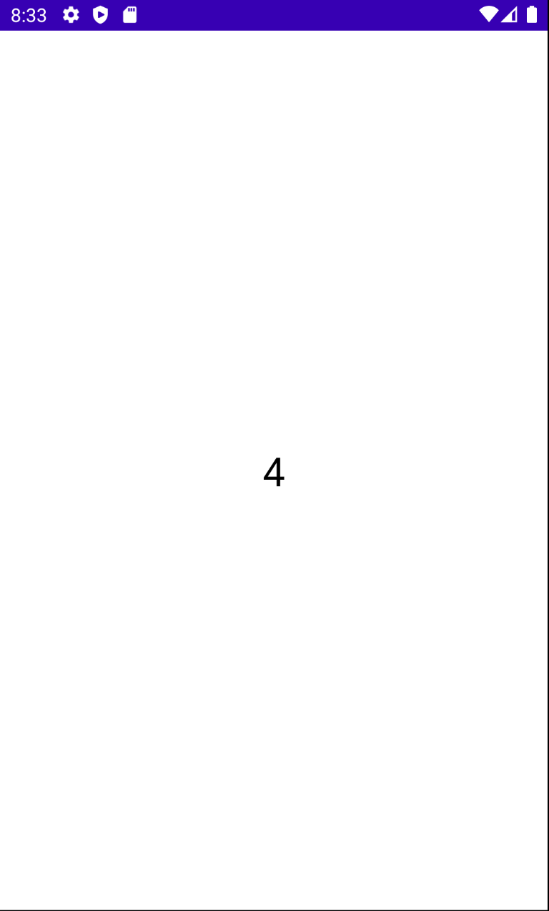
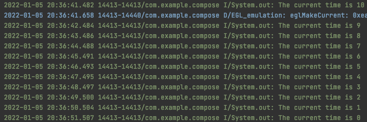
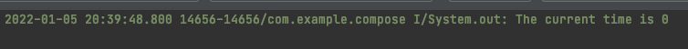

# Flow Basics

Flow는 기본적으로 변경에 대해 알리고 이 변경을 통해 어떤 동작을 수행할 것인지를 구현할 수 있다. 에를 들어 UI 레이어에 업데이트 하는 등. Assembly line과 비슷하다고 보면 된다. API 요청 후 응답을 받아 보여주기 위해 UI에 매핑하거나, 혹은 매핑하기 전 필터링을 수행하고 UI에 보여줄 수 있다.

Kotlin Coroutine은 일정 기간동안 여러개의 값을 방출한다. 만약 카운트다운하는 함수가 있는 경우 카운트다운 시간을 여러번 방출할 수 있다.

카운트다운하는 함수를 예시로 만들어 테스트해보자. 다음과 같이 1초마다 값을 방출하는 코드를 만든다.

```kotlin
class MainViewModel: ViewModel() {

    // flow 블록 안에서 여러 값을 방출할 수 있으며 suspend 함수를 호출할 수 있다.
    val countDownFlow = flow<Int> {
        val startingValue = 10
        var currentValue = startingValue
        emit(startingValue)
        while (currentValue > 0) {
            delay(1000L)
            currentValue--
            // 원하는 값을 방출한다.
            emit(currentValue)
        }
    }
}
```

`MainActivity`에서 `countDownFlow`를 수집하고 이를 UI에 보여주자.

```kotlin
class MainActivity : ComponentActivity() {
    override fun onCreate(savedInstanceState: Bundle?) {
        super.onCreate(savedInstanceState)
        setContent {
            val viewModel = viewModel<MainViewModel>()
            val time = viewModel.countDownFlow.collectAsState(initial = 10)
            Box(modifier = Modifier.fillMaxSize()) {
                Text(
                    text = time.value.toString(),
                    fontSize = 30.sp,
                    modifier = Modifier.align(Alignment.Center)
                )
            }
        }
    }

    companion object {
        const private val TAG = "MainActivity"
    }
}
```

그럼 다음과 같이 카운트다운되는 화면을 볼 수 있다.

<div align="center">

</div>

만약 방출되는 값들을 다르게 수집하고 싶다면, 다음과 같이 `viewModelScope`를 이용해 수집할 수 있다.

```kotlin
class MainViewModel: ViewModel() {

    // flow 블록 안에서 여러 값을 방출할 수 있으며 suspend 함수를 호출할 수 있다.
    val countDownFlow = flow<Int> {
        val startingValue = 10
        var currentValue = startingValue
        emit(startingValue)
        while (currentValue > 0) {
            delay(1000L)
            currentValue--
            // 원하는 값을 방출한다.
            emit(currentValue)
        }
    }

    init {
        collectFlow()
    }

    private fun collectFlow() {
        viewModelScope.launch {
            countDownFlow.collect { time ->
                println("The current time is ${time}")
            }
        }
    }
}
```

<div align="center">

</div>

자주 사용되는 `collectLatest`의 경우 마지막 방출된 값만 취하게 되므로 이전 값들은 모두 취소되어 0 결과를 받게 된다.

<div align="center">

</div>

UI 레이어에는 최신 내용만 보여주기 원할 수 있기 때문에 자주 사용된다.

```kotlin
private fun collectFlow() {
		viewModelScope.launch {
		    // collectLatest는 마지막 방출된 값만 수집한다.
        countDownFlow.collectLatest { time ->
		        // 1.5초 간격
            delay(1500L)
		        println("The current time is ${time}")
		    }
		}
}
```

위에 구현된 flow는 cold flow이다. 이는 수집하지 않으면 동작하지 않는다. 반면에 hot flow의 경우 수집되지 않아도 수집된다.

## References

* [Flow Basics - The Ultimate Guide to Kotlin Flows (Part 1)](https://www.youtube.com/watch?v=ZX8VsqNO_Ss&list=PLQkwcJG4YTCQHCppNAQmLsj_jW38rU9sC)