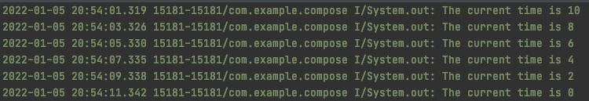
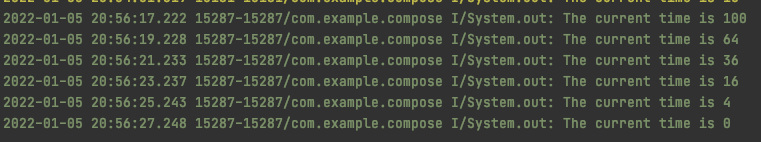
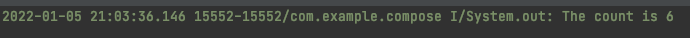
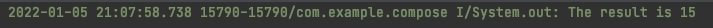
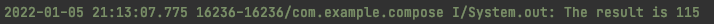
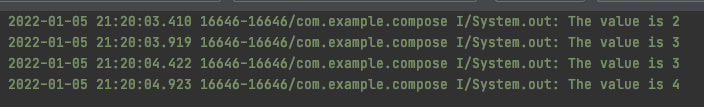
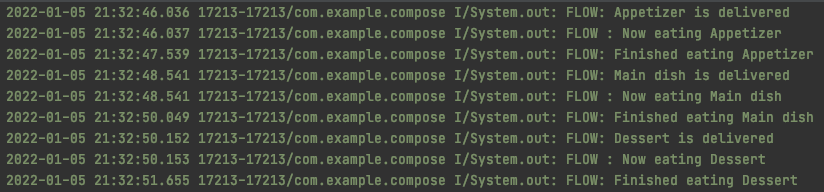
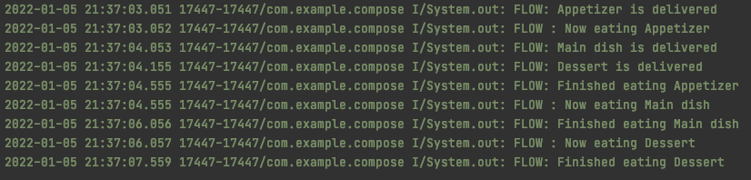
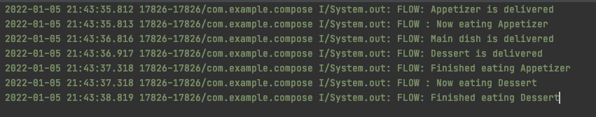
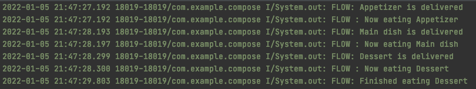

# Flow Operators

일반적으로 프로젝트에 많이 사용되는 연산자에 대해 알아보자.

`filter`는 boolean 값을 통해 값을 필터링한다.

```kotlin
private fun collectFlow() {
		viewModelScope.launch {
		    countDownFlow
		        .filter { time ->
		            time % 2 ==0
            }
            .collect { time ->
								println("The current time is ${time}")
				    }
		}
}
```

<div align="center">

</div>

`map`은 들어온 값에 대해 변경 가능하도록 해준다.

```kotlin
private fun collectFlow() {
		viewModelScope.launch {
		    countDownFlow
		        .filter { time ->
		            time % 2 ==0
            }
						.map { time ->
		            time * time
            }
            .collect { time ->
								println("The current time is ${time}")
				    }
		}
}
```

<div align="center">

</div>

`onEach`는 각 값에 대한 처리를 할 수 있게 해준다. `collect`와 다른 점은 `collect`는 수집 후 종료되는데 `onEach`의 경우 flow를 반환해 계속 처리할 수 있다.

```kotlin
private fun collectFlow() {
		viewModelScope.launch {
		    countDownFlow
		        .filter { time ->
		            time % 2 ==0
            }
						.map { time ->
		            time * time
            }
						.onEach { time ->
		            println(time)
            }
            .collect { time ->
								println("The current time is ${time}")
				    }
		}
}
```

아래의 두 개의 코드는 동일하다.

```kotlin
countDownFlow.onEach {
		println(it)
}.launchIn(viewModelScope)
```

```kotlin
viewModelScope.launch {
		countDownFlow.collect {
				
		}
}
```

Terminal 연산자로 `count`가 있는데 이는 조건을 통해 일치하는 개수를 넘겨준다.

```kotlin
private fun collectFlow() {
		viewModelScope.launch {
		    val count = countDownFlow
		        .filter { time ->
		            time % 2 == 0
            }
            .map { time ->
				        time * time
            }
            .onEach { time ->
		            println(time)
            }
            .count {
		            it % 2 == 0
		        }
            println("The count is $count")
		}
}
```

<div align="center">

</div>

`reduce`는 2개의 파라미터를 가지는데, `accumulator`는 지금까지의 처리 결과이고 `value`는 다음 값이다. 다음과 같이 두 값을 더해주면 (`startingValue = 5`로 설정) 모든 값을 더한 15를 얻을 수 있다.

```kotlin
private fun collectFlow() {
		viewModelScope.launch {
		    val reduceResult = countDownFlow
		        .reduce { accumulator, value ->
		            accumulator + value
            }
        println("The result is $reduceResult")
    }
}
```

<div align="center">

</div>

`reduce`와 유사한 `fold` 연산자가 있는데, `reduce`와의 차이점은 `fold` 연산자는 초기 값을 설정해준다는 것이다.

```kotlin
private fun collectFlow() {
		viewModelScope.launch {
		    val reduceResult = countDownFlow
		        .fold(100) { accumulator, value ->
		            accumulator + value
            }
        println("The result is $reduceResult")
    }
}
```

<div align="center">

</div>

조금 더 복잡한 연산자를 알아보자. flow를 flattening하는 연산자.

flattening은 `[[1, 2], [1, 2, 3]]`과 같이 여러개의 리스트(안)를 가진 리스트(밖)를 `[1, 2, 1, 2, 3]` 하나의 리스트로 만들어주는 것이다.

`flow1`에서 방출한 값을 `flatMapConcat`에서 다시 방출하고 있다. 즉, `flow1`에서 방출된 값을 변경하여 다시 방출할 수 있다는 의미이다. `flatMapConcat`은 방출 후 처리가 끝날때까지 대기하는데 `flatMapMerge`의 경우 즉시 처리한다. `flatMapLatest`의 경우 최신 결과가 들어오면 이전 결과를 취소한다.

```kotlin
private fun collectFlow() {
    val flow1 = flow {
        emit(1)
        delay(500L)
        emit(2)
    }

    viewModelScope.launch {
        // flatMapConcat은 flow를 반환해야 한다.
        flow1.flatMapConcat { value ->
            flow {
                emit(value + 1)
                delay(500L)
                emit(value + 2)
            }
        }.collect { value ->
            println("The value is ${value}")
        }
    }
}
```

<div align="center">

</div>

다음과 같이 레스토랑에서 음식들을 배달하고, 먹고, 끝내기까지를 flow로 만들어보자.

```kotlin
private fun collectFlow() {
    val flow = flow {
        delay(250L)
        emit("Appetizer")
        delay(1000L)
        emit("Main dish")
        delay(100L)
        emit("Dessert")
    }
    viewModelScope.launch {
        flow
            .onEach {
                println("FLOW: ${it} is delivered")
            }
            .collect {
                println("FLOW : Now eating ${it}")
                delay(1500L)
                println("FLOW: Finished eating ${it}")
            }
    }
}
```

<div align="center">

</div>

위의 구현은 동일한 코루틴에서 실행되어 순차적으로 실행되지만 `buffer()`를 추가하면 다른 코루틴에서 실행되어 음식들이 방출하는 코루틴과 음식을 먹는 코루틴이 동작해 음식이 완료되는대로 빠르게 전달할 수 있다.

```kotlin
private fun collectFlow() {
    val flow = flow {
        delay(250L)
        emit("Appetizer")
        delay(1000L)
        emit("Main dish")
        delay(100L)
        emit("Dessert")
    }
    viewModelScope.launch {
        flow
            .onEach {
                println("FLOW: ${it} is delivered")
            }
            .buffer()
            .collect {
                println("FLOW : Now eating ${it}")
                delay(1500L)
                println("FLOW: Finished eating ${it}")
            }
    }
}
```

<div align="center">

</div>

다음 연산자는 `conflate`이다. 메인 디시와 디저트가 나왔는데도 불구하고 아직 애피타이저를 먹고있다. 이 애피타이저를 다 먹은 후 제일 최근에 방출된 디저트를 먹는다. 즉, 최신으로 방출된 값이 있으면 그 전의 값들은 모두 drop 하게 된다.

```kotlin
private fun collectFlow() {
    val flow = flow {
        delay(250L)
        emit("Appetizer")
        delay(1000L)
        emit("Main dish")
        delay(100L)
        emit("Dessert")
    }
    viewModelScope.launch {
        flow
            .onEach {
                println("FLOW: ${it} is delivered")
            }
            .conflate()
            .collect {
                println("FLOW : Now eating ${it}")
                delay(1500L)
                println("FLOW: Finished eating ${it}")
            }
    }
}
```

<div align="center">

</div>

`collectLatest`와 비슷하지만 `collectLatest`의 경우 먹는 행위를 중단하고 새로운 값을 처리한다. 따라서 애피타이저와 메인 디시를 먹는 것이 출력되지 않았다.

```kotlin
private fun collectFlow() {
    val flow = flow {
        delay(250L)
        emit("Appetizer")
        delay(1000L)
        emit("Main dish")
        delay(100L)
        emit("Dessert")
    }
    viewModelScope.launch {
        flow
            .onEach {
                println("FLOW: ${it} is delivered")
            }
            .collectLatest {
                println("FLOW : Now eating ${it}")
                delay(1500L)
                println("FLOW: Finished eating ${it}")
            }
    }
}
```

<div align="center">

</div>

## References

* [Flow Operators - The Ultimate Guide to Kotlin Flows (Part 2)](https://www.youtube.com/watch?v=sk3svS_fzZM&list=PLQkwcJG4YTCQHCppNAQmLsj_jW38rU9sC&index=2)