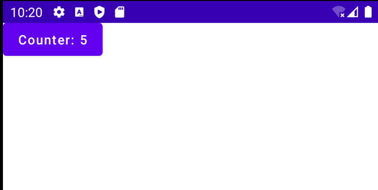
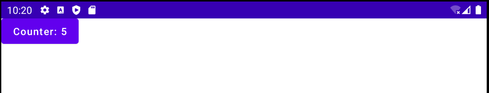
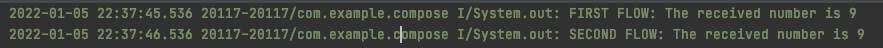
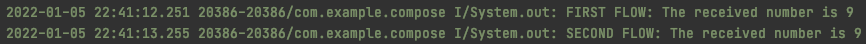

# StateFlow & SharedFlow

`StateFlow`는 이름에서 말해주듯 state를 유지한다. 이는 Lifecycle을 알지 못하는 LiveData와 같다. 이전에 구현한 `countDownFlow`는 일정 시간동안 여러 값을 반환하지만 `StateFlow`는 단일 값만 가지고 있다. 또한 `StateFlow`는 hot flow이다.

Compose를 사용하는 경우 `StateFlow`를 사용하는 것을 추천하지 않는다. Compose는 이미 state를 다루고 있기 때문에 state 함수를 수집하지 않아도 된다. 하지만 라이브러리와 같은 곳에서 `StateFlow`를 받아온다면 `collectAsState`를 사용해 수집할 수 있다.

`MainViewModel`에 다음과 같이 `StateFlow`와 `incrementCounter()` 함수를 만든다.

```kotlin
private val _stateFlow = MutableStateFlow(0)
val stateFlow = _stateFlow.asStateFlow()
fun incrementCounter() {
    _stateFlow.value += 1
}
```

그 다음 `MainAcitivity`에서 `viewModel.stateFlow.collectAsState`를 사용해 수집한 후 버튼을 누르면 값이 증가하도록 해보자.

```kotlin
setContent {
    val viewModel = viewModel<MainViewModel>()
    val count = viewModel.stateFlow.collectAsState(initial = 0)
    Box(modifier = Modifier.fillMaxSize()) {
        Button(onClick = {
            viewModel.incrementCounter()
        }) {
            Text(text = "Counter: ${count.value}")
        }
    }
}
```

<div align="center">

</div>

화면을 변경해도 값은 유지된다.

<div align="center">

</div>

xml에서 LiveData와 같이 lifecycle에 맞춰서 생성되고 파괴되도록 하기 위해 `MainAcitivity`에서 다음과 같이 구현한다.

```kotlin
lifecycleScope.launch {
    repeatOnLifecycle(Lifecycle.State.STARTED) {
        viewModel.stateFlow.collectLatest { number ->
            binding.tvCount.text = number.toString()
        }
    }
}
```

다음과 같이 확장 함수를 구현해 간단하게 사용할 수 있다.

```kotlin
fun <T> ComponentActivity.collectLatestLifecycleFlow(flow: Flow<T>, collect: suspend (T) -> Unit) {
    lifecycleScope.launch {
        repeatOnLifecycle(Lifecycle.State.STARTED) {
            flow.collectLatest(collect)
        }
    }
}
```

```kotlin
collectLatestLifecycleFlow(viewModel.stateFlow) { number ->
}
```

`SharedFlow` 는 `StateFlow`와 달리 한 번만 실행되는 이벤트에 주로 사용된다. `SharedFlow` 여러 collecor와 함께 동작할 수 있다.

다음과 같이 구현하고 수집되는지 확인해보자.

```kotlin
private val _sharedFlow = MutableSharedFlow<Int>()
val sharedFlow = _sharedFlow.asSharedFlow()
fun squareNumber(number: Int) {
    viewModelScope.launch {
        _sharedFlow.emit(number * number)
    }
}
init {
    squareNumber(3)
    viewModelScope.launch {
        sharedFlow.collect {
            delay(2000L)
            println("FIRST FLOW: The received number is ${it}")
        }
    }
    viewModelScope.launch {
        sharedFlow.collect {
            delay(3000L)
            println("SECOND FLOW: The received number is ${it}")
        }
    }
}
```

위 코드는 결과적으로 아무것도 수집되지 않는다. `squareNumber(3)`를 호출했을 때는 collector가 없기 때문이다. `squareNumber(3)`를 collect 후 마지막 위치에 놓아주면 다음과 같이 정상적으로 수집된다.

<div align="center">

</div>

다음과 같이 `replay` 파라미터를 전달하면 방출된 5개의 값이 캐시되어 이후에 수집하는 collector 들에게 캐시된 데이터를 전달해준다. 따라서 `squareNumber(3)` 이후 수집되는 collector에게 값을 전달해주어 결과를 받을 수 있다.

```kotlin
// replay: 5개의 emit를 캐시하고 새로운 컬렉터가 수집하는 경우 캐시 데이터를 전달
private val _sharedFlow = MutableSharedFlow<Int>(replay = 5)
val sharedFlow = _sharedFlow.asSharedFlow()
fun squareNumber(number: Int) {
    viewModelScope.launch {
        _sharedFlow.emit(number * number)
    }
}
init {
    squareNumber(3)
    viewModelScope.launch {
        sharedFlow.collect {
            delay(2000L)
            println("FIRST FLOW: The received number is ${it}")
        }
    }
    viewModelScope.launch {
        sharedFlow.collect {
            delay(3000L)
            println("SECOND FLOW: The received number is ${it}")
        }
    }
}
```

<div align="center">

</div>

Compose에선 `ShareFlow`의 개념을 모르지만 `LaunchedEffect`를 사용해 비슷하게 구현할 수 있다.

```kotlin
LaunchedEffect(key1 = true) {
		// Composition에 영향을 받지 않고 작업을 수행하려면 여기에 구현하면 된다.
    viewModel.sharedFlow.collect { number ->

    }
}
```

이를 xml로 간단하게 구현하면 다음과 같이 구현할 수 있다.

```kotlin
fun <T> ComponentActivity.collectLifecycleFlow(flow: Flow<T>, collect: suspend (T) -> Unit) {
    lifecycleScope.launch {
        repeatOnLifecycle(Lifecycle.State.STARTED) {
            flow.collect(collect)
        }
    }
}
```

## References

* [StateFlow & SharedFlow - The Ultimate Guide to Kotlin Flows (Part 3)](https://www.youtube.com/watch?v=za-EEkqJLCQ&list=PLQkwcJG4YTCQHCppNAQmLsj_jW38rU9sC&index=3)