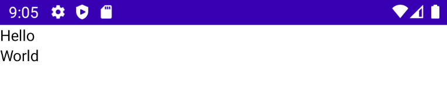
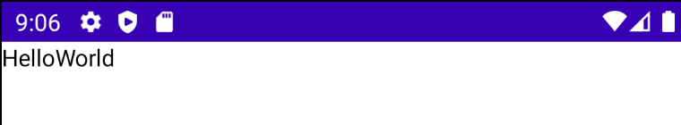
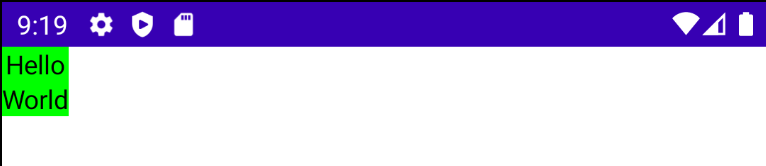
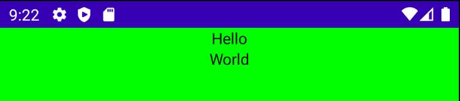
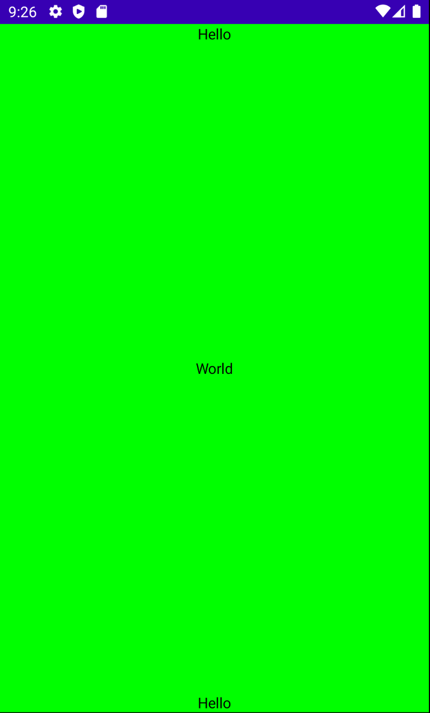
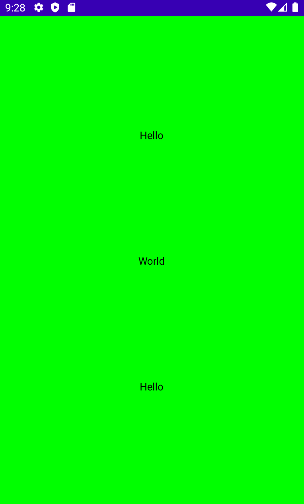
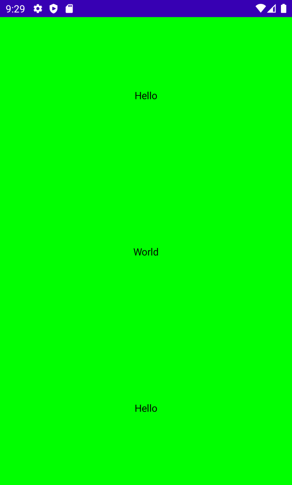
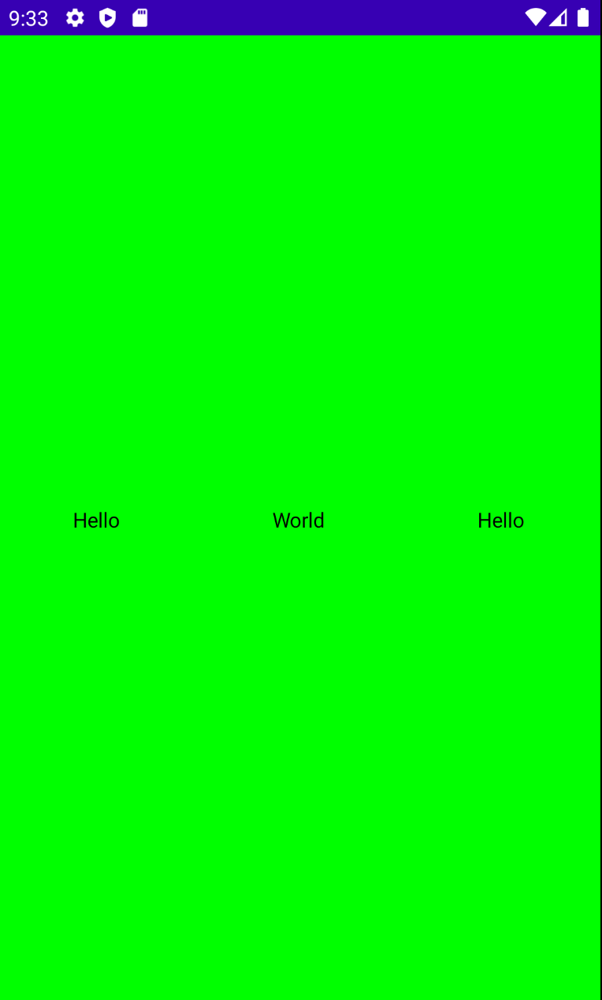
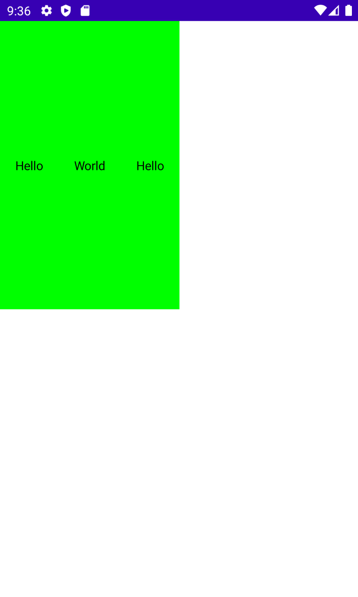
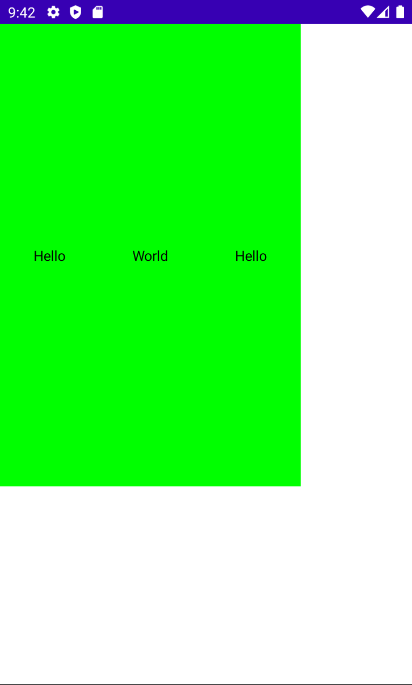

# Rows, Columns & Basic Sizing

이번 섹션에선 Rows, Columns와 기본적인 크기 조정에 대해 알아본다.

Empty Jetpack Compose를 생성한 후 다음과 같이 2개의 `Text()` composable 함수를 추가한다.

```kotlin
class MainActivity : ComponentActivity() {
    override fun onCreate(savedInstanceState: Bundle?) {
        super.onCreate(savedInstanceState)
        setContent {
            Text("Hello")
            Text("World")
        }
    }
}
```

위 코드를 실행하면 다음과 같이 텍스트가 겹치게 된다.

<div align="center">

</div>

이것을 수정하려면 `Row`나 `Column`을 사용해야 한다.

```kotlin
class MainActivity : ComponentActivity() {
    override fun onCreate(savedInstanceState: Bundle?) {
        super.onCreate(savedInstanceState)
        setContent {
            Column() {
                Text("Hello")
                Text("World")
            }
        }
    }
}
```

`Column` 기반으로 텍스트를 나열하기 때문에 다음과 같이 원하는 결과를 얻을 수 있다.

<div align="center">

</div>

`Column`을 `Row`로 변경하면 다음과 같이 가로로 나열하게 된다.

<div align="center">

</div>

기존에는 ConstraintLayout을 사용해 중첩하여 복잡하게 구현했었지만 Jetpack Compose를 이용하면 중첩되는 레이아웃들을 효율적으로 관리할 수 있게 된다. 그렇기 때문에 `Row`나 `Column` 기반 레이아웃을 사용해도 괜찮다.

다음과 같이 `Modifier.background(Color.Green)`와 `Alignment.CenterHorizontally`을 파라미터로 전달하고 실행해보자.

```kotlin
class MainActivity : ComponentActivity() {
    override fun onCreate(savedInstanceState: Bundle?) {
        super.onCreate(savedInstanceState)
        setContent {
            Column(
                modifier = Modifier.background(Color.Green),
                horizontalAlignment = Alignment.CenterHorizontally
            ) {
                Text("Hello")
                Text("World")
            }
        }
    }
}
```

결과는 다음과 같으며 `Alignment.CenterHorizontally`를 설정하면 텍스트가 초록색 바탕의 중앙에 위치하게 된다.

<div align="center">

</div>

modifier에 `.fillMaxSize()`를 추가하게 되면 모든 페이지를 채우게 된다.

```kotlin
class MainActivity : ComponentActivity() {
    override fun onCreate(savedInstanceState: Bundle?) {
        super.onCreate(savedInstanceState)
        setContent {
            Column(
                modifier = Modifier
                    .fillMaxSize()
                    .background(Color.Green),
                horizontalAlignment = Alignment.CenterHorizontally
            ) {
                Text("Hello")
                Text("World")
            }
        }
    }
}
```

그럼 다음과 같이 텍스트가 중앙에 위치한 것을 알 수 있다.

<div align="center">

</div>

`verticalArrangement` 파라미터에 `Arrangement.Bottom`을 인자로 주면 텍스트가 바닥에 위치하게 된다.

```kotlin
class MainActivity : ComponentActivity() {
    override fun onCreate(savedInstanceState: Bundle?) {
        super.onCreate(savedInstanceState)
        setContent {
            Column(
                modifier = Modifier
                    .fillMaxSize()
                    .background(Color.Green),
                horizontalAlignment = Alignment.CenterHorizontally,
                verticalArrangement = Arrangement.Bottom
            ) {
                Text("Hello")
                Text("World")
            }
        }
    }
}
```

`Arrangement.SpaceBetween`을 인자로 전달해보자.

```kotlin
class MainActivity : ComponentActivity() {
    override fun onCreate(savedInstanceState: Bundle?) {
        super.onCreate(savedInstanceState)
        setContent {
            Column(
                modifier = Modifier
                    .fillMaxSize()
                    .background(Color.Green),
                horizontalAlignment = Alignment.CenterHorizontally,
                verticalArrangement = Arrangement.SpaceBetween
            ) {
                Text("Hello")
                Text("World")
								Text("Hello")
            }
        }
    }
}
```

그럼 다음과 같이 텍스트 중간에 Space가 차지하게 된다.

<div align="center">

</div>

`Arrangement.SpaceEvenly`를 전달해보자.

```kotlin
class MainActivity : ComponentActivity() {
    override fun onCreate(savedInstanceState: Bundle?) {
        super.onCreate(savedInstanceState)
        setContent {
            Column(
                modifier = Modifier
                    .fillMaxSize()
                    .background(Color.Green),
                horizontalAlignment = Alignment.CenterHorizontally,
                verticalArrangement = Arrangement.SpaceEvenly
            ) {
                Text("Hello")
                Text("World")
                Text("Hello")
            }
        }
    }
}
```

각 텍스트마다 동일한 높이를 가지도록 정렬된다.

<div align="center">

</div>

`Arrangement.SpaceAround`를 인자로 전달해보자.

```kotlin
class MainActivity : ComponentActivity() {
    override fun onCreate(savedInstanceState: Bundle?) {
        super.onCreate(savedInstanceState)
        setContent {
            Column(
                modifier = Modifier
                    .fillMaxSize()
                    .background(Color.Green),
                horizontalAlignment = Alignment.CenterHorizontally,
                verticalArrangement = Arrangement.SpaceAround
            ) {
                Text("Hello")
                Text("World")
                Text("Hello")
            }
        }
    }
}
```

`Arrangement.SpaceEvenly`와 비슷하지만 조금 다르다. 텍스트 사이는 동일한 Space를 가지지만 처음 또는 마지막 텍스트는 텍스트 간 Space의 절반의 높이를 가진다.

<div align="center">

</div>

`Row`로 변경하는 경우 `horizontalArrangement`과 `verticalAlignment`를 바꿔주어야 한다.

```kotlin
class MainActivity : ComponentActivity() {
    override fun onCreate(savedInstanceState: Bundle?) {
        super.onCreate(savedInstanceState)
        setContent {
            Row(
                modifier = Modifier
                    .fillMaxSize()
                    .background(Color.Green),
                horizontalArrangement = Arrangement.SpaceAround,
                verticalAlignment = Alignment.CenterVertically
            ) {
                Text("Hello")
                Text("World")
                Text("Hello")
            }
        }
    }
}
```

그럼 다음과 같이 수평으로 정렬된 결과를 얻을 수 있다.

<div align="center">

</div>

다음과 같이 `.fillMaxSize(0.5f)`에 0.5f 인자를 전달하면 전체 화면의 50% 까지만 차지하게 된다. 기존 xml에서는 가이드라인과 같이 ConstraintLayout이 필요하고, 가이드라인의 퍼센트를 설정해야 하지만 compose는 다음과 같이 간단하게 표현할 수 있다.

```kotlin
class MainActivity : ComponentActivity() {
    override fun onCreate(savedInstanceState: Bundle?) {
        super.onCreate(savedInstanceState)
        setContent {
            Row(
                modifier = Modifier
                    .fillMaxSize(0.5f)
                    .background(Color.Green),
                horizontalArrangement = Arrangement.SpaceAround,
                verticalAlignment = Alignment.CenterVertically
            ) {
                Text("Hello")
                Text("World")
                Text("Hello")
            }
        }
    }
}
```

<div align="center">

</div>

위에처럼 비율을 사용하고 싶지 않은 경우 다음과 같이 `.width(300.dp)` 표현할 수 있다.

```kotlin
class MainActivity : ComponentActivity() {
    override fun onCreate(savedInstanceState: Bundle?) {
        super.onCreate(savedInstanceState)
        setContent {
            Row(
                modifier = Modifier
                    .width(300.dp)
                    .fillMaxHeight(0.7f)
                    .background(Color.Green),
                horizontalArrangement = Arrangement.SpaceAround,
                verticalAlignment = Alignment.CenterVertically
            ) {
                Text("Hello")
                Text("World")
                Text("Hello")
            }
        }
    }
}
```

<div align="center">

</div>

## References

* [Rows, Columns & Basic Sizing - Android Jetpack Compose - Part 2](https://www.youtube.com/watch?v=rHKeRWK3zL4&list=PLQkwcJG4YTCSpJ2NLhDTHhi6XBNfk9WiC&index=2)