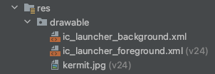
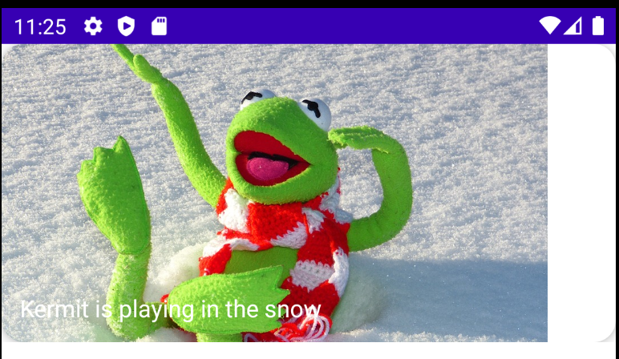
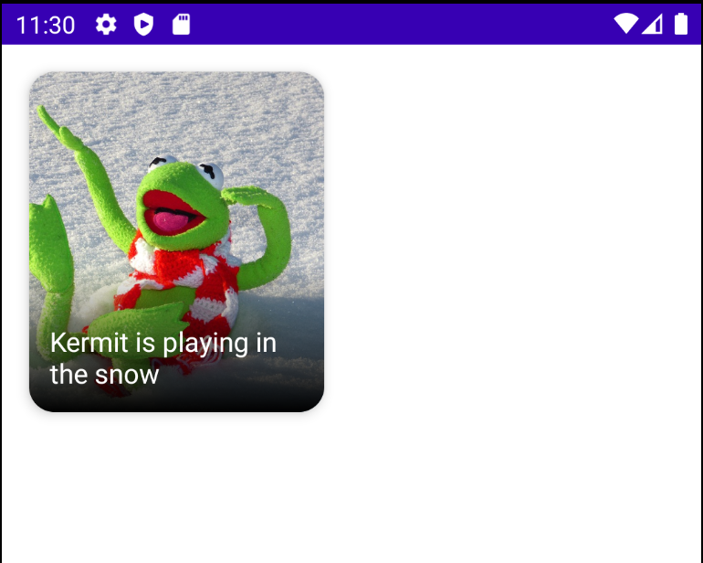

# Creating an Image Card Composable

이번엔 이미지에 텍스트가 있는 composable을 만들어보자. 우선 drawable에 kermit.jpg 파일을 넣는다.

<div align="center" class="column">
<div></div>
<div></div>
</div>

Composable 함수의 Naming Convention은 대문자로 시작하여 카멜 기법으로 표기한다.

다음과 같이 Composable 함수를 만들고 확인한다.

```kotlin
class MainActivity : ComponentActivity() {
    override fun onCreate(savedInstanceState: Bundle?) {
        super.onCreate(savedInstanceState)
        setContent {
            val painter = painterResource(id = R.drawable.kermit)
            val description = "Kermit is playing in the snow"
            val title = "Kermit is playing in the snow"
            ImageCard(
                painter = painter,
                contentDescription = description,
                title = title
            )
        }
    }
}

@Composable
fun ImageCard(
    painter: Painter, // iamge resource로부터 이미지를 사용하기 하기 위함
    contentDescription: String,
    title: String,
    modifier: Modifier = Modifier
) {
    Card(
        modifier = modifier.fillMaxWidth(),
        shape = RoundedCornerShape(15.dp),
        elevation = 5.dp // shadow
    ) {
        // 여기에 composable을 넣으면 stack 된다.
        Box(modifier = Modifier.height(200.dp)) {
            Image(
                painter = painter,
                contentDescription = contentDescription,
                contentScale = ContentScale.Crop // 이미지의 가로/세로 길이 중 짧은 쪽을 Image의 레이아웃에 꽉 차게 맞춘다.
            )
            Box(
                modifier = Modifier
                    .fillMaxSize()
                    .padding(12.dp),
                contentAlignment = Alignment.BottomStart
            ) {
                Text(title, style = TextStyle(color = Color.White, fontSize = 16.sp))
            }
        }
    }
}
```

<div align="center">

</div>

텍스트가 잘 안보이기 때문에 gradient를 추가한다.

```kotlin
class MainActivity : ComponentActivity() {
    override fun onCreate(savedInstanceState: Bundle?) {
        super.onCreate(savedInstanceState)
        setContent {
            val painter = painterResource(id = R.drawable.kermit)
            val description = "Kermit is playing in the snow"
            val title = "Kermit is playing in the snow"
            Box(
								modifier = Modifier
		                .fillMaxWidth(0.5f)
		                .padding(16.dp)
								) {
                ImageCard(
                    painter = painter,
                    contentDescription = description,
                    title = title
                )
            }
        }
    }
}

@Composable
fun ImageCard(
    painter: Painter, // iamge resource로부터 이미지를 사용하기 하기 위함
    contentDescription: String,
    title: String,
    modifier: Modifier = Modifier
) {
    Card(
        modifier = modifier.fillMaxWidth(),
        shape = RoundedCornerShape(15.dp),
        elevation = 5.dp // shadow
    ) {
        // 여기에 composable을 넣으면 stack 된다.
        Box(modifier = Modifier.height(200.dp)) {
            Image(
                painter = painter,
                contentDescription = contentDescription,
                contentScale = ContentScale.Crop // 이미지의 가로/세로 길이 중 짧은 쪽을 Image의 레이아웃에 꽉 차게 맞춘다.
            )
            Box(modifier = Modifier
                .fillMaxSize()
                .background(
                    Brush.verticalGradient(
                        colors = listOf(
                            Color.Transparent,
                            Color.Black
                        ),
                        startY = 300f
                    )
                )
            )
            Box(
                modifier = Modifier
                    .fillMaxSize()
                    .padding(12.dp),
                contentAlignment = Alignment.BottomStart
            ) {
                Text(title, style = TextStyle(color = Color.White, fontSize = 16.sp))
            }
        }
    }
}
```

<div align="center">

</div>

## References

* [Creating an Image Card Composable - Android Jetpack Compose - Part 4](https://www.youtube.com/watch?v=KPVoQjwmWX4&list=PLQkwcJG4YTCSpJ2NLhDTHhi6XBNfk9WiC&index=4)