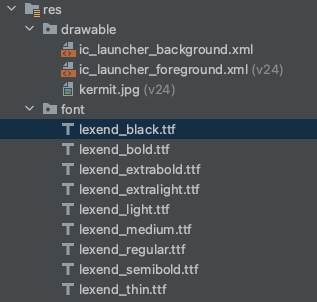
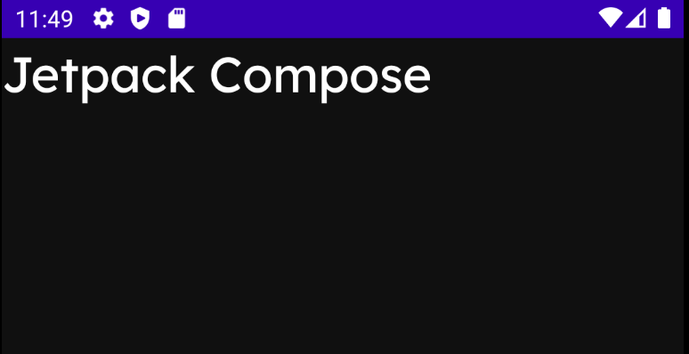

# Styling Text

xml보다 compose가 더 텍스트 스타일링에 더 가능성이 많다.

다음의 폰트를 사용할 것이다.

- [https://fonts.google.com/specimen/Lexend?query=lexend](https://fonts.google.com/specimen/Lexend?query=lexend)

위 사이트에서 Download 후 `res/font` 디렉토리 하위에 위치시킨다. 리소스는 소문자로 변경해야하며 `-`도 `_`로 변경해야 한다.

<div align="center">

</div>

그 후 다음과 같이 `FontFamily`를 설정하고, 텍스트에 해당 폰트를 적용해본다.

```kotlin
class MainActivity : ComponentActivity() {
    override fun onCreate(savedInstanceState: Bundle?) {
        super.onCreate(savedInstanceState)
        val fontFamily = FontFamily(
            Font(R.font.lexend_thin, FontWeight.Thin),
            Font(R.font.lexend_light, FontWeight.Light),
            Font(R.font.lexend_regular, FontWeight.Normal),
            Font(R.font.lexend_medium, FontWeight.Medium),
            Font(R.font.lexend_semibold, FontWeight.SemiBold),
            Font(R.font.lexend_bold, FontWeight.Bold),
            Font(R.font.lexend_extrabold, FontWeight.ExtraBold),
        )
        setContent {
            Box(
                modifier = Modifier
                    .fillMaxSize()
                    .background(Color(0Xff101010))
            ) {
                Text(
                    text = "Jetpack Compose",
                    color = Color.White,
                    fontSize = 30.sp,
                    fontFamily = fontFamily
                )
            }
        }
    }
}
```

<div align="center">

</div>

다음과 같이 텍스트의 `J`와 `C`에 대해 스타일을 지정할 수 있고, 나머지는 기본 스타일로 지정되게 만들 수 있다. buildAnnotatedString을 이용해 만들어진 `AnnotatedString`은 하나의 Text 안에서 여러 스타일을 적용할 수 있도록 하는 정보를 담은 객체로 `AnnotatedString` 속에는 텍스트의 스타일에 대한 정보를 담은 text, spanStyles, paragraphStyles, annotations 객체들이 저장되어 있다.

```kotlin
class MainActivity : ComponentActivity() {
    override fun onCreate(savedInstanceState: Bundle?) {
        super.onCreate(savedInstanceState)
        val fontFamily = FontFamily(
            Font(R.font.lexend_thin, FontWeight.Thin),
            Font(R.font.lexend_light, FontWeight.Light),
            Font(R.font.lexend_regular, FontWeight.Normal),
            Font(R.font.lexend_medium, FontWeight.Medium),
            Font(R.font.lexend_semibold, FontWeight.SemiBold),
            Font(R.font.lexend_bold, FontWeight.Bold),
            Font(R.font.lexend_extrabold, FontWeight.ExtraBold),
        )
        setContent {
            Box(
                modifier = Modifier
                    .fillMaxSize()
                    .background(Color(0Xff101010))
            ) {
                Text(
                    text = buildAnnotatedString {
                        withStyle(
                            style = SpanStyle(
                                color = Color.Green,
                                fontSize = 50.sp,
                            )
                        ) {
                            append("J")
                        }
                        append("etpack ")
                        withStyle(
                            style = SpanStyle(
                                color = Color.Green,
                                fontSize = 50.sp,
                            )
                        ) {
                            append("C")
                        }
                        append("ompose")
                    },
                    color = Color.White,
                    fontSize = 30.sp,
                    fontFamily = fontFamily,
                    fontWeight = FontWeight.Bold,
                    fontStyle = FontStyle.Italic,
                    textAlign = TextAlign.Center,
                    textDecoration = TextDecoration.Underline // xml에서는 불가한 설정
                )
            }
        }
    }
}
```

<div align="center">

</div>

## References

* [Styling Text - Android Jetpack Compose - Part 5](https://www.youtube.com/watch?v=nm_LNJWHi9A&list=PLQkwcJG4YTCSpJ2NLhDTHhi6XBNfk9WiC&index=5)