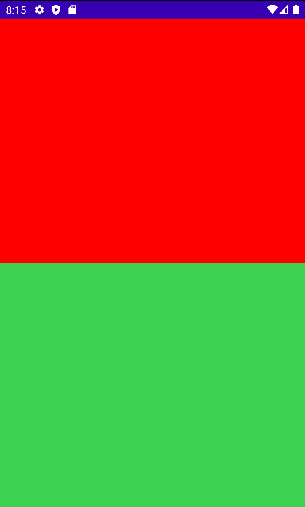

# State

리얼 애플리케이션은 유저와 상호작용하는 다이나믹한 컨텐트를 가지고 있는 경우가 있다. 특정 시점에 보여지게 하는 방법으로 UI state를 사용할 수 있다.

버튼을 누르면 카운터가 증가하는 UI가 있다고 하자. 버튼을 누르면 카운터가 증가하기 때문에 카운터 변수는 버튼의 state가 된다. 버튼을 누르면 카운터를 증가시키기 위해 redraw되는데 이를 recomposing이라 한다.

다음은 화면을 클릭하면 백그라운드 색상이 변경되는 코드이다. state를 사용해 클릭하는 경우의 처리를 해주고 있다.

```kotlin
class MainActivity : ComponentActivity() {
    override fun onCreate(savedInstanceState: Bundle?) {
        super.onCreate(savedInstanceState)
        setContent {
            ColorBox(
                Modifier.fillMaxSize()
            )
        }
    }
}

@Composable
fun ColorBox(modifier: Modifier = Modifier) {
    // remember 블록 없이 다시 호출되게 되면 Color.Yellow로 설정된다.
    // remember를 선언하면 마지막 state의 값을 가지고 있다. 그러므로 매 recomposition에 재설정하고 싶지 않은 경우 remember 키워드를 선언한면 된다.
    val color = remember {
        mutableStateOf(Color.Yellow)
    }

    Box(modifier = modifier
        .background(color.value)
        .clickable {
            color.value = Color(
                Random.nextFloat(),
                Random.nextFloat(),
                Random.nextFloat(),
                1f
            )
        }) {

    }
}
```

지금은 `ColorBox`의 recomposition을 수행하므로 구현하기 쉽지만, 다른 함수 외부의 `Box`를 변경하고 싶다고 가정해보자. 그럼 다음과 같이 `ColorBox`의 `color.value`를 참조해야 하지만, 접근할 수 없다.

```kotlin
class MainActivity : ComponentActivity() {
    override fun onCreate(savedInstanceState: Bundle?) {
        super.onCreate(savedInstanceState)
        setContent {
            Column(Modifier.fillMaxSize()) {
                ColorBox(
                    Modifier.fillMaxSize()
                )
                Box(modifier = Modifier
                    .background(color.value))
            }
        }
    }
}

@Composable
fun ColorBox(modifier: Modifier = Modifier) {
    // remember 블록 없이 다시 호출되게 되면 Color.Yellow로 설정된다.
    // remember를 선언하면 마지막 state의 값을 가지고 있다. 그러므로 매 recomposition에 재설정하고 싶지 않은 경우 remember 키워드를 선언한면 된다.
    val color = remember {
        mutableStateOf(Color.Yellow)
    }

    Box(modifier = modifier
        .background(color.value)
        .clickable {
            color.value = Color(
                Random.nextFloat(),
                Random.nextFloat(),
                Random.nextFloat(),
                1f
            )
        }) {
    }
}
```

위와 같이 `ColorBox` 외부의 `Box`를 변경하고 싶은 경우 다음과 같이 코드를 작성할 수 있다.

```kotlin
class MainActivity : ComponentActivity() {
    override fun onCreate(savedInstanceState: Bundle?) {
        super.onCreate(savedInstanceState)
        setContent {
            Column(Modifier.fillMaxSize()) {
                val color = remember {
                    mutableStateOf(Color.Yellow)
                }
                ColorBox(
                    Modifier
                        .weight(1f)
                        .fillMaxSize()
                ) {  // 람다를 마지막 파라미터로 전달하므로 람다식 밖으로 뺄 수 있다.
                    color.value = it
                }
                Box(
                    modifier = Modifier
                        .background(color.value)
                        .weight(1f)
                        .fillMaxSize()
                )
            }
        }
    }
}

@Composable
fun ColorBox(
    modifier: Modifier = Modifier,
    updateColor: (Color) -> Unit // 람다 함수를 받고
) {
    Box(modifier = modifier
        .background(Color.Red)
        .clickable {
						// ColorBox를 클릭하면 Color가 변경된다. 
            updateColor(
                Color(
                    Random.nextFloat(),
                    Random.nextFloat(),
                    Random.nextFloat(),
                    1f
                )
            )
        }) {
    }
}
```

<div align="center">

</div>

이렇게 구현하는 것은 앱이 커질수록 복잡해질 수 있고, 이는 ViewModel에서 state를 간단하게 처리할 수 있다. 이것은 추후에 다룰 것이다.

## References

* [State - Android Jetpack Compose - Part 6](https://www.youtube.com/watch?v=s3m1PSd7VWc&list=PLQkwcJG4YTCSpJ2NLhDTHhi6XBNfk9WiC&index=6)