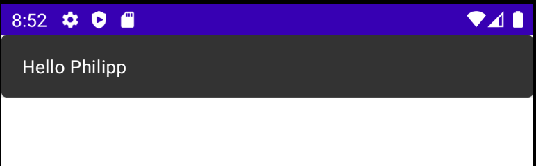
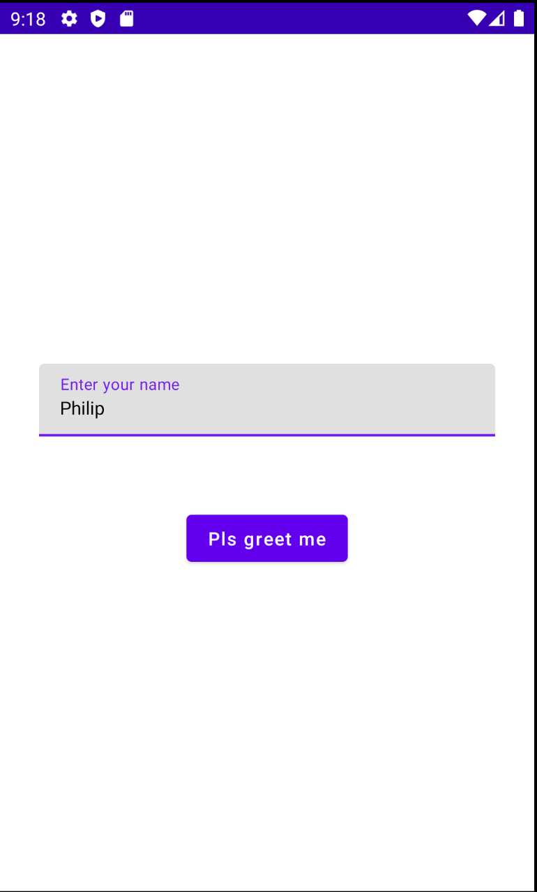

# Textfields, Buttons & Showing Snackbars

텍스트를 입력 후 버튼을 클릭하면 스낵바에 표시해주는 간단한 앱을 만들어보자.

## Snackbar

스낵바를 보여주려면 다음과 같이 Snackbar composable 함수를 사용하면 된다. 하지만 이렇게 구현하게 되면 영구적으로 표시하게 된다.

```kotlin
class MainActivity : ComponentActivity() {
    override fun onCreate(savedInstanceState: Bundle?) {
        super.onCreate(savedInstanceState)
        setContent {
            Snackbar() {
                Text(text = "Hello Philipp")
            }
        }
    }
}
```

<div align="center">

</div>

우리가 원하는 스낵바를 사용하려면 다음과 같이 `Scaffold` 안에 정의해 사용할 수 있다. 이름을 입력하고 버튼을 클릭하면 greeting 메시지가 출력된다.

```kotlin
class MainActivity : ComponentActivity() {
    override fun onCreate(savedInstanceState: Bundle?) {
        super.onCreate(savedInstanceState)
        setContent {
            // rememberScaffoldState()는 Scaffold의 기본 값을 제공한다.
            val scaffoldState = rememberScaffoldState()
            /*
            다음과 같이 표현할 수도 있지만(MutableState 타입)
            val textFieldState = remember {
               mutableStateOf("")
            }
            */
            // 이렇게 하면 상태의 값 직접적으로 값(String 타입)을 표시할 수 있다. 그러므로 textFieldState.value 표현을 사용안하고 직접적으로 사용할 수 있다.
            // import androidx.compose.runtime.*
            var textFieldState by remember {
                mutableStateOf("")
            }

            val scope = rememberCoroutineScope()

            // Scaffold 이미 존재하는 머티리얼 디자인 컴포넌트를 쉽게 포함하도록 한다.
            // topbar, toolbar, navigation drawer 등..
            Scaffold(
                modifier = Modifier.fillMaxSize(),
                scaffoldState = scaffoldState
            ) {
                Column(
                    horizontalAlignment = Alignment.CenterHorizontally,
                    verticalArrangement = Arrangement.Center,
                    modifier = Modifier
                        .fillMaxSize()
                        .padding(horizontal = 30.dp)
                ) {
                    // TextField의 값이 변경되면 state를 업데이트해야 하기 때문에 이 TextField를 state와 링크해야 한다.
                    TextField(
                        value = textFieldState,
                        label = {
                            Text("Enter your name")
                        },
												// 값이 변경되면 state 변경
                        onValueChange = {
                            textFieldState = it
                        },
                        singleLine = true,
                        modifier = Modifier.fillMaxWidth()
                    )
                    Spacer(modifier = Modifier.height(60.dp))
                    Button(onClick = {
                        scope.launch {
                            // showSnackbar가 suspend function이므로 코루틴에서 실행해야 한다.
                            scaffoldState.snackbarHostState.showSnackbar("Hello ${textFieldState}", )
                        }
                    }) {
                        Text("Pls greet me")
                    }
                }
            }
        }
    }
}
```

<div align="center">

</div>

## References

* [Textfields, Buttons & Showing Snackbars - Android Jetpack Compose - Part 7](https://www.youtube.com/watch?v=_yON9d9if6g&list=PLQkwcJG4YTCSpJ2NLhDTHhi6XBNfk9WiC&index=7)