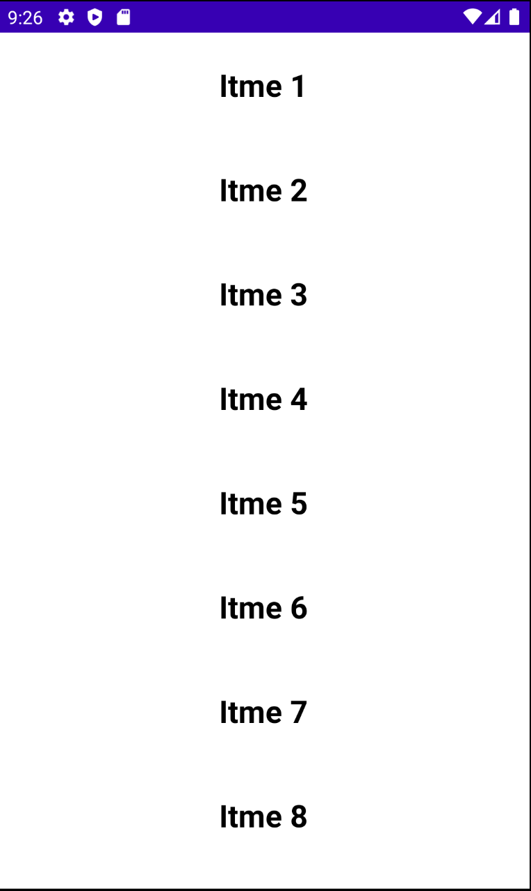
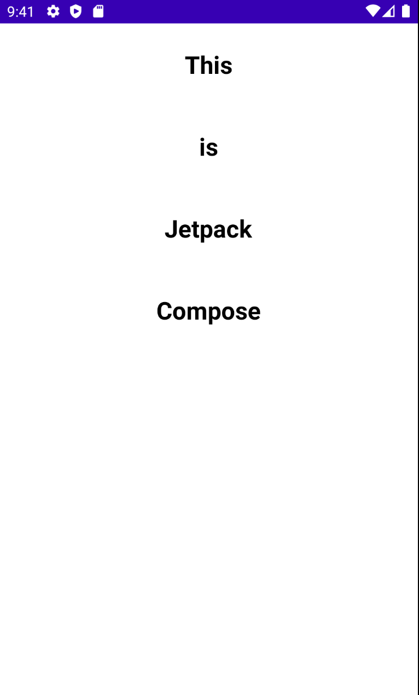

# Lists

`LazyColumn`을 사용해 스크롤 되었을 때 로딩되도록 하는 `Column`을 선언할 수 있다. 이는 xml의 `RecyclerView`와 동일하다.

다음과 같이 `Column`에 여러개의 텍스트가 위치하도록 구현할 경우 스크롤이 되지 않는다.

```kotlin
class MainActivity : ComponentActivity() {
    override fun onCreate(savedInstanceState: Bundle?) {
        super.onCreate(savedInstanceState)
        setContent {
            Column {
                for (i in 1..50) {
                    Text(
                        text = "Itme ${i}",
                        fontSize = 24.sp,
                        fontWeight = FontWeight.Bold,
                        textAlign = TextAlign.Center,
                        modifier = Modifier
                            .fillMaxWidth()
                            .padding(vertical = 24.dp)
                    )
                }
            }
        }
    }
}
```

<div align="center">

</div>

다음과 같이 `Column`에 `verticalScroll`을 추가하면 스크롤되지만 모든 리스트가 한 번에 로딩되어 느려지게 된다.

```kotlin
class MainActivity : ComponentActivity() {
    override fun onCreate(savedInstanceState: Bundle?) {
        super.onCreate(savedInstanceState)
        setContent {
            val scrollState = rememberScrollState()
            Column(
                modifier = Modifier.verticalScroll(scrollState)
            ) {
                for (i in 1..50) {
                    Text(
                        text = "Itme ${i}",
                        fontSize = 24.sp,
                        fontWeight = FontWeight.Bold,
                        textAlign = TextAlign.Center,
                        modifier = Modifier
                            .fillMaxWidth()
                            .padding(vertical = 24.dp)
                    )
                }
            }
        }
    }
}
```

이러한 부분을 개선하기 위해 `LazyColumn`을 이용해 아이템을 lazy하게 로딩할 수 있다. 즉, 스크롤되었을 때 보여지는 부분의 아이템만 로딩하게 된다.

```kotlin
class MainActivity : ComponentActivity() {
    override fun onCreate(savedInstanceState: Bundle?) {
        super.onCreate(savedInstanceState)
        setContent {
            // LazyColumn은 Scroll이 기본적으로 동작하므로 state 삭제
            LazyColumn {
                items(5000) {
                    Text(
                        text = "Item ${it}",
                        fontSize = 24.sp,
                        fontWeight = FontWeight.Bold,
                        textAlign = TextAlign.Center,
                        modifier = Modifier
                            .fillMaxWidth()
                            .padding(vertical = 24.dp)
                    )
                }
            }
        }
    }
}
```

리스트에 있는 내용을 보여주고 싶다면 `itemsIndexed`를 사용하면 된다.

```kotlin
class MainActivity : ComponentActivity() {
    override fun onCreate(savedInstanceState: Bundle?) {
        super.onCreate(savedInstanceState)
        setContent {
            // LazyColumn은 Scroll이 기본적으로 동작하므로 state 삭제
            LazyColumn {
                itemsIndexed(
                    listOf("This", "is", "Jetpack", "Compose")
                ) { index, string ->
                    Text(
                        text = string,
                        fontSize = 24.sp,
                        fontWeight = FontWeight.Bold,
                        textAlign = TextAlign.Center,
                        modifier = Modifier
                            .fillMaxWidth()
                            .padding(vertical = 24.dp)
                    )
                }
            }
        }
    }
}
```

<div align="center">

</div>

## References

* [Lists - Android Jetpack Compose - Part 8](https://www.youtube.com/watch?v=1Thp0bB5Ev0&list=PLQkwcJG4YTCSpJ2NLhDTHhi6XBNfk9WiC&index=8)