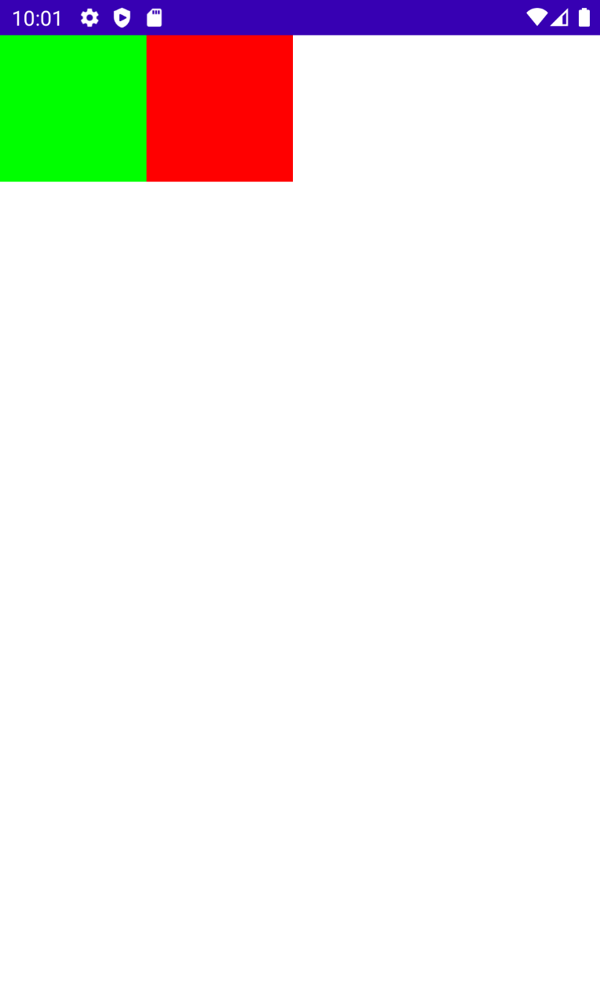
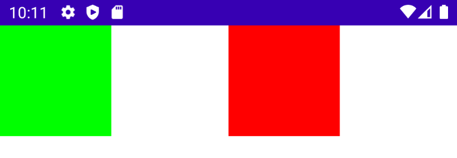
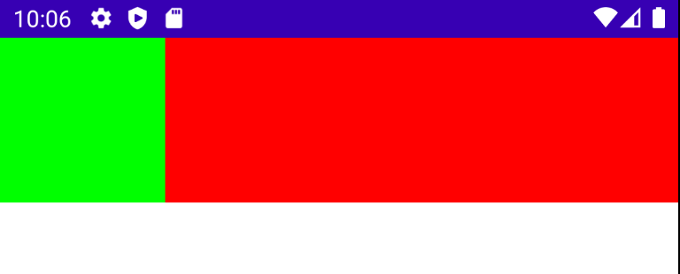
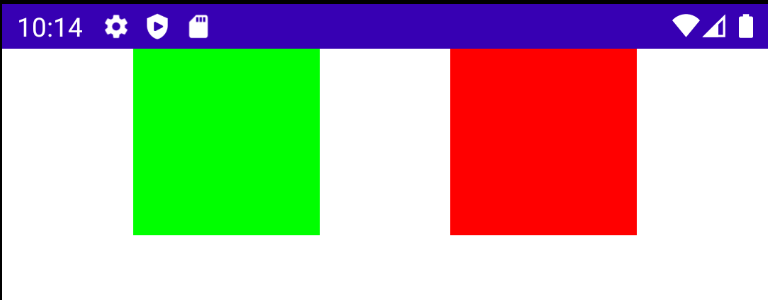
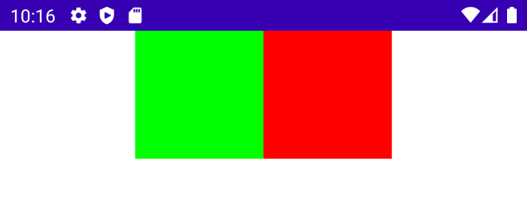
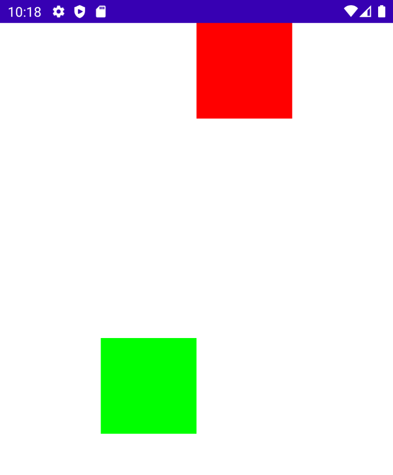

# ConstraintLayout

ConstraintLayout을 Jetpack Compose에서 어떻게 사용하는지 알아보자. 우선 ConstraintLayout를 사용하기 위해 다음 디펜던시를 추가한다.

```groovy
implementation "androidx.constraintlayout:constraintlayout-compose:1.0.0-beta02"
```

다음과 같이 2개의 `Box`를 만들고 Constraint를 걸어 UI에 표시한다.

```kotlin
class MainActivity : ComponentActivity() {
    override fun onCreate(savedInstanceState: Bundle?) {
        super.onCreate(savedInstanceState)
        setContent {
            val constraints = ConstraintSet {
                val greenBox = createRefFor("greenbox")
                val redBox = createRefFor("redbox")

                // greenBox를 왼쪽 위에 놓는다.
                // 즉, parent start, top에 제약을 건다.
                constrain(greenBox) {
                    top.linkTo(parent.top)
                    start.linkTo(parent.start)
                    width = Dimension.value(100.dp)
                    height = Dimension.value(100.dp)
                }

                // greenBox 오른쪽에 위치시킨다.
                constrain(redBox) {
                    top.linkTo(parent.top)
                    start.linkTo(greenBox.end)
                    width = Dimension.value(100.dp)
                    height = Dimension.value(100.dp)
                }
            }
            ConstraintLayout(constraints, modifier = Modifier.fillMaxSize()) {
                Box(modifier = Modifier
                    .background(Color.Green)
                    .layoutId("greenbox"))
                Box(modifier = Modifier
                    .background(Color.Red)
                    .layoutId("redbox"))
            }
        }
    }
}
```

<div align="center">

</div>

`end.linkTo(parent.end)`를 추가하면 `greenBox`와 `parent.end` 사이에 위치하게 된다.

```kotlin
constrain(redBox) {
		top.linkTo(parent.top)
		start.linkTo(greenBox.end)
		end.linkTo(parent.end)
		width = Dimension.value(100.dp)
		height = Dimension.value(100.dp)
}
```

<div align="center">

</div>

다음과 같이 `width`를 `Dimension.fillToConstraints`로 설정하면 나머지 공간을 가득 채우게 된다.

```kotlin
constrain(redBox) {
		top.linkTo(parent.top)
		start.linkTo(greenBox.end)
		end.linkTo(parent.end)
		width = Dimension.fillToConstraints
		height = Dimension.value(100.dp)
}
```

<div align="center">

</div>

`ConstraintSet` 마지막에 다음 코드를 추가하면 수평으로 체이닝된다.

```kotlin
createHorizontalChain(greenBox, redBox)
```

<div align="center">

</div>

`chainStyle` 파라미터에 `ChainStyle.Packed`를 전달하면 중앙에 위치하게 된다.

```kotlin
createHorizontalChain(greenBox, redBox, chainStyle = ChainStyle.Packed)
```

<div align="center">

</div>

가이드라인을 추가하여 원하는 위치에 아이템을 위치시킬 수 있다. 다음의 경우 `greenBox`를 top으로부터 50% 밑에 위치시킨다.

```kotlin
class MainActivity : ComponentActivity() {
    override fun onCreate(savedInstanceState: Bundle?) {
        super.onCreate(savedInstanceState)
        setContent {
            val constraints = ConstraintSet {
                val greenBox = createRefFor("greenbox")
                val redBox = createRefFor("redbox")
                // top으로부터 50%
                val guideline = createGuidelineFromTop(0.5f)

                // greenBox를 왼쪽 위에 놓는다.
                // 즉, parent start, top에 제약을 건다.
                constrain(greenBox) {
                    top.linkTo(guideline)
                    start.linkTo(parent.start)
                    width = Dimension.value(100.dp)
                    height = Dimension.value(100.dp)
                }

                // greenBox 오른쪽에 위치시킨다.
                constrain(redBox) {
                    top.linkTo(parent.top)
                    start.linkTo(greenBox.end)
                    end.linkTo(parent.end)
                    width = Dimension.value(100.dp)
                    height = Dimension.value(100.dp)
                }
                createHorizontalChain(greenBox, redBox, chainStyle = ChainStyle.Packed)
            }
            ConstraintLayout(constraints, modifier = Modifier.fillMaxSize()) {
                Box(modifier = Modifier
                    .background(Color.Green)
                    .layoutId("greenbox"))
                Box(modifier = Modifier
                    .background(Color.Red)
                    .layoutId("redbox"))
            }
        }
    }
}
```

<div align="center">

</div>

## References

* [ConstraintLayout - Android Jetpack Compose - Part 9](https://www.youtube.com/watch?v=FBpiOAiseD0&list=PLQkwcJG4YTCSpJ2NLhDTHhi6XBNfk9WiC&index=9)