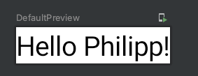

# Creating Your First Jetpack Compose App

Empty Compose Project를 생성한다. Compose를 사용하면 `res` 디렉토리 하위에 `.xml` 파일들이 없다.

이전에 view라 불렸던 것들은 이제 composable이라 불른다.

```kotlin
class MainActivity : ComponentActivity() {
    override fun onCreate(savedInstanceState: Bundle?) {
        super.onCreate(savedInstanceState)
        setContent {
            ComposeTheme {
                // A surface container using the 'background' color from the theme
                Surface(color = MaterialTheme.colors.background) {
                    Greeting("Android")
                }
            }
        }
    }
}

@Composable
fun Greeting(name: String) {
    Text(text = "Hello $name!")
}

@Preview(showBackground = true)
@Composable
fun DefaultPreview() {
    ComposeTheme {
        Greeting("Android")
    }
}
```

`setContent`의 내용을 다음과 같이 변경한다. 이것은 `Greeting` composable 함수를 호출하라는 것이다. `Greeting` 함수는 `Text` 함수를 호출하는데 이것도 또한 composable 함수이다.

```kotlin
class MainActivity : ComponentActivity() {
    override fun onCreate(savedInstanceState: Bundle?) {
        super.onCreate(savedInstanceState)
        setContent {
            Greeting(name = "Philipp")
        }
    }
}
```

`@Preview` 어노테이션이 있는 composable은 미리보기가 가능한 함수이다.

<div align="center">

</div>

## References

* [Creating Your First Jetpack Compose App - Android Jetpack Compose - Part 1](https://www.youtube.com/watch?v=cDabx3SjuOY&list=PLQkwcJG4YTCSpJ2NLhDTHhi6XBNfk9WiC)