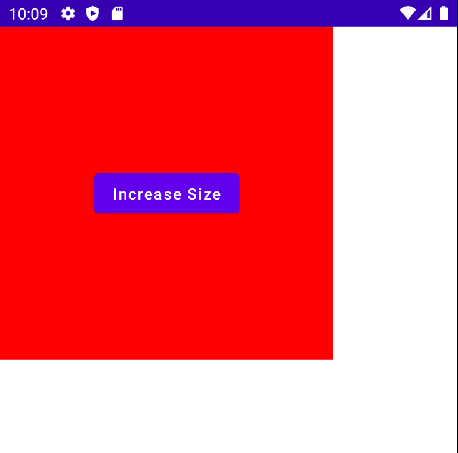
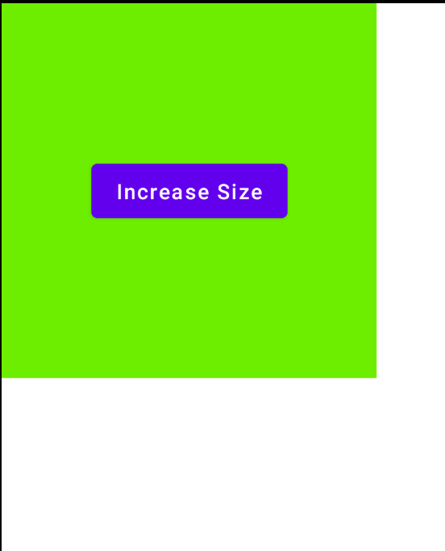

# Simple Animations

애니메이션 깊게 들어가면 복잡해진다.

`Box`를 클릭하면 사이즈가 변경되도록 해보자. 다음과 같이 구현하면 애니메이션 없이 사이즈만 +50.dp 증가한다.

```kotlin
class MainActivity : ComponentActivity() {
    override fun onCreate(savedInstanceState: Bundle?) {
        super.onCreate(savedInstanceState)
        setContent {
            var sizeState by remember {
                mutableStateOf(200.dp)
            }
            Box(modifier = Modifier
                .size(sizeState)
                .background(Color.Red),
                contentAlignment = Alignment.Center) {
                Button(onClick = {
                    sizeState += 50.dp
                }) {
                    Text("Increase Size")
                }
            }
        }
    }
}
```

<div align="center">

</div>


`animateDpAsState`를 사용해 크기가 증가할 때 부드럽게 증가시킬 수 있다.

```kotlin
class MainActivity : ComponentActivity() {
    override fun onCreate(savedInstanceState: Bundle?) {
        super.onCreate(savedInstanceState)
        setContent {
            var sizeState by remember {
                mutableStateOf(200.dp)
            }
            // dp state를 사용하므로 animateDpAsState를 사용한다.
            // size가 증가하는 것을 감지한 경우 부드럽게 증가시켜준다.
            val size by animateDpAsState(
                targetValue = sizeState
            )
            Box(modifier = Modifier
                .size(size)
                .background(Color.Red),
                contentAlignment = Alignment.Center) {
                Button(onClick = {
                    sizeState += 50.dp
                }) {
                    Text("Increase Size")
                }
            }
        }
    }
}
```

2번째 인자로 다음과 같이 전달하는 경우, 0.3초 딜레이 후 3초동안 애니메이션 동작을 수행한다. 여러번 클릭할 경우 마지막 `sizeState` 크기로 증가한다.

```kotlin
val size by animateDpAsState(
	targetValue = sizeState,
	// 2번째 인자(AnimationSpec)로 delay, curve 등 설정할 수 있다.
  tween(
		  durationMillis = 3000,
      delayMillis = 300,
      easing = LinearOutSlowInEasing
	)
)
```

`spring`을 사용하면 spring 애니메이션을 사용할 수 있다. 다음과 같이 구현하면 바운스되며 증가하게 된다.

```kotlin
val size by animateDpAsState(
    targetValue = sizeState,
    spring(
		    Spring.DampingRatioHighBouncy
		)
)
```

`keyframes`를 사용해 좀 더 정교한 애니메이션을 만들 수 있다.

```kotlin
val size by animateDpAsState(
		targetValue = sizeState,
    keyframes {
		    durationMillis = 5000
        // 0에서는 LinearEasing
        sizeState at 0 with LinearEasing
        // 1초까지 FastOutLinearInEasing
        sizeState * 1.5f at 1000 with FastOutLinearInEasing
        // 이후 4초간 느리게 확장
        sizeState * 2f at 5000
		}
)
```

`rememberInfiniteTransition()`을 생성해 무한으로 반복되는 애니메이션을 만들 수도 있다. 다음은 백그라운드 색상을 계속 변경하는 코드이다.

```kotlin
setContent {
    var sizeState by remember {
        mutableStateOf(200.dp)
    }
    // dp state를 사용하므로 animateDpAsState를 사용한다.
    // size가 증가하는 것을 감지한 경우 부드럽게 증가시켜준다.
    val size by animateDpAsState(
        targetValue = sizeState,
        tween(
            durationMillis = 1000
        )
    )
    val infiniteTransition = rememberInfiniteTransition()
    val color by infiniteTransition.animateColor(
        initialValue = Color.Red,
        targetValue = Color.Green,
        // 백그라운드 색상은 Red -> Green -> Red를 반복한다.
        animationSpec = InfiniteRepeatableSpec(
            tween(durationMillis = 2000),
            repeatMode = RepeatMode.Reverse
        )
    )
    Box(modifier = Modifier
        .size(size)
        .background(color),
        contentAlignment = Alignment.Center) {
        Button(onClick = {
            sizeState += 50.dp
        }) {
            Text("Increase Size")
        }
    }
}
```

<div align="center">

</div>


## References

* [Simple Animations - Android Jetpack Compose - Part 11](https://www.youtube.com/watch?v=trVmP1rw0uw&list=PLQkwcJG4YTCSpJ2NLhDTHhi6XBNfk9WiC&index=11)