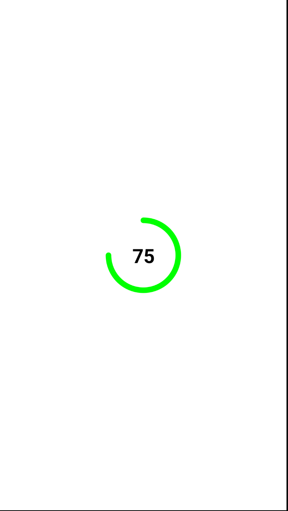

# How to Make an Animated Circular Progress Bar

특정 퍼센트를 받으면 이 퍼센트를 애니메이션으로 그려주는 프로그레스바를 만들어보자.

```kotlin
@Composable
fun CircularProgressBar(
    percentage: Float,
    number: Int,
    fontSize: TextUnit = 28.sp,
    radius: Dp = 50.dp,
    color: Color = Color.Green,
    strokeWidth: Dp = 8.dp,
    animDuration: Int = 1000,
    animDelay: Int = 0
) {
    // 이 변수를 통해 애니메이션이 시작했는지 여부 알 수 있다.
    var animationPlayed by remember {
        mutableStateOf(false)
    }
    // animDuration과 animDelay를 사용해 0부터 percentage 까지 애니메이션하고, 결과를 curPercentage에 반환하여 실제 Composable에 애니메이션을 보여주도록 한다.
    val curPercentage = animateFloatAsState(
        targetValue = if (animationPlayed) percentage else 0f,
        animationSpec = tween(
            durationMillis = animDuration,
            delayMillis = animDelay
        )
    )
    LaunchedEffect(key1 = true) {
        animationPlayed = true
    }

    // 프로그레스바와 텍스트 설정
    Box(
        contentAlignment = Alignment.Center,
        modifier = Modifier.size(radius * 2f)
    ) {
        // 캔버스는 자체적인 커스텀 View를 그릴 수 있게 도와준다.
        Canvas(modifier = Modifier.size(radius * 2f)) {
            // arc를 사용함
            drawArc(
                color = color,
                -90f,
                360 * curPercentage.value,
                // 중심이랑 연결하지 않는다.
                useCenter = false,

                style = Stroke(
                    strokeWidth.toPx(),
                    // 끝 지점 둥글게
                    cap = StrokeCap.Round
                )
            )
        }
        Text(
            text = (curPercentage.value * number).toInt().toString(),
            color = Color.Black,
            fontSize = fontSize,
            fontWeight = FontWeight.Bold
        )
    }
}
```

<div align="center">

</div>

## References

* [How to Make an Animated Circular Progress Bar in Jetpack Compose - Android Studio Tutorial](https://www.youtube.com/watch?v=ZasJB95VBtM&list=PLQkwcJG4YTCSpJ2NLhDTHhi6XBNfk9WiC&index=12)