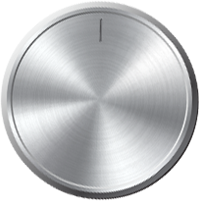
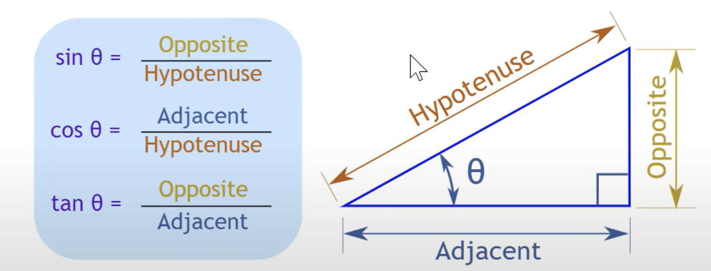
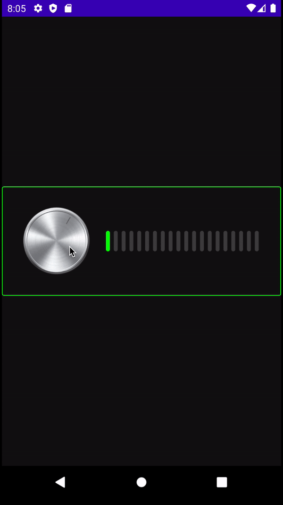

# How to Make a Draggable Music Knob

볼륨 Knob을 만들고 이를 통해 볼륨을 조절할 수 있도록 만들어보자.

[다음 이미지](https://www.youtube.com/redirect?event=video_description&redir_token=QUFFLUhqbWw2bzE5TmNkb1IyUU5BX3dsbUlzM0J1TFRGZ3xBQ3Jtc0tscXdGSEcwaVFFZFRXQW53N3pldk1qcmNtaTF2X1N4WEpOd2lmblNmTFMtQW9vLWhEYS1CTjBLMXZGRVNNVVpQcHJGUThPb05NREd6Sy0wWFdzRzg3TndMbHdyaWxJd0VpTFJHVGpjVWVLQ3NVQVdmZw&q=https%3A%2F%2Fgithub.com%2Fphilipplackner%2FMusicKnob)를 사용해 볼륨을 조절할 것이다.

<div align="center">

</div>

터치된 좌표와 위 이미지의 중심 좌표를 계산해 각도를 구한다. `atan2()` 함수를 이용한다.

<div align="center">

</div>

```kotlin
@ExperimentalComposeUiApi
@Composable
fun MusicKnob(
    modifier: Modifier = Modifier,
    // 첫, 마지막 값의 limit을 정해주는 값
    limitingAngle: Float = 25f,
    // knob을 회전시켰을 때 퍼센트 값을 알려줌
    onValueChange: (Float) -> Unit
) {
    var rotation by remember {
        mutableStateOf(limitingAngle)
    }

    var touchX by remember {
        mutableStateOf(0f)
    }
    var touchY by remember {
        mutableStateOf(0f)
    }

    var centerX by remember {
        mutableStateOf(0f)
    }
    var centerY by remember {
        mutableStateOf(0f)
    }

    Image(painter = painterResource(id = R.drawable.music_knob),
        contentDescription = "Music Knob",
        modifier = modifier
            .fillMaxSize()
            // 콘텐츠의 global position이 변경되었을 때 레이아웃의 최종 LayoutCoordinates와 함께 onGloballyPositioned가 호출되는 modifier
						// coordinate가 완료되면 composition 이후에 호출됨
            .onGloballyPositioned {
                val windowsBounds = it.boundsInWindow()
                centerX = windowsBounds.size.width / 2f
                centerY = windowsBounds.size.height / 2f
            }
            .pointerInteropFilter { event ->
                touchX = event.x
                touchY = event.y
                // atan2를 이용해 터치한 부분과의 각도를 구한다.
                val angle = -atan2(centerX - touchX, centerY - touchY) * (180f / PI).toFloat()

                when (event.action) {
                    MotionEvent.ACTION_DOWN,
                    MotionEvent.ACTION_MOVE -> {
                        // 180f 이상이면 -180f로 변경되기 때문에 정상적으로 동작시키기 위해 -180 ~ -limitingAngle 까지 +360 해준다.
                        if (angle !in -limitingAngle..limitingAngle) {
                            val fixedAnagle = if (angle in -180f..-limitingAngle) {
                                360f + angle
                            } else {
                                angle
                            }
                            rotation = fixedAnagle

                            val percent = (fixedAnagle - limitingAngle) / (360f - 2 * limitingAngle)
                            onValueChange(percent)
                            true
                        } else false
                    }
                    else -> false
                }
            }
            .rotate(rotation)
    )
}
```

`VolumeBar` Composable를 만들어준다.

```kotlin
@Composable
fun VolumeBar(
    modifier: Modifier = Modifier,
    activeBars: Int = 0,
    barCount: Int = 10
) {
    BoxWithConstraints(
        contentAlignment = Alignment.Center,
        modifier = modifier
    ) {
        val barWidth = remember {
            // bar 사이 공간 만들기 위해 2f 곱함
            constraints.maxWidth / (2f * barCount)
        }
        Canvas(modifier = modifier) {
            for (i in 0 until barCount) {
                drawRoundRect(
                    color = if (i in 0..activeBars) Color.Green else Color.DarkGray,
                    topLeft = Offset(i * barWidth * 2f + barWidth / 2f, 0f),
                    size = Size(barWidth, constraints.maxHeight.toFloat()),
                    cornerRadius = CornerRadius(30f)
                )
            }
        }
    }
}
```

`MainActivity`에서 `MusicKnob`과 `VolumeBar`를 설정한 후 실행한다.

```kotlin
class MainActivity : ComponentActivity() {
    @ExperimentalComposeUiApi
    override fun onCreate(savedInstanceState: Bundle?) {
        super.onCreate(savedInstanceState)
        setContent {
            Box(
                contentAlignment = Alignment.Center,
                modifier = Modifier
                    .fillMaxSize()
                    .background(Color(0xff101010))
            ) {
                Row(
                    horizontalArrangement = Arrangement.Center,
                    verticalAlignment = Alignment.CenterVertically,
                    modifier = Modifier
                        .border(1.dp, Color.Green, RoundedCornerShape(10.dp))
                        .padding(30.dp)
                ) {
                    var volumn by remember {
                        mutableStateOf(0f)
                    }
                    var barCount = 20
                    MusicKnob(
                        modifier = Modifier.size(100.dp)
                    ) {
                        volumn = it
                    }
                    Spacer(modifier = Modifier.width(20.dp))
                    VolumeBar(
                        modifier = Modifier
                            .fillMaxWidth()
                            .height(30.dp),
                        activeBars = (barCount * volumn).roundToInt(),
                        barCount = barCount
                    )
                }
            }
        }
    }
}
```

<div align="center">

</div>

## References

[How to Make a Draggable Music Knob in Jetpack Compose - Android Studio Tutorial](https://www.youtube.com/watch?v=TOflUdgx4pw&list=PLQkwcJG4YTCSpJ2NLhDTHhi6XBNfk9WiC&index=13)