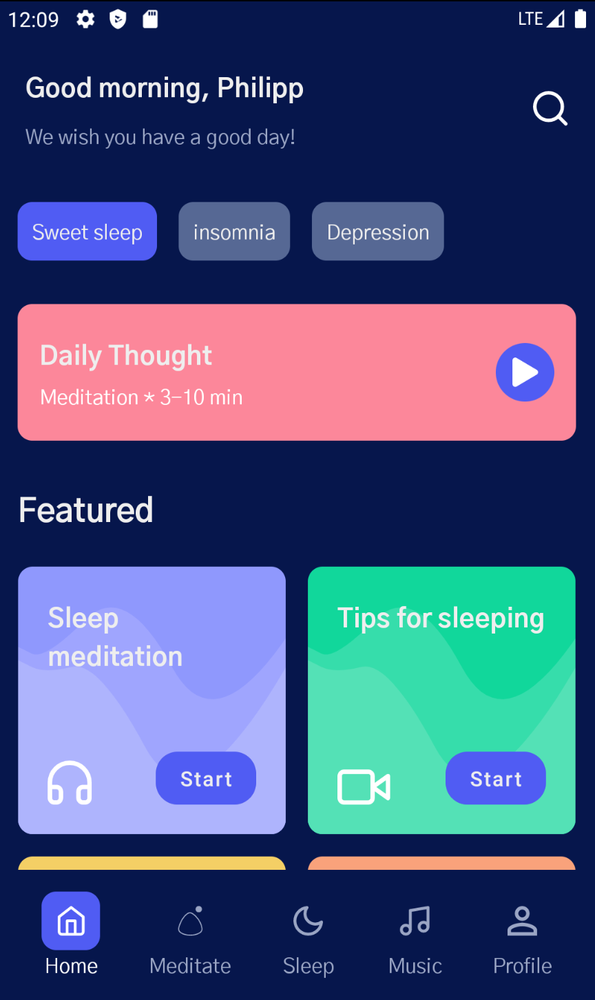

# Making a Meditation UI

Meditation UI를 만들어보자. 이 프로젝트를 수행하기 전 [이 레포지토리](https://github.com/philipplackner/MeditationUIYouTube)에서 클론한다. 이 레포지토리에 drawable, font 등이 모두 준비되어 있다. UI는 Dribbble의 [이것을](https://dribbble.com/shots/15822493-Meditation-Mobile-App) 사용해 다음과 같이 보여줄 것이다.

<div align="center">

</div>

우선 `ui` 디렉토리 하위에 `HomeScreen`을 만들어준다. 그 후 맨 위에서 보여주는 `GreetingSection` Composable을 다음과 같이 생성한다.

```kotlin
@Composable
fun GreetingSection(
    name: String = "Philipp"
) {
    Row(
        horizontalArrangement = Arrangement.SpaceBetween,
        verticalAlignment = Alignment.CenterVertically,
        modifier = Modifier
            .fillMaxWidth()
            .padding(15.dp)
    ) {
        Column(
            verticalArrangement = Arrangement.Center
        ) {
            Text(
                text = "Good morning, $name",
                style = MaterialTheme.typography.h2
            )
            Text(
                text = "We wish you have a good day!",
                style = MaterialTheme.typography.body1
            )
        }
        Icon(painter = painterResource(
            id = R.drawable.ic_search),
            contentDescription = "Search",
            tint = Color.White,
            modifier = Modifier.size(24.dp)
        )
    }
}
```

<div align="center">

</div>

그 다음 섹션인 `ChipSection`을 다음과 같이 작성한다.

```kotlin
@Composable
fun ChipSection(
    chips: List<String>
) {
    var selectedChipIndex by remember {
        mutableStateOf(0)
    }
    LazyRow {
        items(chips.size) {
            Box(
                contentAlignment = Alignment.Center,
                modifier = Modifier
                    .padding(start = 15.dp, top = 15.dp, bottom = 15.dp)
                    .clickable {
                        selectedChipIndex = it
                    }
                    .clip(RoundedCornerShape(10.dp))
                    .background(
                        if (selectedChipIndex == it) ButtonBlue
                        else DarkerButtonBlue
                    )
                    .padding(15.dp)
            ) {
                Text(
                    text = chips[it],
                    color = TextWhite
                )
            }
        }
    }
}
```

<div align="center">

</div>

다음 섹션인 `CurrentMeditation`을 만들고 플레이 버튼을 추가해준다.

```kotlin
@Composable
fun CurrentMeditation(
    color: Color = LightRed
) {
    Row(
        verticalAlignment = Alignment.CenterVertically,
        horizontalArrangement = Arrangement.SpaceBetween,
        modifier = Modifier
            .padding(15.dp)
            .clip(RoundedCornerShape(10.dp))
            .background(color)
            .padding(horizontal = 15.dp, vertical = 20.dp)
            .fillMaxWidth()
    ) {
        Column() {
            Text(
                text = "Dayliy Thought",
                style = MaterialTheme.typography.h2
            )
            Text(
                text = "Meditation * 3-10 min",
                style = MaterialTheme.typography.body1,
                color = TextWhite
            )
        }
        Box(
            contentAlignment = Alignment.Center,
            modifier = Modifier
                .size(40.dp)
                .clip(CircleShape)
                .background(ButtonBlue)
                .padding(10.dp)
        ) {
            Icon(painter = painterResource(id = R.drawable.ic_play),
                contentDescription = "Play",
                tint = Color.White,
                modifier = Modifier.size(16.dp)
            )
        }
    }
}
```

<div align="center">

</div>

다음 섹션인 `FeatureSection`을 만들기 위해 `Feature` 데이터 클래스를 생성해준다.

```kotlin
data class Feature(
    val title: String,
    @DrawableRes val iconId: Int,
    val lightColor: Color,
    val mediumColor: Color,
    val darkColor: Color
)
```

부드러운 곡선을 그려주기 위해 `Path`의 확장 함수로 `.standardQuadFromTo`를 생성해준다.

```kotlin
fun Path.standardQuadFromTo(from: Offset, to: Offset) {
    // 곡선을 그려주기 위함 
    // control point(x1, y1)를 사용해 현재 point에서 주어진 점(x2, y2)까지 곡선을 이루는 quadratic bezier segment를 추가한다.
    quadraticBezierTo(
        from.x,
        from.y,
        abs(from.x + to.x) / 2f,
        abs(from.y + to.y) / 2f
    )
}
```

`FeatureSection`과 `FeatureItem` Composable을 다음과 같이 작성한다.

```kotlin
@ExperimentalFoundationApi
@Composable
fun FeatureSection(
    features: List<Feature>
) {
    Column(
        modifier = Modifier.fillMaxWidth()
    ) {
        Text(
            text = "Featured",
            style = MaterialTheme.typography.h1,
            modifier = Modifier.padding(15.dp),
            fontWeight = FontWeight.Bold
        )
        LazyVerticalGrid(
            cells = GridCells.Fixed(2),
            contentPadding = PaddingValues(start = 7.5.dp, end = 7.5.dp, bottom = 100.dp),
            modifier = Modifier
                .fillMaxHeight()
        ) {
            items(features.size) {
                FeatureItem(feature = features[it])
            }
        }
    }
}

@Composable
fun FeatureItem(
    feature: Feature
) {
    BoxWithConstraints(
        modifier = Modifier
            .padding(7.5.dp)
            .aspectRatio(1f)
            .clip(RoundedCornerShape(10.dp))
            .background(feature.darkColor)
    ) {
        val width = constraints.maxWidth
        val height = constraints.maxHeight

        // Medium colored path
        val mediumColoredPoint1 = Offset(0f, height * 0.3f)
        val mediumColoredPoint2 = Offset(width * 0.1f, height * 0.35f)
        val mediumColoredPoint3 = Offset(width * 0.4f, height * 0.05f)
        val mediumColoredPoint4 = Offset(width * 0.75f, height * 0.7f)
        val mediumColoredPoint5 = Offset(width * 1.4f, -height.toFloat())

        val mediumColoredPath = Path().apply {
            moveTo(mediumColoredPoint1.x, mediumColoredPoint1.y)
            standardQuadFromTo(mediumColoredPoint1, mediumColoredPoint2)
            standardQuadFromTo(mediumColoredPoint2, mediumColoredPoint3)
            standardQuadFromTo(mediumColoredPoint3, mediumColoredPoint4)
            standardQuadFromTo(mediumColoredPoint4, mediumColoredPoint5)
            // 색이 다 칠해지도록 line 연결
            lineTo(width.toFloat() + 100f, height.toFloat() + 100f)
            lineTo(- 100f, height.toFloat() + 100f)
            close()
        }

        // Light colored path
        val lightPoint1 = Offset(0f, height * 0.35f)
        val lightPoint2 = Offset(width * 0.1f, height * 0.4f)
        val lightPoint3 = Offset(width * 0.3f, height * 0.35f)
        val lightPoint4 = Offset(width * 0.65f, height.toFloat())
        val lightPoint5 = Offset(width * 1.4f, -height.toFloat() / 3f)

        val lightColoredPath = Path().apply {
            moveTo(lightPoint1.x, lightPoint1.y)
            standardQuadFromTo(lightPoint1, lightPoint2)
            standardQuadFromTo(lightPoint2, lightPoint3)
            standardQuadFromTo(lightPoint3, lightPoint4)
            standardQuadFromTo(lightPoint4, lightPoint5)
            lineTo(width.toFloat() + 100f, height.toFloat() + 100f)
            lineTo(-100f, height.toFloat() + 100f)
            close()
        }

        Canvas(
            modifier = Modifier.fillMaxSize()
        ) {
            drawPath(
                path = mediumColoredPath,
                color = feature.mediumColor
            )
            drawPath(
                path = lightColoredPath,
                color = feature.lightColor
            )
        }

        Box(
            modifier = Modifier
                .fillMaxSize()
                .padding(20.dp)
        ) {
            Text(
                text = feature.title,
                style = MaterialTheme.typography.h2,
                lineHeight = 26.sp,
                modifier = Modifier
                    .align(Alignment.TopStart)
            )
            Icon(
                painter = painterResource(id = feature.iconId),
                contentDescription = feature.title,
                tint = Color.White,
                modifier = Modifier.align(Alignment.BottomStart)
            )
            Button(
                onClick = { /*TODO*/ },
                modifier = Modifier
                    .align(Alignment.BottomEnd)
                    .clip(RoundedCornerShape(15.dp)),
                colors = ButtonDefaults.buttonColors(
                    backgroundColor = ButtonBlue
                )

            ) {
                Text(
                    text = "Start",
                    modifier = Modifier,
                    color = TextWhite,
                    fontSize = 14.sp
                )
            }
        }
    }
}
```

<div align="center">

</div>

Bottom navigation view를 만들기 위해 `BottomMenuContent` 데이터 클래스를 생성한다.

```kotlin
data class BottomMenuContent(
    val title: String,
    @DrawableRes val iconId: Int
)
```

Bottom navigation menu를 생성하고 선택된 네비게이션에 따라 색상을 설정해주도록 작성한다.

```kotlin
@Composable
fun BottomMenu(
    items: List<BottomMenuContent>,
    modifier: Modifier = Modifier,
    activeHighlightColor: Color = ButtonBlue,
    activeTextColor: Color = Color.White,
    inactiveTextColor: Color = AquaBlue,
    initialSelectedItemIndex: Int = 0
) {
    var selectedItemIndex by remember {
        mutableStateOf(initialSelectedItemIndex)
    }
    Row(
        horizontalArrangement = Arrangement.SpaceAround,
        verticalAlignment = Alignment.CenterVertically,
        modifier = modifier
            .fillMaxWidth()
            .background(DeepBlue)
            .padding(15.dp)
    ) {
        items.forEachIndexed { index, item ->
            BottomMenuItem(
                item = item,
                isSelected = index == selectedItemIndex,
                activeHighlightColor = activeHighlightColor,
                activeTextColor = activeTextColor,
                inactiveTextColor = inactiveTextColor
            ) {
                selectedItemIndex = index
            }
        }
    }
}

@Composable
fun BottomMenuItem(
    item: BottomMenuContent,
    isSelected: Boolean = false,
    activeHighlightColor: Color = ButtonBlue,
    activeTextColor: Color = Color.White,
    inactiveTextColor: Color = AquaBlue,
    onItemClick: () -> Unit
) {
    Column(
        horizontalAlignment = Alignment.CenterHorizontally,
        verticalArrangement = Arrangement.Center,
        modifier = Modifier
            .clickable {
                onItemClick()
            }
    ) {
        Box(
            contentAlignment = Alignment.Center,
            modifier = Modifier
                .clip(RoundedCornerShape(10.dp))
                .background(if (isSelected) activeHighlightColor else Color.Transparent)
                .padding(10.dp)
        ) {
            Icon(
                painter = painterResource(id = item.iconId),
                contentDescription = item.title,
                tint = if (isSelected) activeTextColor else inactiveTextColor,
                modifier = Modifier.size(20.dp)
            )
        }
        Text(
            text = item.title,
            color = if (isSelected) activeTextColor else inactiveTextColor
        )
    }
}
```

<div align="center">

</div>

다음과 같이 `HomeScreen`을 작성하고 실행하면 원하던 결과를 얻을 수 있다.

```kotlin
@ExperimentalFoundationApi
@Composable
fun HomeScreen() {
    Box(
        modifier = Modifier
            .background(DeepBlue)
            .fillMaxSize()
    ) {
        Column {
            GreetingSection()
            ChipSection(chips = listOf("Sweet sleep", "Insomnia", "Depression"))
            CurrentMeditation()
            FeatureSection(
                features = listOf(
                    Feature(
                        title = "Sleep meditation",
                        R.drawable.ic_headphone,
                        BlueViolet1,
                        BlueViolet2,
                        BlueViolet3
                    ),
                    Feature(
                        title = "Tips for sleeping",
                        R.drawable.ic_videocam,
                        LightGreen1,
                        LightGreen2,
                        LightGreen3
                    ),
                    Feature(
                        title = "Night island",
                        R.drawable.ic_headphone,
                        OrangeYellow1,
                        OrangeYellow2,
                        OrangeYellow3
                    ),
                    Feature(
                        title = "Calming sounds",
                        R.drawable.ic_headphone,
                        Beige1,
                        Beige2,
                        Beige3
                    )
                )
            )
        }
        BottomMenu(items = listOf(
            BottomMenuContent("Home", R.drawable.ic_home),
            BottomMenuContent("Meditate", R.drawable.ic_bubble),
            BottomMenuContent("Sleep", R.drawable.ic_moon),
            BottomMenuContent("Music", R.drawable.ic_music),
            BottomMenuContent("Profile", R.drawable.ic_profile),
        ), modifier = Modifier.align(Alignment.BottomCenter))
    }
}
```

<div align="center">

</div>

## References

* [Making a Meditation UI With Jetpack Compose - Android Studio Tutorial](https://www.youtube.com/watch?v=g5-wzZUnIbQ&list=PLQkwcJG4YTCSpJ2NLhDTHhi6XBNfk9WiC&index=14)
* [CustomPainter, Path - 말풍선 그리기 - 우유튀김 BLOG](https://heewookji.github.io/2021/01/04/CustomPainter/)
* [AndroidPath](https://developer.android.com/reference/kotlin/androidx/compose/ui/graphics/AndroidPath#quadraticBezierTo(kotlin.Float,kotlin.Float,kotlin.Float,kotlin.Float))