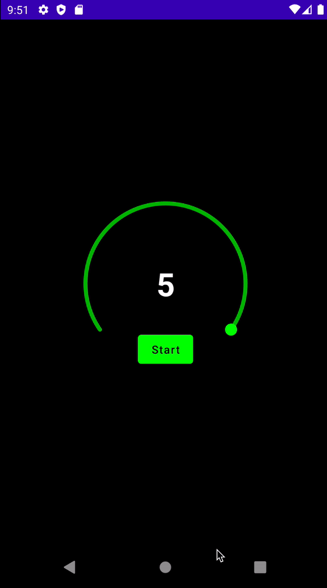

# How to Make a Timer

이번엔 간단한 타이머를 만들어보자. 다음과 같이 `Timer` Composable을 작성하자.

```kotlin
@Composable
fun Timer(
    totalTime: Long,
    handleColor: Color,
    inactiveBarColor: Color,
    activeBarColor: Color,
    modifier: Modifier = Modifier,
    initialValue: Float = 1f,
    strokeWidth: Dp = 5.dp
) {
    var size by remember {
        mutableStateOf(IntSize.Zero)
    }
    var value by remember {
        mutableStateOf(initialValue)
    }
    var currentTime by remember {
        mutableStateOf(totalTime)
    }
    var isTimerRunning by remember {
        mutableStateOf(false)
    }
    // key1나 key2가 변경되는 경우 블록 재실행
    LaunchedEffect(key1 = currentTime, key2 = isTimerRunning) {
        if (currentTime > 0L && isTimerRunning) {
            delay(100L)
            currentTime -= 100L
            value = currentTime / totalTime.toFloat()
        }
    }
    Box(
        contentAlignment = Alignment.Center,
        modifier = Modifier
            .onSizeChanged {
                size = it
            }
    ) {
        Canvas(modifier = modifier) {
            // Arc는 Circle 중 하나
            drawArc(
                color = inactiveBarColor,
                startAngle = -215f,
                sweepAngle = 250f,
                useCenter = false,
                size = Size(size.width.toFloat(), size.height.toFloat()),
                style = Stroke(strokeWidth.toPx(), cap = StrokeCap.Round)
            )
            drawArc(
                color = activeBarColor,
                startAngle = -215f,
                // 현재 퍼센트를 곱해주어 타이머가 줄어들도록 한다.
                sweepAngle = 250f * value,
                useCenter = false,
                size = Size(size.width.toFloat(), size.height.toFloat()),
                style = Stroke(strokeWidth.toPx(), cap = StrokeCap.Round)
            )
            val center = Offset(size.width / 2f, size.height / 2f)
            // angle
            val beta = (250f * value + 145f) * (PI / 180f).toFloat()
            val radius = size.width / 2f
            val a = cos(beta) * radius
            val b = sin(beta) * radius
            drawPoints(
                listOf(Offset(center.x + a, center.y + b)),
                pointMode = PointMode.Points,
                color = handleColor,
                strokeWidth = (strokeWidth * 3f).toPx(),
                cap = StrokeCap.Round
            )
        }
        Text(
            text = (currentTime / 1000L).toString(),
            fontSize = 44.sp,
            fontWeight = FontWeight.Bold,
            color = Color.White
        )
        Button(
            onClick = {
                      if (currentTime <= 0L) {
                          currentTime = totalTime
                          isTimerRunning = true
                      } else {
                          isTimerRunning = !isTimerRunning
                      }
            } ,
            modifier = Modifier.align(Alignment.BottomCenter),
            colors = ButtonDefaults.buttonColors(
                backgroundColor = if (!isTimerRunning || currentTime <= 0L) {
                    Color.Green
                } else {
                    // timer is running
                    Color.Red
                }
            )
        ) {
            Text(
                text = if (isTimerRunning && currentTime > 0L) "Stop"
                else if (!isTimerRunning && currentTime >= 0L) "Start"
                else "Restart"
            )
        }
    }
}
```

`MainActivity`에서 `Timer` Composable을 호출한다. 그럼 다음과 같이 타이머가 동작하게 된다.

```kotlin
class MainActivity : ComponentActivity() {
    @ExperimentalComposeUiApi
    override fun onCreate(savedInstanceState: Bundle?) {
        super.onCreate(savedInstanceState)
        setContent {
            Surface(
                color = Color(0xFF101010),
                modifier = Modifier.fillMaxSize()
            ) {
                Box(
                    contentAlignment = Alignment.Center
                ) {
                    Timer(
                        totalTime = 100L * 1000L,
                        handleColor = Color.Green,
                        inactiveBarColor = Color.DarkGray,
                        activeBarColor = Color(0xFF37B900),
                        modifier = Modifier.size(200.dp)
                    )
                }
            }
        }
    }
}
```

<div align="center">

</div>

## References

* [How to Make a Timer in Jetpack Compose - Android Studio Tutorial](https://www.youtube.com/watch?v=2mKhmMrt2Ok&list=PLQkwcJG4YTCSpJ2NLhDTHhi6XBNfk9WiC&index=15)