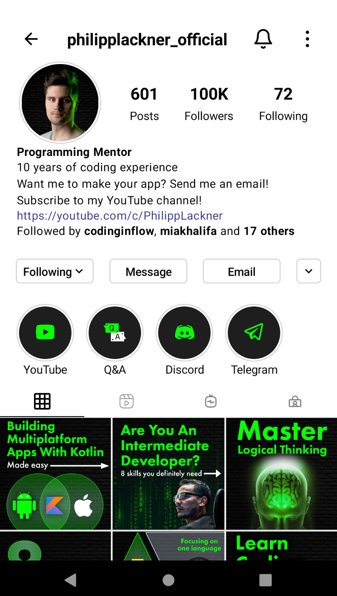
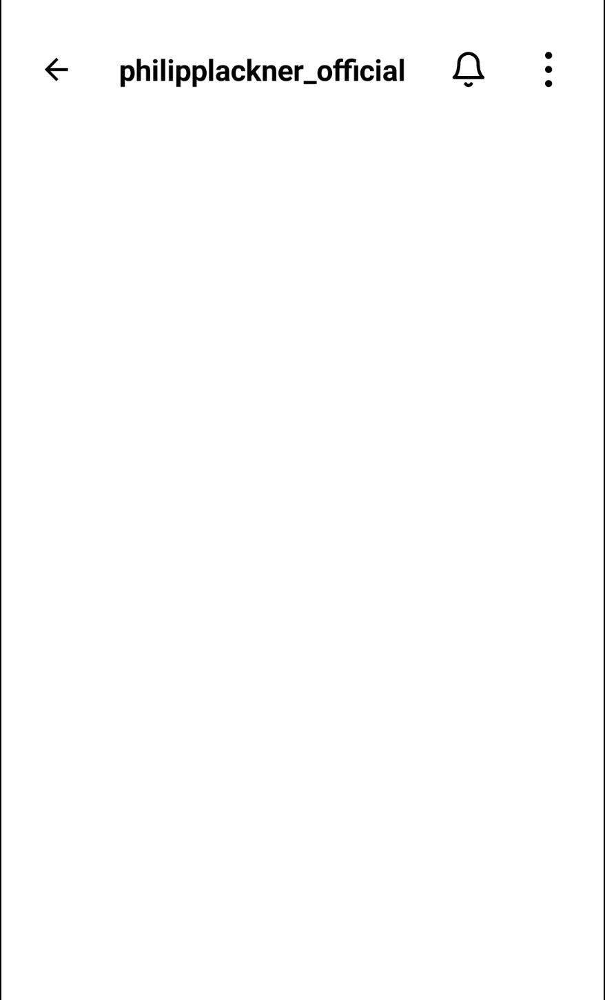
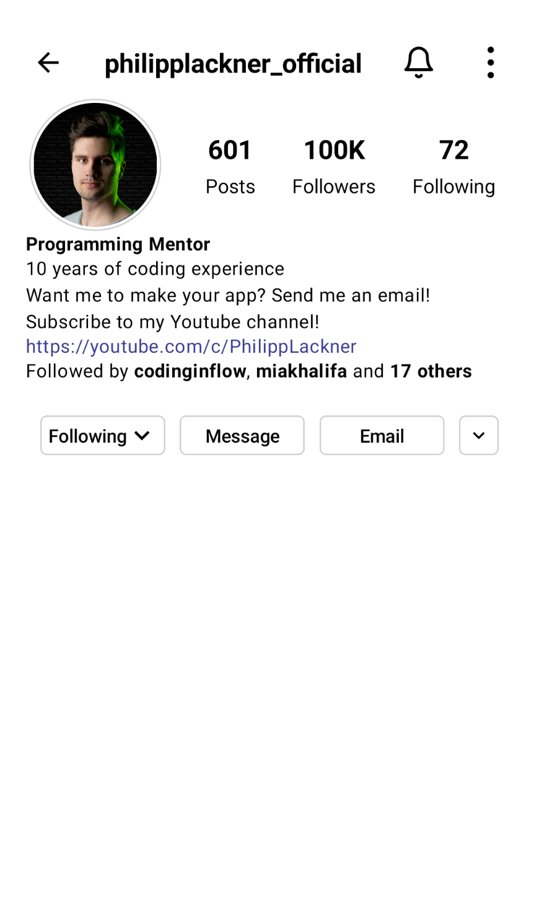
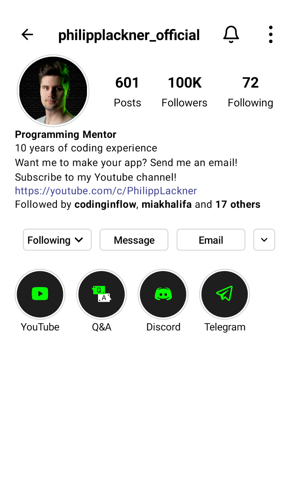
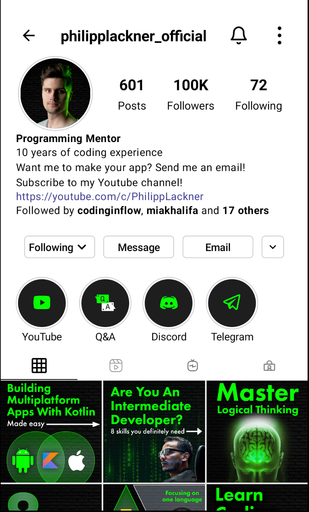
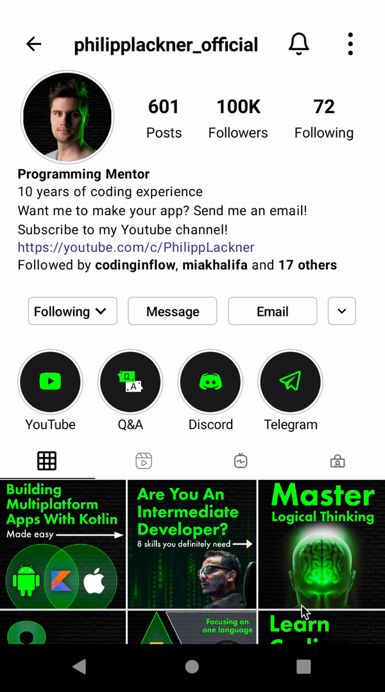

# Instagram Profile UI

이번엔 인스타그램 프로필 UI를 만들어보자. [이 레포](https://github.com/philipplackner/InstagramUI)에서 클론하여 프로젝트를 준비하자. 다음과 같이 UI를 구현할 것이다.

<div align="center">

</div>

우선 맨 위의 `Row`인 `TopBar`를 만들어준다.

```kotlin
@Composable
fun TopBar(
    name: String,
    modifier: Modifier = Modifier
) {
    Row(
        verticalAlignment = Alignment.CenterVertically,
        horizontalArrangement = Arrangement.SpaceAround,
        modifier = Modifier
            .fillMaxWidth()
    ) {
        Icon(
            imageVector = Icons.Default.ArrowBack,
            contentDescription = "Back",
            tint = Color.Black,
            modifier = Modifier.size(24.dp)
        )
        Text(
            text = name,
            // 이름이 길면 ...으로 보여주기 위함
            overflow = TextOverflow.Ellipsis,
            fontWeight = FontWeight.Bold,
            fontSize = 20.sp
        )
        Icon(
            painter = painterResource(id = R.drawable.ic_bell),
            contentDescription = "Back",
            tint = Color.Black,
            modifier = Modifier.size(24.dp)
        )
        Icon(
            painter = painterResource(id = R.drawable.ic_dotmenu),
            contentDescription = "Back",
            tint = Color.Black,
            modifier = Modifier.size(20.dp)
        )
    }
}
```

<div align="center">

</div>

그 다음 `ProfileSection`을 만들어주기 위한 `RoundImage` Composable을 추가한다.

```kotlin
@Composable
fun RoundImage(
    image: Painter,
    modifier: Modifier = Modifier
) {
    Image(
        painter = image,
        contentDescription = null,
        modifier = modifier
            // matchHeightConstraintsFirst는 이미지의 height와 동일하게 width를 조절해준다.
            .aspectRatio(1f, matchHeightConstraintsFirst = true)
            .border(
                width = 1.dp,
                color = Color.LightGray,
                shape = CircleShape
            )
            .padding(3.dp)
            // 실제 이미지가 Round 되게 해줌
            .clip(CircleShape)
    )
}
```

그리고 프로필 옆에 Posts, Followers, Following을 만들어주기 위한 `ProfileStat`과 `StatSection` Composable을 만든다.

```kotlin
@Composable
fun StatSection(modifier: Modifier = Modifier) {
    Row(
        verticalAlignment = Alignment.CenterVertically,
        horizontalArrangement = Arrangement.SpaceAround,
        modifier = modifier
    ) {
        ProfileStat(numberText = "601", text = "Posts")
        ProfileStat(numberText = "100K", text = "Followers")
        ProfileStat(numberText = "71", text = "Following")
    }
}

@Composable
fun ProfileStat(
    numberText: String,
    text: String,
    modifier: Modifier = Modifier
) {
    Column(
        verticalArrangement = Arrangement.Center,
        horizontalAlignment = Alignment.CenterHorizontally,
        modifier = modifier
    ) {
        Text(
            text = numberText,
            fontWeight = FontWeight.Bold,
            fontSize = 20.sp
        )
        Spacer(modifier = Modifier.height(4.dp))
        Text(
            text = text,
        )
    }
}
```

또한 프로필 밑에 설명을 추가하기 위해 `ProfileDescription`을 작성한다.

```kotlin
@Composable
fun ProfileDescription(
    displayName: String,
    description: String,
    url: String,
    followedBy: List<String>,
    otherCount: Int
) {
    val letterSpaceing = 0.5.sp
    val lineHeight = 20.sp
    Column(
        modifier = Modifier
            .fillMaxWidth()
            .padding(horizontal = 20.dp)
    ) {
        Text(
            text = displayName,
            fontWeight = FontWeight.Bold,
            letterSpacing = letterSpaceing,
            lineHeight = lineHeight
        )
        Text(
            text = description,
            letterSpacing = letterSpaceing,
            lineHeight = lineHeight
        )
        Text(
            text = url,
            color = Color(0xFF3D3D91),
            letterSpacing = letterSpaceing,
            lineHeight = lineHeight
        )
        if(followedBy.isNotEmpty()) {
            Text(
                text = buildAnnotatedString {
                    val boldStyle = SpanStyle(
                        color = Color.Black,
                        fontWeight = FontWeight.Bold
                    )
                    append("Followed by ")
                    pushStyle(boldStyle)
                    followedBy.forEachIndexed { index, name ->
                        pushStyle(boldStyle)
                        append(name)
                        pop()
                        if(index < followedBy.size - 1) {
                            append(", ")
                        }
                    }
                    if(otherCount > 2) {
                        pop()
                        append(" and ")
                        pushStyle(boldStyle)
                        append("${otherCount} others")
                    }
                },
                letterSpacing = letterSpaceing,
                lineHeight = lineHeight
            )
        }
    }
}
```

`RoundImage`를 이용해 `ProfileSection`을 만들고, `Spacer`를 주고 `StatSection`, `ProfileDescription`을 추가한다.

```kotlin
@Composable
fun ProfileSection(
    modifier: Modifier = Modifier
) {
    Column(modifier = modifier.fillMaxWidth()) {
        Row(
            verticalAlignment = Alignment.CenterVertically,
            modifier = Modifier
                .fillMaxWidth()
                .padding(horizontal = 20.dp)
        ) {
            RoundImage(
                image = painterResource(id = R.drawable.philipp),
                modifier = Modifier
                    .size(100.dp)
                    .weight(3f)
            )
            Spacer(modifier = Modifier.width(16.dp))
            StatSection(modifier = Modifier.weight(7f))
        }
        ProfileDescription(
            displayName = "Programming Mentor",
            description = "10 years of coding experience\n" +
                    "Want me to make your app? Send me an email!\n" +
                    "Subscribe to my Youtube channel!",
            url = "https://youtube.com/c/PhilippLackner",
            followedBy = listOf("codinginflow", "miakhalifa"),
            otherCount = 17
        )
    }
}
```

<div align="center">

</div>

다음은 각 `ActionButton`을 만들고 `ButtonSection`에 추가하는 코드이다.

```kotlin
@Composable
fun ButtonSection(
    modifier: Modifier = Modifier
) {
    val minWidth = 95.dp
    val height = 30.dp
    Row(
        horizontalArrangement = Arrangement.SpaceEvenly,
        modifier = modifier
    ) {
        ActionButton(
            text = "Following",
            icon = Icons.Default.KeyboardArrowDown,
            modifier = Modifier
                .defaultMinSize(minWidth = minWidth)
                .height(height)
        )
        ActionButton(
            text = "Message",
            modifier = Modifier
                .defaultMinSize(minWidth = minWidth)
                .height(height)
        )
        ActionButton(
            text = "Email",
            modifier = Modifier
                .defaultMinSize(minWidth = minWidth)
                .height(height)
        )
        ActionButton(
            icon = Icons.Default.KeyboardArrowDown,
            modifier = Modifier
                .size(height)
        )
    }
}

@Composable
fun ActionButton(
    modifier: Modifier = Modifier,
    text: String? = null,
    icon: ImageVector? = null
) {
    Row(
        horizontalArrangement = Arrangement.Center,
        verticalAlignment = Alignment.CenterVertically,
        modifier = modifier
            .border(
                width = 1.dp,
                color = Color.LightGray,
                shape = RoundedCornerShape(5.dp)
            )
            .padding(6.dp)
    ) {
        if(text != null) {
            Text(
                text = text,
                fontWeight = FontWeight.SemiBold,
                fontSize = 14.sp
            )
        }
        if(icon != null) {
            Icon(
                imageVector = icon,
                contentDescription = null,
                tint = Color.Black
            )
        }
    }
}
```

<div align="center">

</div>

다음으로 `HighlightSection`을 작성한다.

```kotlin
@Composable
fun HighlightSection(
    modifier: Modifier = Modifier,
    highlights: List<ImageWithText>
) {
    LazyRow(modifier = modifier) {
        items(highlights.size) {
            Column(
                horizontalAlignment = Alignment.CenterHorizontally,
                verticalArrangement = Arrangement.Center,
                modifier = Modifier
                    .padding(end = 15.dp)
            ) {
                RoundImage(
                    image = highlights[it].image,
                    modifier = Modifier.size(70.dp)
                )
                Text(
                    text = highlights[it].text,
                    overflow = TextOverflow.Ellipsis,
                    textAlign = TextAlign.Center
                )
            }
        }
    }
}
```

<div align="center">

</div>

탭 뷰를 만들기 위해 `PostTabView` Composable을 생성하고, Post를 보여주기 위해 `PostSection`을 생성한다.

```kotlin
@Composable
fun PostTabView(
    modifier: Modifier = Modifier,
    imageWithTexts: List<ImageWithText>,
    // 일치하는 컨텐츠에 일치하는 탭을 보여주기 위함
    onTabSelected: (selectedIndex: Int) -> Unit
) {
    var selectedTabIndex by remember {
        mutableStateOf(0)
    }
    TabRow(
        selectedTabIndex = selectedTabIndex,
        backgroundColor = Color.Transparent,
        contentColor = Color.Black,
        modifier = modifier
    ) {
        imageWithTexts.forEachIndexed { index, item ->
            val inactiveColor = Color(0xFF777777)
            Tab(
                selected = selectedTabIndex == index,
                selectedContentColor = Color.Black,
                unselectedContentColor = inactiveColor,
                onClick = {
                    selectedTabIndex = index
                    onTabSelected(index)
                }
            ) {
                Icon(
                    painter = item.image,
                    contentDescription = item.text,
                    tint = if (selectedTabIndex == index) Color.Black else inactiveColor,
                    modifier = Modifier
                        .padding(10.dp)
                        .size(20.dp)
                )
            }
        }
    }
}

@ExperimentalFoundationApi
@Composable
fun PostSection(
    posts: List<Painter>,
    modifier: Modifier = Modifier
) {
    LazyVerticalGrid(
        cells = GridCells.Fixed(3),
        modifier = modifier
            .scale(1.01f)
    ) {
        items(posts.size) {
            Image(
                painter = posts[it],
                contentDescription = null,
                contentScale = ContentScale.Crop,
                modifier = Modifier
                    .aspectRatio(1f)
                    .border(
                        width = 1.dp,
                        color = Color.White
                    )
            )
        }
    }
}
```

<div align="center">

</div>

`ProfileScreen()`에서 모든 Composable을 설정해준 후 실행해보자.

```kotlin
@ExperimentalFoundationApi
@Composable
fun ProfileScreen() {
    var selectedTabIndex by remember {
        mutableStateOf(0)
    }
    Column(
        modifier = Modifier.fillMaxSize()
    ) {
        TopBar(
            name = "Philipplackner_official",
            modifier = Modifier
                .padding(10.dp)
        )
        Spacer(modifier = Modifier.height(4.dp))
        ProfileSection()
        Spacer(modifier = Modifier.height(25.dp))
        ButtonSection(modifier = Modifier.fillMaxWidth())
        Spacer(modifier = Modifier.height(25.dp))
        HighlightSection(
            highlights = listOf(
                ImageWithText(
                    image = painterResource(id = R.drawable.youtube),
                    text = "YouTube"
                ),
                ImageWithText(
                    image = painterResource(id = R.drawable.qa),
                    text = "Q&A"
                ),
                ImageWithText(
                    image = painterResource(id = R.drawable.discord),
                    text = "Discord"
                ),
                ImageWithText(
                    image = painterResource(id = R.drawable.telegram),
                    text = "Telegram"
                ),
            ),
            modifier = Modifier
                .fillMaxWidth()
                .padding(horizontal = 20.dp)
        )
        Spacer(modifier = Modifier.height(10.dp))
        PostTabView(
            imageWithTexts = listOf(
                ImageWithText(
                    image = painterResource(id = R.drawable.ic_grid),
                    text = "Posts"
                ),
                ImageWithText(
                    image = painterResource(id = R.drawable.ic_reels),
                    text = "Reels"
                ),
                ImageWithText(
                    image = painterResource(id = R.drawable.ic_igtv),
                    text = "IGTV"
                ),
                ImageWithText(
                    image = painterResource(id = R.drawable.profile),
                    text = "Profile"
                ),

                )
        ) {
            selectedTabIndex = it
        }
        when (selectedTabIndex) {
            0 -> PostSection(
                posts = listOf(
                    painterResource(id = R.drawable.kmm),
                    painterResource(id = R.drawable.intermediate_dev),
                    painterResource(id = R.drawable.master_logical_thinking),
                    painterResource(id = R.drawable.bad_habits),
                    painterResource(id = R.drawable.multiple_languages),
                    painterResource(id = R.drawable.learn_coding_fast),
                ),
                modifier = Modifier.fillMaxWidth()
            )
        }
    }
}
```

<div align="center">

</div>

## References

* [Instagram Profile UI in Jetpack Compose - Android Studio Tutorial](https://www.youtube.com/watch?v=Kw4_i4l5y4s&list=PLQkwcJG4YTCSpJ2NLhDTHhi6XBNfk9WiC&index=17)