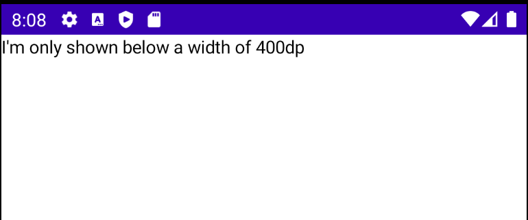
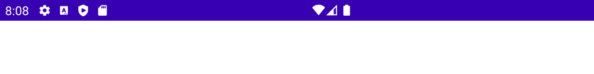
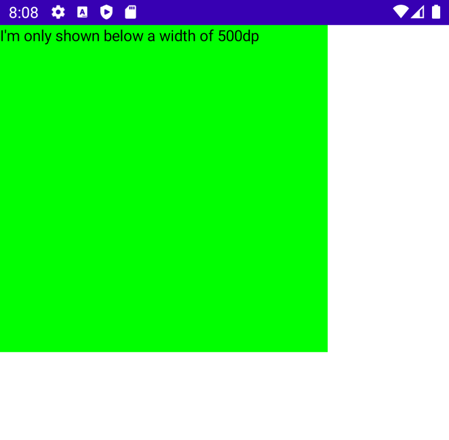
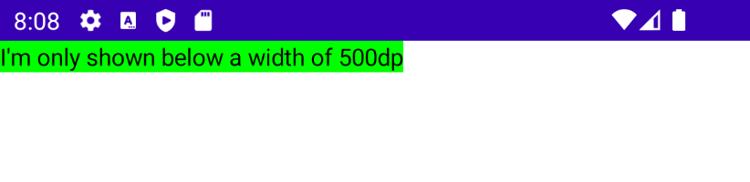

# How to Support All Screen Sizes

이 레슨에서 media query를 배울 수 있다. 단말기의 유형(출력물 vs. 화면)과, 어떤 특성이나 수치에 따라 앱의 스타일을 수정하기 위한 목적이다.

`Dimensions` sealed class를 생성한다.

```kotlin
sealed class Dimensions {
    object Width : Dimensions()
    object Height : Dimensions()

    sealed class DimensionOperator {
        object LessThan : DimensionOperator()
        object GreaterThan : DimensionOperator()
    }

    class DimensionComparator(
        val operator: DimensionOperator,
        private val dimension: Dimensions,
        val value: Dp
    ) {
        fun compare(screenWidth: Dp, screenHeight: Dp): Boolean {
            return if (dimension is Width) {
                when (operator) {
                    is DimensionOperator.LessThan -> screenWidth < value
                    is DimensionOperator.GreaterThan -> screenWidth > value
                }
            } else {
                when (operator) {
                    is DimensionOperator.LessThan -> screenHeight < value
                    is DimensionOperator.GreaterThan -> screenHeight > value
                }
            }
        }
    }
}

@Composable
fun MediaQuery(comparator: Dimensions.DimensionComparator, content: @Composable () -> Unit) {
    val screenWidth = LocalContext.current.resources.displayMetrics.widthPixels.dp /
            LocalDensity.current.density
    val screenHeight = LocalContext.current.resources.displayMetrics.heightPixels.dp /
            LocalDensity.current.density
    if (comparator.compare(screenWidth, screenHeight)) {
        content()
    }
}

infix fun Dimensions.lessThan(value: Dp): Dimensions.DimensionComparator {
    return Dimensions.DimensionComparator(
        operator = Dimensions.DimensionOperator.LessThan,
        dimension = this,
        value = value
    )
}

infix fun Dimensions.greaterThan(value: Dp): Dimensions.DimensionComparator {
    return Dimensions.DimensionComparator(
        operator = Dimensions.DimensionOperator.GreaterThan,
        dimension = this,
        value = value
    )
}
```

그 후 `MainActivity`에서 다음과 같이 구현하면 500dp 이하에서 텍스트가 보여지게 된다.

```kotlin
class MainActivity : ComponentActivity() {
    override fun onCreate(savedInstanceState: Bundle?) {
        super.onCreate(savedInstanceState)
        setContent {
            MediaQuery(Dimensions.Width lessThan 500.dp) {
                Text("I'm only shown below a width of 400dp")
            }
        }
    }
}
```

<div align="center">

</div>

그러나 화면을 회전하는 경우 해당 텍스트는 보여지지 않는다.

<div align="center">

</div>

다음은 Modifier에 확장 함수를 추가하는 방식으로 구현해보자. `ModifierExt`를 생성한 후 다음과 같이 작성한다.

```kotlin
fun Modifier.mediaQuery(
    comparator: Dimensions.DimensionComparator,
    modifier: Modifier
// composed를 사용해 compose 기능을 사용할 수 있다.
): Modifier = composed {
    val screenWidth = LocalContext.current.resources.displayMetrics.widthPixels.dp /
            LocalDensity.current.density
    val screenHeight = LocalContext.current.resources.displayMetrics.heightPixels.dp /
            LocalDensity.current.density
    if (comparator.compare(screenWidth, screenHeight)) {
        // then()은 modifier 함수이며 2개의 modifiers를 합친다.
        this.then(modifier)
    } else this
}
```

그리고 다음과 같이 `MainActivity`를 작성해주고 실행해보자.

```kotlin
class MainActivity : ComponentActivity() {
    override fun onCreate(savedInstanceState: Bundle?) {
        super.onCreate(savedInstanceState)
        setContent {
            Text(
                text = "I'm only shown below a width of 500dp",
                modifier = Modifier
                    .background(Color.Green)
                    .mediaQuery(
                        Dimensions.Width lessThan 500.dp,
                        modifier = Modifier
                            .size(300.dp)
                    )
            )
        }
    }
}
```

500dp 이하일 경우 다음과 같이 출력된다. width, height는 각 300dp로 설정된다.

<div align="center">

</div>

그러나 화면을 회전하면 텍스트 크기만큼 width와 height가 설정되게 된다.

<div align="center">

</div>

## References

* [How to Support All Screen Sizes With Jetpack Compose - Android Studio Tutorial](https://www.youtube.com/watch?v=iUIXsHiuRfY&list=PLQkwcJG4YTCSpJ2NLhDTHhi6XBNfk9WiC&index=18)