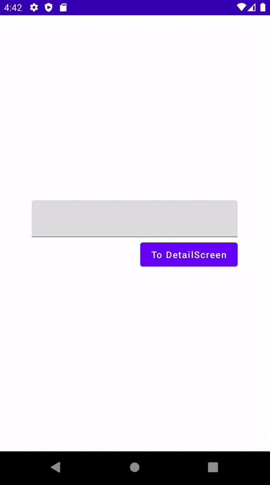

# Jetpack Compose Navigation for Beginners

이 레슨에선 네비게이션에 대한 내용을 다룬다. 우선 다음 `navigation-compose` 디펜던시를 추가한다.

```groovy
implementation "androidx.navigation:navigation-compose:2.4.0-alpha04"
```

2개의 스크린을 만들기 위해 다음과 같이 `Screen` sealed class를 생성한다.

```kotlin
sealed class Screen(
    val route: String
) {
    object MainScreen: Screen("main_screen")
    object DetailScreen: Screen("detail_screen")

		// argument와 함께 전달하기 위함
    fun withArgs(vararg args: String): String {
        return buildString {
            append(route)
            args.forEach { arg ->
                append("/${arg}")
            }
        }
    }
}
```

다음과 같이 `Navigation`을 생성한다. `navController`를 만들고, 해당 컨트롤러를 통해 이동하는 방식이다. 인자가 있는 경우 `arguments` 파라미터로 인자에 대한 정보를 전달해주어야 한다.

```kotlin
@Composable
fun Navigation() {
    val navController = rememberNavController()
    NavHost(navController = navController, startDestination = Screen.MainScreen.route) {
        composable(route = Screen.MainScreen.route) {
            MainScreen(navController = navController)
        }
        composable(
            route = Screen.DetailScreen.route + "/{name}",
            arguments = listOf(
                navArgument("name") {
                    type = NavType.StringType
                    defaultValue = "Philip"
                    nullable = true
                }
            )
        ) { entry ->
            DetailScreen(name = entry.arguments?.getString("name"))
        }
    }
}

@Composable
fun MainScreen(navController: NavController) {
    var text by remember {
        mutableStateOf("")
    }
    Column(
        verticalArrangement = Arrangement.Center,
        modifier = Modifier
            .fillMaxSize()
            .padding(horizontal = 50.dp)
    ) {
        TextField(
            value = text,
            onValueChange = {
                text = it
            },
            modifier = Modifier.fillMaxWidth()
        )
        Spacer(modifier = Modifier.height(8.dp))
        Button(onClick = {
            navController.navigate(Screen.DetailScreen.withArgs(text))
        },
        modifier = Modifier.align(Alignment.End)
        ) {
            Text(text = "To DetailScreen")
        }
    }
}

@Composable
fun DetailScreen(name: String?) {
    Box(
        contentAlignment = Alignment.Center,
        modifier = Modifier.fillMaxSize()
    ) {
        Text(text = "Hello, ${name}!")
    }
}
```

<div align="center">

</div>

## References

* [Jetpack Compose Navigation for Beginners - Android Studio Tutorial](https://www.youtube.com/watch?v=4gUeyNkGE3g&list=PLQkwcJG4YTCSpJ2NLhDTHhi6XBNfk9WiC&index=19)