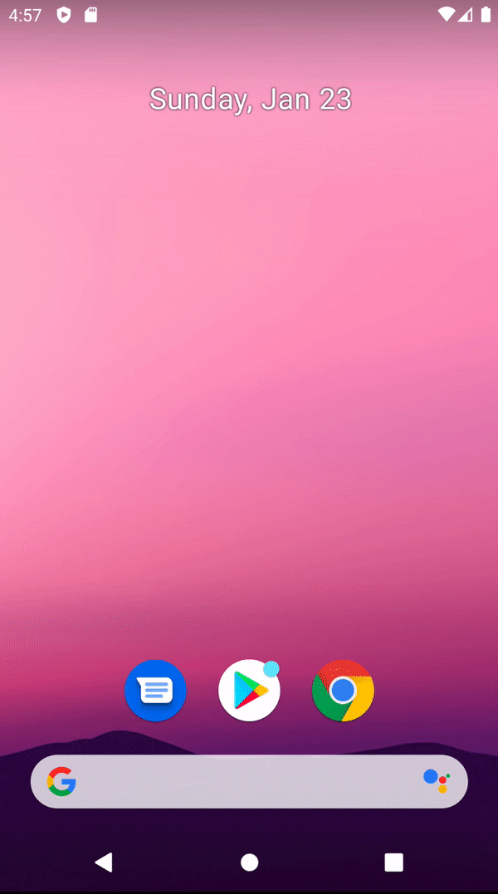

# How to Make an Animated Splash Screen

Jetpack Compose와 함께 Animated Splash Screen을 만들어보자. 우선 `navigation-compose` 디펜던시를 추가한다.

```groovy
implementation "androidx.navigation:navigation-compose:2.4.0-alpha05"
```

`SplashScreen`에서 애니메이션을 보여준 뒤 `main_screen`으로 이동하도록 작성한다.

```kotlin
class MainActivity : ComponentActivity() {
    override fun onCreate(savedInstanceState: Bundle?) {
        super.onCreate(savedInstanceState)
        setContent {
            Surface(
                color = Color(0xFF202020),
                modifier = Modifier.fillMaxSize()
            ) {
                Navigation()
            }
        }
    }
}

@Composable
fun Navigation() {
    val navController = rememberNavController()
    NavHost(navController = navController, startDestination = "splash_screen") {
        composable("splash_screen") {
            SplashScreen(navController = navController)
        }
        composable("main_screen") {
            Box(
                modifier = Modifier.fillMaxSize(),
                contentAlignment = Alignment.Center
            ) {
                Text(text = "MAIN SCREEN", color = Color.White)
            }
        }
    }
}

@Composable
fun SplashScreen(navController: NavController) {
    val scale = remember {
        Animatable(0f)
    }
    LaunchedEffect(key1 = true) {
        scale.animateTo(
            targetValue = 1f,
            animationSpec = tween(
                durationMillis = 500,
                easing = {
										// 2f 까지 커진 후 타겟 값으로 
                    OvershootInterpolator(2f).getInterpolation(it)
                }
            )
        )
        delay(3000L)
        navController.navigate("main_screen")
    }
    Box(
        contentAlignment = Alignment.Center,
        modifier = Modifier.fillMaxSize()
    ) {
        Image(painter = painterResource(
            id = R.drawable.ic_launcher_foreground),
            contentDescription = "Logo",
            modifier = Modifier.scale(scale.value)
        )
    }
}
```

<div align="center">

</div>

## References

* [How to Make an Animated Splash Screen With Jetpack Compose - Android Studio Tutorial](https://www.youtube.com/watch?v=GhNwvGePTbY&list=PLQkwcJG4YTCSpJ2NLhDTHhi6XBNfk9WiC&index=20)
* [Android Animation Interpolator 구현하기](https://gus0000123.medium.com/android-animation-interpolar-%EA%B5%AC%ED%98%84%ED%95%98%EA%B8%B0-8d228f4fc3c3)