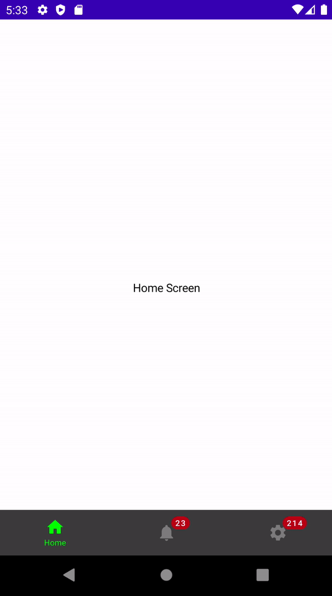

# How to Make A Bottom Navigation With Badges

Jetpack Compose와 함께 Bottom Navigation을 만들어보자.

우선 `navigation-compose` 디펜던시를 추가한다.

```groovy
implementation "androidx.navigation:navigation-compose:2.4.0-alpha06"
```

바텀 네비게이션 아이템을 만들기 위해 `BottomNavItem` data class를 만든다.

```kotlin
data class BottomNavItem(
    val name: String,
    val route: String,
    val icon: ImageVector,
    val badgeCount: Int = 0
)
```

3개의 뷰를 만들고 Bottom Navigation 중 하나를 눌렀을 경우 해당 화면이 보여지도록 구성한다.

```kotlin
class MainActivity : ComponentActivity() {
    @ExperimentalMaterialApi
    override fun onCreate(savedInstanceState: Bundle?) {
        super.onCreate(savedInstanceState)
        setContent {
            val navController = rememberNavController()
            Scaffold(
                bottomBar = {
                    BottomNavigationBar(
                        items = listOf(
                            BottomNavItem(
                                name = "Home",
                                route = "home",
                                icon = Icons.Default.Home
                            ),
                            BottomNavItem(
                                name = "Chat",
                                route = "chat",
                                icon = Icons.Default.Notifications,
                                badgeCount = 23
                            ),
                            BottomNavItem(
                                name = "Settings",
                                route = "settings",
                                icon = Icons.Default.Settings,
                                badgeCount = 214
                            )
                        ),
                        navController = navController,
                        onItemClick = {
                            navController.navigate(it.route)
                        }
                    )
                }
            ) {
                Navigation(navController = navController)
            }
        }
    }
}

@Composable
fun Navigation(navController: NavHostController) {
    NavHost(navController = navController, startDestination = "home") {
        composable("home") {
            HomeScreen()
        }
        composable("chat") {
            ChatScreen()
        }
        composable("settings") {
            SettingsScreen()
        }
    }
}

@ExperimentalMaterialApi
@Composable
fun BottomNavigationBar(
    items: List<BottomNavItem>,
    navController: NavController,
    modifier: Modifier = Modifier,
    onItemClick: (BottomNavItem) -> Unit
) {
    // state인 backStackEntry를 가져온다.
    val backStackEntry = navController.currentBackStackEntryAsState()
    BottomNavigation(
        modifier = modifier,
        backgroundColor = Color.DarkGray,
        elevation = 5.dp
    ) {
        items.forEach { item ->
            // 가져온 backStackEntry를 통해 route 되었는지 확인
            val selected = item.route == backStackEntry.value?.destination?.route
            BottomNavigationItem(
                selected = selected,
                onClick = { onItemClick(item) },
                selectedContentColor = Color.Green,
                unselectedContentColor = Color.Gray,
                icon = {
                    Column(
                        horizontalAlignment = CenterHorizontally
                    ) {
                        if (item.badgeCount > 0) {
                            BadgeBox(
                                badgeContent =  {
                                    Text(text = item.badgeCount.toString())
                                }
                            ) {
                                Icon(
                                    imageVector = item.icon,
                                    contentDescription = item.name
                                )
                            }
                        } else {
                            Icon(
                                imageVector = item.icon,
                                contentDescription = item.name
                            )
                        }
                        if (selected) {
                            Text(
                                text = item.name,
                                textAlign = TextAlign.Center,
                                fontSize = 10.sp
                            )
                        }
                    }
                }
            )
        }
    }
}

@Composable
fun HomeScreen() {
    Box(
        modifier = Modifier.fillMaxSize(),
        contentAlignment = Alignment.Center
    ) {
        Text(text = "Home Screen")
    }
}

@Composable
fun ChatScreen() {
    Box(
        modifier = Modifier.fillMaxSize(),
        contentAlignment = Alignment.Center
    ) {
        Text(text = "Chat Screen")
    }
}

@Composable
fun SettingsScreen() {
    Box(
        modifier = Modifier.fillMaxSize(),
        contentAlignment = Alignment.Center
    ) {
        Text(text = "Settings Screen")
    }
}
```

<div align="center">

</div>

## References

* [How to Make A Bottom Navigation With Badges in Jetpack Compose - Android Studio Tutorial](https://www.youtube.com/watch?v=4xyRnIntwTo&list=PLQkwcJG4YTCSpJ2NLhDTHhi6XBNfk9WiC&index=21)