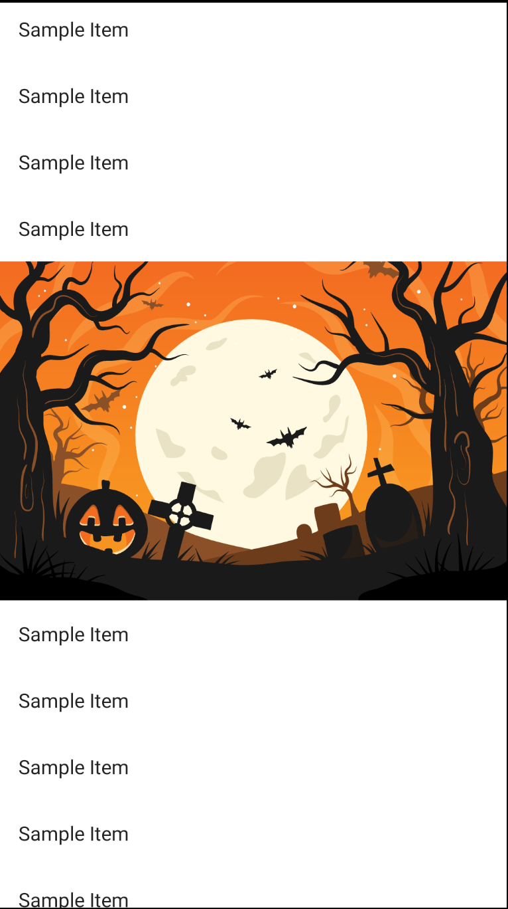
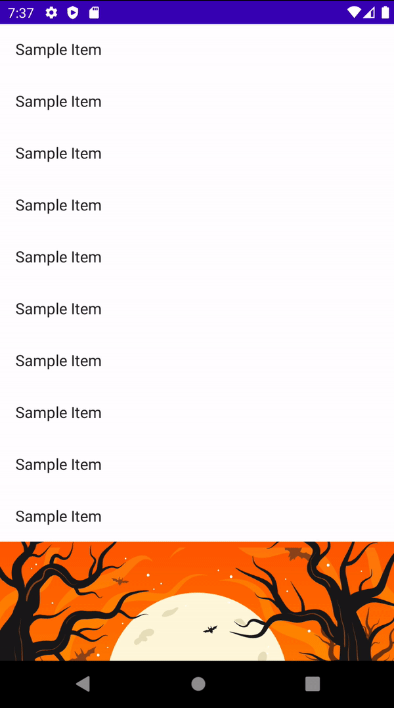

# How to Make a Multi-Layer Parallax Scroll Effect

Jetpack Compose를 통해 여러 레이어의 이미지를 리스트 중간에 위치하도록 해보자. [이 레포](https://github.com/philipplackner/ComposeParallaxScroll)에서 클론해 프로젝트를 준비한다.

우선 리스트에 이미지가 포함되도록 다음과 같이 구현해보자.

```kotlin
class MainActivity : ComponentActivity() {
    override fun onCreate(savedInstanceState: Bundle?) {
        super.onCreate(savedInstanceState)
        setContent {
            ComposeParallaxScrollTheme {

                val imageHeight = (LocalConfiguration.current.screenWidthDp * (2f / 3f)).dp
                val lazyListState = rememberLazyListState()

                LazyColumn(
                    modifier = Modifier
                        .fillMaxWidth(),
                    state = lazyListState
                ) {
                    items(10) {
                        Text(
                            text = "Sample Item",
                            modifier = Modifier
                                .fillMaxWidth()
                                .padding(16.dp)
                        )
                    }
                    item {
                        Box(
                            modifier = Modifier
                                // not overlap
                                .clipToBounds()
                                .fillMaxWidth()
                                .height(imageHeight)
                                .background(
                                    Brush.verticalGradient(
                                        listOf(
                                            Color(0xFFf36b21),
                                            Color(0xFFf9a521),
                                        )
                                    )
                                )
                        ) {
                            Image(
                                painter = painterResource(id = R.drawable.ic_moonbg),
                                contentDescription = "moon",
                                contentScale = ContentScale.FillWidth,
                                alignment = Alignment.BottomCenter,
                                modifier = Modifier.matchParentSize()
                            )
                            Image(
                                painter = painterResource(id = R.drawable.ic_midbg),
                                contentDescription = "mid bg",
                                contentScale = ContentScale.FillWidth,
                                alignment = Alignment.BottomCenter,
                                modifier = Modifier.matchParentSize()
                            )
                            Image(
                                painter = painterResource(id = R.drawable.ic_outerbg),
                                contentDescription = "outer bg",
                                contentScale = ContentScale.FillWidth,
                                alignment = Alignment.BottomCenter,
                                modifier = Modifier.matchParentSize()
                            )
                        }
                    }
                    items(20) {
                        Text(
                            text = "Sample Item",
                            modifier = Modifier
                                .fillMaxWidth()
                                .padding(16.dp)
                        )
                    }
                }
            }
        }
    }
}
```

<div align="center">

</div>

리스트에 이미지가 포함되긴 하지만 Parallax Scroll Effect가 없다. 다음과 같이 `moon`과 `midBg`에 스크롤 스피드를 주고 offset을 계산하여 동적인 이미지를 만들어보자.

```kotlin
class MainActivity : ComponentActivity() {
    override fun onCreate(savedInstanceState: Bundle?) {
        super.onCreate(savedInstanceState)
        setContent {
            ComposeParallaxScrollTheme {
                val moonScrollSpeed = 0.08f
                val midBgScrollSpeed = 0.03f

                val imageHeight = (LocalConfiguration.current.screenWidthDp * (2f / 3f)).dp
                val lazyListState = rememberLazyListState()

                // moon에 대한 스크롤 오프셋 state
                var moonOffset by remember {
                    mutableStateOf(0f)
                }
                // mid background에 대한 스크롤 오프셋 state
                var midBgOffset by remember {
                    mutableStateOf(0f)
                }
                // outer background는 항상 밑에 붙어있기 때문에 위로 이동하지 않아 state가 필요 없다.

                val nestedScrollConnection = object: NestedScrollConnection {
                    // 마지막에 실제로 얼마나 스크롤되는지 여부를 알 수 있다.
                    override fun onPreScroll(
                        available: Offset, // how fast we scrolled
                        source: NestedScrollSource
                    ): Offset {
                        // offset 계산하기 위함
                        val delta = available.y

                        // 첫 아이템 또는 마지막 아이템이 노출되었을 때 스크롤하면 moon과 midBg가 계속 내려가거나 올라가는 이상 현상이 있으므로 해결하기 위함
                        val layoutInfo = lazyListState.layoutInfo
                        // check is the first item is visible
                        if (lazyListState.firstVisibleItemIndex == 0) {
                            return Offset.Zero
                        }
                        // 마지막 item index인 경우 return
                        if (layoutInfo.visibleItemsInfo.lastOrNull()?.index == layoutInfo.totalItemsCount - 1) {
                            return Offset.Zero
                        }

                        moonOffset += delta * moonScrollSpeed
                        midBgOffset += delta * midBgScrollSpeed
                        return Offset.Zero // unchanged
                    }
                }

                LazyColumn(
                    modifier = Modifier
                        .fillMaxWidth()
                        .nestedScroll(nestedScrollConnection),
                    state = lazyListState
                ) {
                    items(10) {
                        Text(
                            text = "Sample Item",
                            modifier = Modifier
                                .fillMaxWidth()
                                .padding(16.dp)
                        )
                    }
                    item {
                        Box(
                            modifier = Modifier
                                // not overlap
                                .clipToBounds()
                                .fillMaxWidth()
                                // midBgOffset.toDp()를 추가
                                .height(imageHeight + midBgOffset.toDp())
                                .background(
                                    Brush.verticalGradient(
                                        listOf(
                                            Color(0xFFf36b21),
                                            Color(0xFFf9a521),
                                        )
                                    )
                                )
                        ) {
                            Image(
                                painter = painterResource(id = R.drawable.ic_moonbg),
                                contentDescription = "moon",
                                contentScale = ContentScale.FillWidth,
                                alignment = Alignment.BottomCenter,
                                modifier = Modifier
                                    .matchParentSize()
                                    // 다른 composable 영향 없이 이미지 내용을 변경할 수 있게 해준다.
                                    .graphicsLayer {
                                        translationY = moonOffset
                                    }
                            )
                            Image(
                                painter = painterResource(id = R.drawable.ic_midbg),
                                contentDescription = "mid bg",
                                contentScale = ContentScale.FillWidth,
                                alignment = Alignment.BottomCenter,
                                modifier = Modifier
                                    .matchParentSize()
                                    .graphicsLayer {
                                        translationY = midBgOffset
                                    }
                            )
                            Image(
                                painter = painterResource(id = R.drawable.ic_outerbg),
                                contentDescription = "outer bg",
                                contentScale = ContentScale.FillWidth,
                                alignment = Alignment.BottomCenter,
                                modifier = Modifier.matchParentSize()
                            )
                        }
                    }
                    items(20) {
                        Text(
                            text = "Sample Item",
                            modifier = Modifier
                                .fillMaxWidth()
                                .padding(16.dp)
                        )
                    }
                }
            }
        }
    }

    private fun Float.toDp(): Dp {
        return (this / Resources.getSystem().displayMetrics.density).dp
    }
}
```

<div align="center">

</div>

## References

* [How to Make a Multi-Layer Parallax Scroll Effect in Jetpack Compose - Android Studio Tutorial](https://www.youtube.com/watch?v=1qscY5b4Q2s&list=PLQkwcJG4YTCSpJ2NLhDTHhi6XBNfk9WiC&index=22)