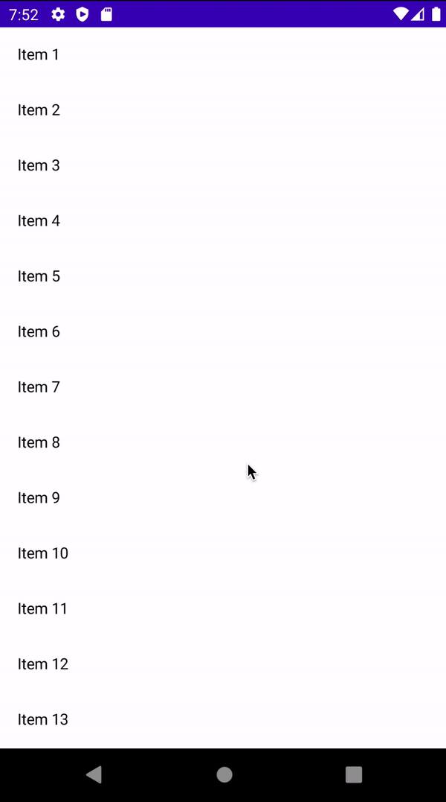

# How to Implement a Multi-Select LazyColumn

다중 선택이 가능한 `LazyColumn`을 구현해보자. 우선 리스트아이템을 생성한다.

```kotlin
data class ListItem(
    val title: String,
    val isSelected: Boolean
)
```

그 다음 리스트를 생성한 후 다중 선택이 가능하도록 다음과 같이 구현한다.

```kotlin
class MainActivity : ComponentActivity() {
    @ExperimentalMaterialApi
    override fun onCreate(savedInstanceState: Bundle?) {
        super.onCreate(savedInstanceState)
        setContent {
            // 이 아이템들을 UI에 보여주기 위해 state로 만들어야 한다.
            var items by remember {
                mutableStateOf(
                    (1..20).map {
                        ListItem(
                            title = "Item $it",
                            isSelected = false
                        )
                    }
                )
            }
            LazyColumn(
                modifier = Modifier
                    .fillMaxSize()
            ) {
                items(items.size) { i ->
                    Row(
                        modifier = Modifier
                            .fillMaxWidth()
                            .clickable {
                                items = items.mapIndexed { j, item ->
                                    if (i == j) {
																				// item 리스트를 
                                        item.copy(isSelected = !item.isSelected)
                                    } else {
                                        item
                                    }
                                }
                            }
                            .padding(16.dp),
                        horizontalArrangement = Arrangement.SpaceBetween,
                        verticalAlignment = Alignment.CenterVertically
                    ) {
                        Text(
                            text = items[i].title
                        )
                        if (items[i].isSelected) {
                            Icon(
                                imageVector = Icons.Default.Check,
                                contentDescription = "selected",
                                tint = Color.Green,
                                modifier = Modifier.size(18.dp)
                            )
                        }
                    }
                }
            }
        }
    }
}
```

<div align="center">

</div>

## References

* [How to Implement a Multi-Select LazyColumn in Jetpack Compose - Android Studio Tutorial](https://www.youtube.com/watch?v=pvNcJXprrKM&list=PLQkwcJG4YTCSpJ2NLhDTHhi6XBNfk9WiC&index=23)