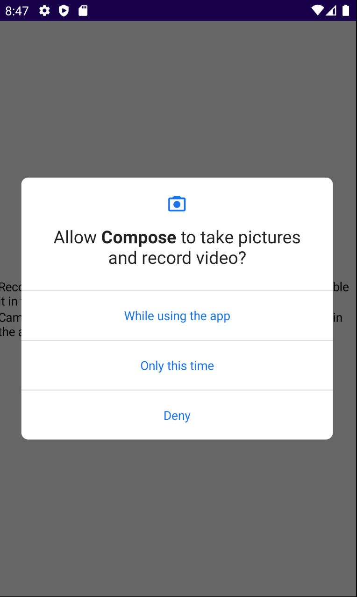
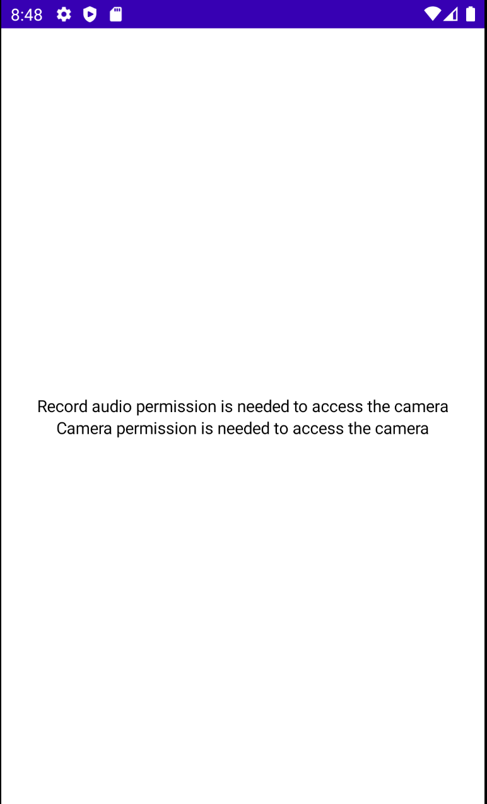

# How to Do PROPER Permission Handling

여러 퍼미션을 Jetpack Compose를 통해 처리하는 법을 배워보자. 우선 다음 디펜던시를 추가한다. 이 라이브러리는 권한을 쉽게 처리하도록 도와준다. 이 라이브러리 없이는 코드가 조금 복잡할 수 있다.

```groovy
implementation "com.google.accompanist:accompanist-permissions:0.21.1-beta"
```

보통 `onCreate()`에서 권한을 확인하고 추가하는데, 이렇게 하면 `onCreate()`에서 권한을 승인하고 백그라운드로 이동한 후 설정에서 권한을 취소하게되면 `onCreate()`이 다시 실행되지 않아 권한을 다시 묻지 않는다. 따라서 해당 코드를 `onStart()`에 두어야 권한 확인이 한다.

```kotlin
class MainActivity : ComponentActivity() {
    @ExperimentalPermissionsApi
    @ExperimentalMaterialApi
    override fun onCreate(savedInstanceState: Bundle?) {
        super.onCreate(savedInstanceState)
        setContent {
            val permissionsState = rememberMultiplePermissionsState(
                permissions = listOf(
                    Manifest.permission.RECORD_AUDIO,
                    Manifest.permission.CAMERA
                )
            )

            val lifecycleOwner = LocalLifecycleOwner.current

            // onResume에서 권한 체크
            DisposableEffect(
                key1 = lifecycleOwner,
                effect = {
                    val observer = LifecycleEventObserver { _, event ->
                        if (event == Lifecycle.Event.ON_START) {
                            permissionsState.launchMultiplePermissionRequest()
                        }
                    }
                    lifecycleOwner.lifecycle.addObserver(observer)

                    onDispose {
                        lifecycleOwner.lifecycle.removeObserver(observer)
                    }
                }
            )

            Column(
                modifier = Modifier
                    .fillMaxSize(),
                horizontalAlignment = Alignment.CenterHorizontally,
                verticalArrangement = Arrangement.Center
            ) {
                permissionsState.permissions.forEach { perm ->
                    when (perm.permission) {
                        Manifest.permission.CAMERA -> {
                            when {
                                perm.hasPermission -> {
                                    Text(text = "Camera permission accepted")
                                }
                                perm.shouldShowRationale -> {
                                    Text(text = "Camera permission is needed " +
                                            "to access the camera")
                                }
                                perm.isPermanentlyDenied() -> {
                                    Text(text = "Camera permission was permanantly denied." +
                                            "You can enable it in the app settings.")
                                }
                            }
                        }
                        Manifest.permission.RECORD_AUDIO -> {
                            when {
                                perm.hasPermission -> {
                                    Text(text = "Record audio permission accepted")
                                }
                                perm.shouldShowRationale -> {
                                    Text(text = "Record audio permission is needed " +
                                            "to access the camera")
                                }
                                perm.isPermanentlyDenied() -> {
                                    Text(text = "Record audio permission was permanantly denied." +
                                            "You can enable it in the app settings.")
                                }
                            }
                        }
                    }
                }
            }
        }
    }
}
```

<div align="center">

</div>

첫 번째 요청에 거부하게 되면 두 번째 요청에 다시 권한을 달라고 요청하는데, 이것까지 거부한다면 영구적으로 거부되며, 설정에서 권한을 승인해주어야 한다.

<div align="center">

</div>

## References

* [How to Do PROPER Permission Handling in Jetpack Compose - Android Studio Tutorial](https://www.youtube.com/watch?v=ltHN50BdDc4&list=PLQkwcJG4YTCSpJ2NLhDTHhi6XBNfk9WiC&index=24)