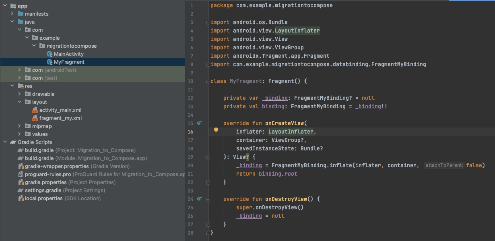
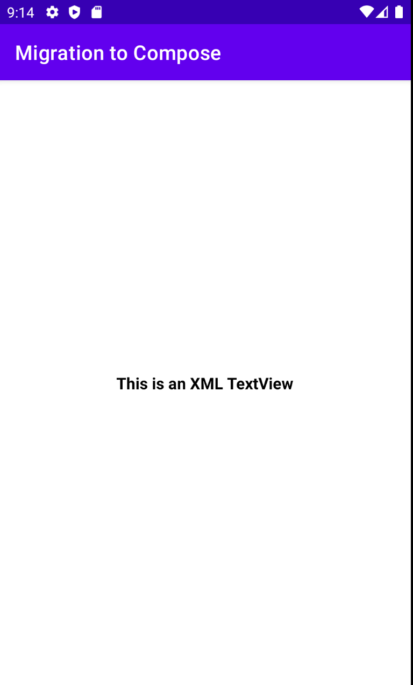
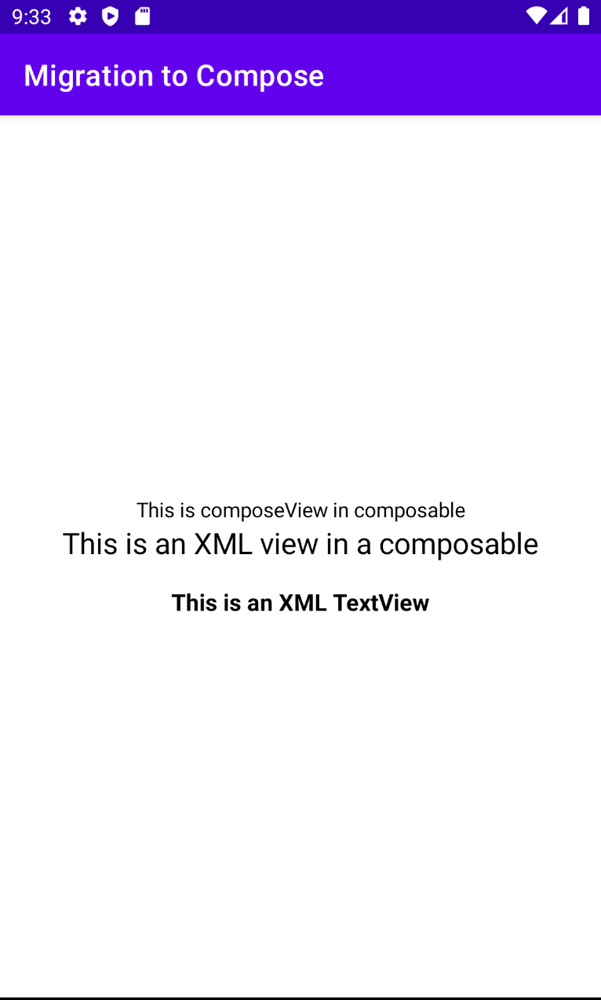

# How to Migrate XML ↔ Compose

XML을 Jetpack Compose로 마이그레이션 해보자. 다음과 같이 하나의 액티비티와 프레그먼트를 생성한다.

<div align="center">

</div>

간단하게 다음 텍스트만 출력해주는 앱이다.

<div align="center">

</div>

Project 단위 `build.gradle` 파일을 열고 `ext`에 compose 버전을 설정해준다.

```groovy
ext {
		compose_version = "1.0.5"
}
```

App 단위 `build.gradle` 파일에 `compose = true`와 `composeOptions`를 추가한다.

```groovy
buildFeatures {
    viewBinding = true
		compose = true
}

composeOptions {
		kotlinCompilerExtensionVersion compose_version
    kotlinCompilerVersion '1.5.10'
}
```

그리고 다음 디펜던시들을 추가해준다.

```groovy
implementation "androidx.compose.ui:ui:$compose_version"
implementation "androidx.compose.material:material:$compose_version"
implementation "androidx.compose.ui:ui-tooling-preview:$compose_version"
androidTestImplementation "androidx.compose.ui:ui-test-junit4:$compose_version"
```

`fragment_my.xml`에서 compose를 사용하기 위해 xml에 `ComposeView`를 생성해준다.

```xml
<?xml version="1.0" encoding="utf-8"?>
<androidx.constraintlayout.widget.ConstraintLayout xmlns:android="http://schemas.android.com/apk/res/android"
    xmlns:app="http://schemas.android.com/apk/res-auto"
    xmlns:tools="http://schemas.android.com/tools"
    android:layout_width="match_parent"
    android:layout_height="match_parent">

    <androidx.compose.ui.platform.ComposeView
        android:id="@+id/composeView"
        android:layout_width="wrap_content"
        android:layout_height="wrap_content"
        app:layout_constraintBottom_toTopOf="@+id/textView"
        app:layout_constraintVertical_chainStyle="packed"
        app:layout_constraintEnd_toEndOf="parent"
        app:layout_constraintHorizontal_bias="0.5"
        app:layout_constraintStart_toStartOf="parent"
        app:layout_constraintTop_toTopOf="parent" />

    <TextView
        android:id="@+id/textView"
        android:layout_width="wrap_content"
        android:layout_height="wrap_content"
        android:text="This is an XML TextView"
        android:textColor="@color/black"
        android:textSize="16sp"
        android:textStyle="bold"
        android:layout_marginTop="16dp"
        app:layout_constraintBottom_toBottomOf="parent"
        app:layout_constraintEnd_toEndOf="parent"
        app:layout_constraintHorizontal_bias="0.5"
        app:layout_constraintStart_toStartOf="parent"
        app:layout_constraintTop_toBottomOf="@+id/composeView" />
</androidx.constraintlayout.widget.ConstraintLayout>
```

위 `composeView`를 통해 composable을 사용할 수 있고, `AndroidView`로 xml을 사용할 수 있다.

```kotlin
class MyFragment: Fragment() {

    private var _binding: FragmentMyBinding? = null
    private val binding: FragmentMyBinding
        get() = _binding!!

    override fun onCreateView(
        inflater: LayoutInflater,
        container: ViewGroup?,
        savedInstanceState: Bundle?
    ): View? {
        _binding = FragmentMyBinding.inflate(inflater, container, false)
        binding.composeView.apply {
            // xml과는 다르게 동작하기 때문에 이 composeView가 언제 recycle 되고 destroy 되는지 알려주어야 한다.
            // ViewCompositionStrategy.DisposeOnViewTreeLifecycleDestroyed 를 파라미터로 주면 프레그먼트의 생명주기에 따라 동작하게 된다.
            setViewCompositionStrategy(ViewCompositionStrategy.DisposeOnViewTreeLifecycleDestroyed)
            setContent {

                Column(
                    verticalArrangement = Arrangement.Center,
                    horizontalAlignment = Alignment.CenterHorizontally,
                    modifier = Modifier
                        .fillMaxWidth()
                ) {
                    // Text composable 
                    Text(
                        text = "This is composeView in composable"
                    )

                    // XML
                    AndroidView(
                        factory = {
                            TextView(it)
                        }
                    ) { textView ->
                        textView.apply {
                            text = "This is an XML view in a composable"
                            setTextColor(Color.BLACK)
                            textSize = 20f
                            gravity = Gravity.CENTER

                        }
                    }
                }
            }
        }
        return binding.root
    }

    override fun onDestroyView() {
        super.onDestroyView()
        _binding = null
    }
}
```

<div align="center">

</div>

## References

* [How to Migrate XML ↔ Compose - Android Studio Tutorial](https://www.youtube.com/watch?v=Pur_0KroFR8&list=PLQkwcJG4YTCSpJ2NLhDTHhi6XBNfk9WiC&index=25)