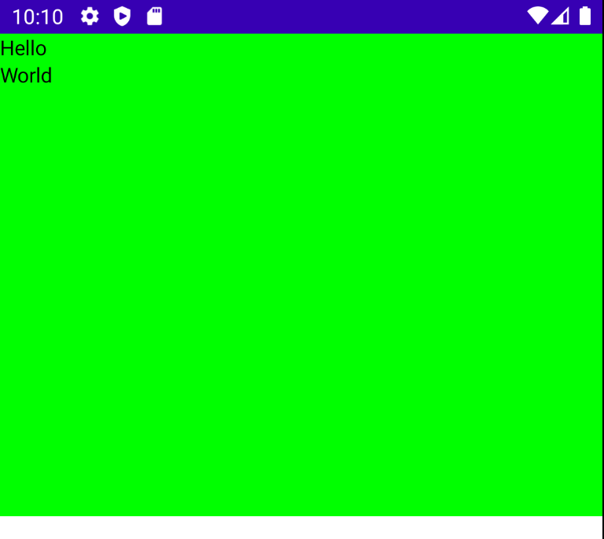
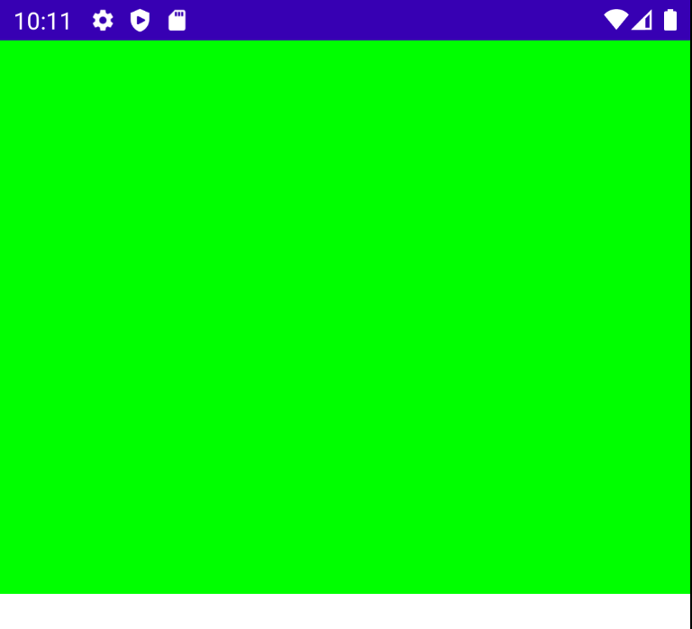
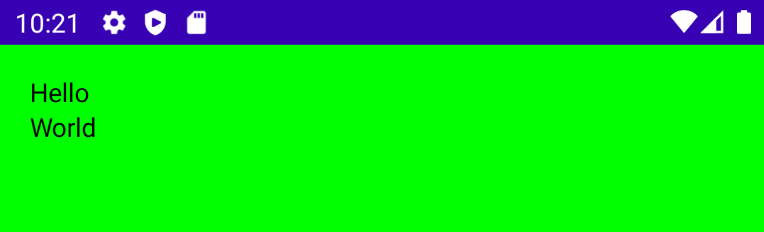
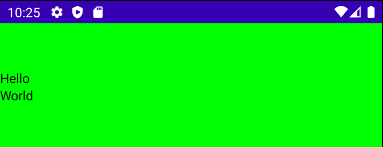
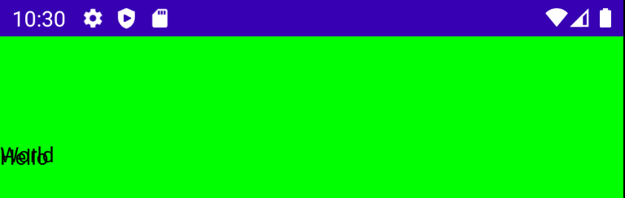
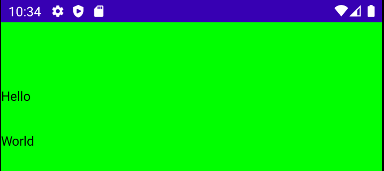
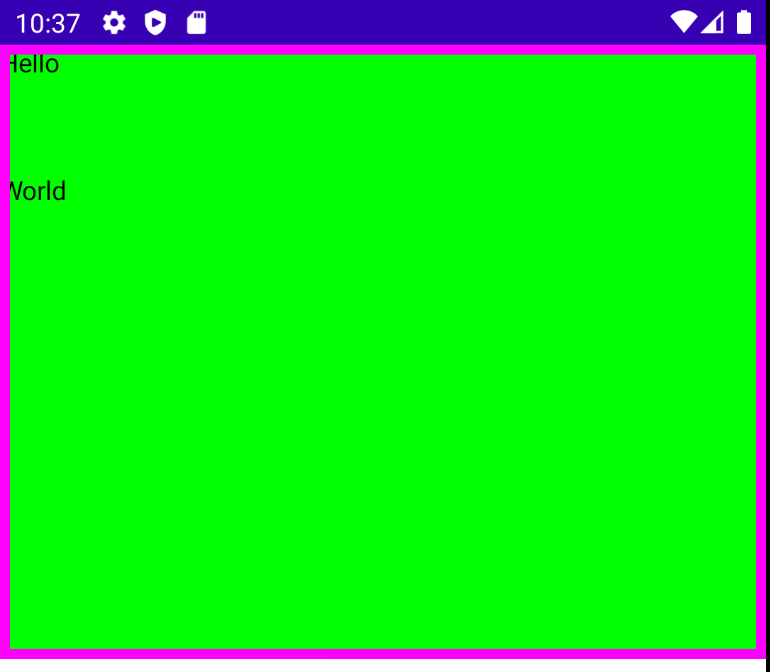
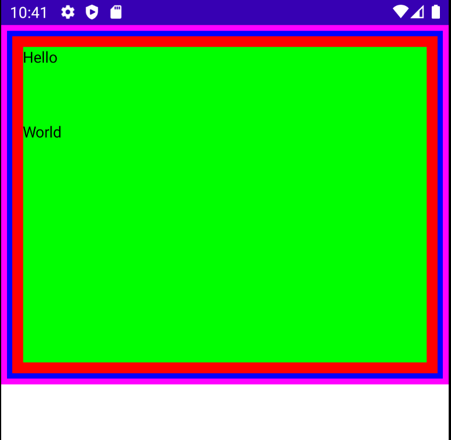
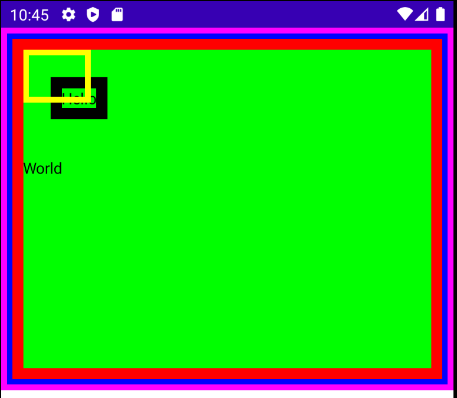

# Modifiers

modifier를 통해 composable의 크기, 사이즈 등을 변경하거나 클릭, 이벤트 등의 상호작용을 처리할 수 있다. 드래그 & 드랍, 줌 등 많은 기능도 지원하고 있다.

## width vs requiredWidth

`.width(600.dp)`를 사용하면 화면에 관계없이 넓이를 600dp로 설정한다. 그러므로 600dp 이하인 화면에서는 화면을 초과하게 된다.

```kotlin
class MainActivity : ComponentActivity() {
    override fun onCreate(savedInstanceState: Bundle?) {
        super.onCreate(savedInstanceState)
        setContent {
            Column(
                modifier = Modifier
                    .background(Color.Green)
                    .fillMaxHeight(0.5f)
                    .width(600.dp)
//                    .requiredWidth(300.dp)
            ) {
                Text("Hello")
                Text("World")
            }
        }
    }
}
```


<div align="center">

</div>

다음과 같이 `.requiredWidth(600.dp)`로 설정한 경우 정확히 설정된 `600.dp` 만큼 설정하게 된다. 중앙에서부터 차지하기 때문에 텍스트들이 왼쪽 바깥으로 나가게 된다.

```kotlin
class MainActivity : ComponentActivity() {
    override fun onCreate(savedInstanceState: Bundle?) {
        super.onCreate(savedInstanceState)
        setContent {
            Column(
                modifier = Modifier
                    .background(Color.Green)
                    .fillMaxHeight(0.5f)
//                    .width(600.dp)
                    .requiredWidth(600.dp)
            ) {
                Text("Hello")
                Text("World")
            }
        }
    }
}
```

<div align="center">

</div>

## Padding

padding은 컨테이너의 내용물을 원하는 값만큼 밀어넣는 것이라고 생각하면 된다. 다음과 같이 16dp로 padding을 설정할 경우 위, 왼쪽으로부터 16dp 떨어져 텍스트가 생성된다.

```kotlin
class MainActivity : ComponentActivity() {
    override fun onCreate(savedInstanceState: Bundle?) {
        super.onCreate(savedInstanceState)
        setContent {
            Column(
                modifier = Modifier
                    .background(Color.Green)
                    .fillMaxHeight(0.5f)
                    .fillMaxWidth()
                    .padding(16.dp)
            ) {
                Text("Hello")
                Text("World")
            }
        }
    }
}
```

<div align="center">

</div>

물론 상하좌우로도 padding을 각각 추가할 수 있다. top으로부터 50dp 떨어지도록 만들어보자.

```kotlin
class MainActivity : ComponentActivity() {
    override fun onCreate(savedInstanceState: Bundle?) {
        super.onCreate(savedInstanceState)
        setContent {
            Column(
                modifier = Modifier
                    .background(Color.Green)
                    .fillMaxHeight(0.5f)
                    .fillMaxWidth()
                    .padding(top = 50.dp)
            ) {
                Text("Hello")
                Text("World")
            }
        }
    }
}
```

<div align="center">

</div>

## Offset

Jetpack Compose는 margin을 가지고 있지 않다. 대신 padding으로 재생성할 수 있다. padding으로 margin을 표현할 수 있다.

margin처럼 요소를 offset으로 설정하지만, 다른 요소들을 밀어내지 않는다. 다음과 같이 작성하면 두 텍스트는 겹치게 된다.

```kotlin
class MainActivity : ComponentActivity() {
    override fun onCreate(savedInstanceState: Bundle?) {
        super.onCreate(savedInstanceState)
        setContent {
            Column(
                modifier = Modifier
                    .background(Color.Green)
                    .fillMaxHeight(0.5f)
                    .fillMaxWidth()
                    .padding(top = 50.dp)
            ) {
                Text("Hello", modifier = Modifier
                    .offset(0.dp, 20.dp))
                Text("World")
            }
        }
    }
}
```

<div align="center">

</div>

## Spacer

이러한 겹침 현상을 해결하기 위해 `Spacer`를 사용한다. Spacer는 설정한 width 또는 height를 가진 빈 composable이다.

```kotlin
class MainActivity : ComponentActivity() {
    override fun onCreate(savedInstanceState: Bundle?) {
        super.onCreate(savedInstanceState)
        setContent {
            Column(
                modifier = Modifier
                    .background(Color.Green)
                    .fillMaxHeight(0.5f)
                    .fillMaxWidth()
                    .padding(top = 50.dp)
            ) {
                Text("Hello", modifier = Modifier
                    .offset(0.dp, 20.dp))
                // empty composable that has hegiht of 50dp
                Spacer(modifier = Modifier.height(50.dp))
                Text("World")
            }
        }
    }
}
```

<div align="center">

</div>

## Border

border는 테두리를 그려주며, 다음과 같이 5dp 넓이의 border를 생성한다.

```kotlin
class MainActivity : ComponentActivity() {
    override fun onCreate(savedInstanceState: Bundle?) {
        super.onCreate(savedInstanceState)
        setContent {
            Column(
                modifier = Modifier
                    .background(Color.Green)
                    .fillMaxHeight(0.5f)
                    .fillMaxWidth()
                    .border(5.dp, Color.Magenta)
            ) {
                Text("Hello")
                Spacer(modifier = Modifier.height(50.dp))
                Text("World")
            }
        }
    }
}
```

<div align="center">

</div>

modifier는 순차적으로 적용된다. 따라서 동일한 modifier를 여러번 적용할 경우 다른 결과를 초래한다. 즉, 다음과 같이 설정하면 컨테이너에 3개의 border가 적용되고 그 안에 텍스트가 있는 것을 확인할 수 있다.

```kotlin
class MainActivity : ComponentActivity() {
    override fun onCreate(savedInstanceState: Bundle?) {
        super.onCreate(savedInstanceState)
        setContent {
            Column(
                modifier = Modifier
                    .background(Color.Green)
                    .fillMaxHeight(0.5f)
                    .fillMaxWidth()
                    .border(5.dp, Color.Magenta)
                    .padding(5.dp)
                    .border(5.dp, Color.Blue)
                    .padding(5.dp)
                    .border(10.dp, Color.Red)
                    .padding(10.dp)
            ) {
                Text("Hello")
                Spacer(modifier = Modifier.height(50.dp))
                Text("World")
            }
        }
    }
}
```

<div align="center">

</div>

다음과 같이 `Text`에도 border, padding을 적용해 창의적인 결과를 만들어낼 수 있다.

```kotlin
class MainActivity : ComponentActivity() {
    override fun onCreate(savedInstanceState: Bundle?) {
        super.onCreate(savedInstanceState)
        setContent {
            Column(
                modifier = Modifier
                    .background(Color.Green)
                    .fillMaxHeight(0.5f)
                    .fillMaxWidth()
                    .border(5.dp, Color.Magenta)
                    .padding(5.dp)
                    .border(5.dp, Color.Blue)
                    .padding(5.dp)
                    .border(10.dp, Color.Red)
                    .padding(10.dp)
            ) {
                Text("Hello", modifier = Modifier
                    .border(5.dp, Color.Yellow)
                    .padding(5.dp)
                    .offset(20.dp, 20.dp)
                    .border(10.dp, Color.Black)
                    .padding(10.dp))
                Spacer(modifier = Modifier.height(50.dp))
                Text("World")
            }
        }
    }
}
```

<div align="center">

</div>

## Click

다음과 같이 `Modifier.clickable`를 선언하여 상호작용하도록 만들 수 있다.

```kotlin
class MainActivity : ComponentActivity() {
    override fun onCreate(savedInstanceState: Bundle?) {
        super.onCreate(savedInstanceState)
        setContent {
            Column(
                modifier = Modifier
                    .background(Color.Green)
                    .fillMaxHeight(0.5f)
                    .fillMaxWidth()
                    .border(5.dp, Color.Magenta)
                    .padding(5.dp)
                    .border(5.dp, Color.Blue)
                    .padding(5.dp)
                    .border(10.dp, Color.Red)
                    .padding(10.dp)
            ) {
                Text("Hello", modifier = Modifier.clickable {
                    
                })
                Spacer(modifier = Modifier.height(50.dp))
                Text("World")
            }
        }
    }
}
```

## References

* [Modifiers - Android Jetpack Compose - Part 3](https://www.youtube.com/watch?v=XCuC_p3E0qo&list=PLQkwcJG4YTCSpJ2NLhDTHhi6XBNfk9WiC&index=3)