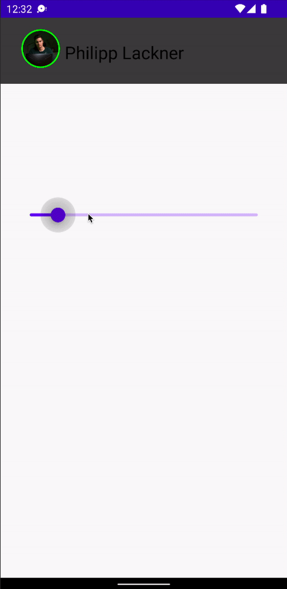
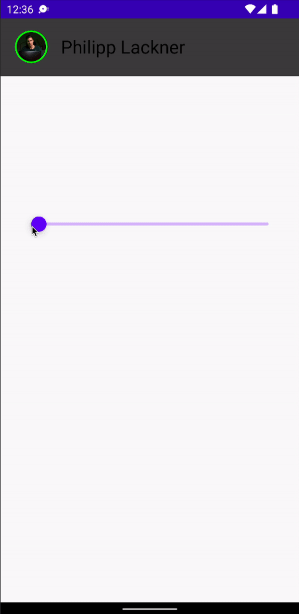
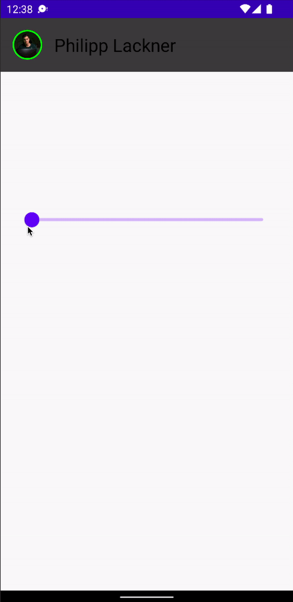
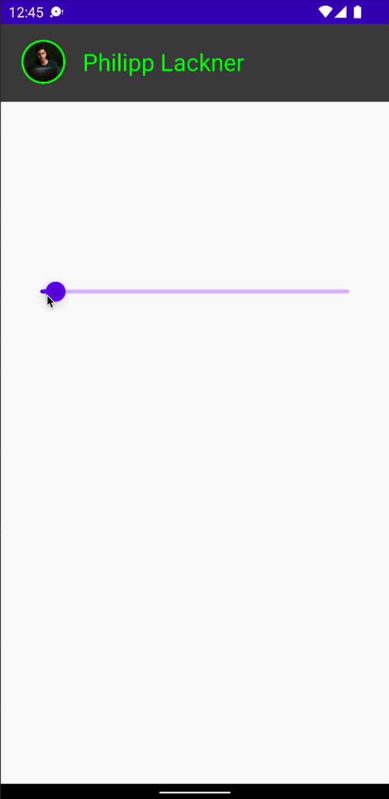

# Build Complex Animations With MotionLayout

Jetpack Compose에서 모션 레이아웃이 어떻게 동작하는지 알아보자. 우선 다음 디펜던시를 추가하자. 이 디펜던시는 모션 레이아웃을 포함한다. 모션 레이아웃은 결국 Constraint 레이아웃이다.

```groovy
implementation "androidx.constraintlayout:constraintlayout-compose:1.0.0"
```

start와 end state를 설정해야 한다.

Constraints sets를 설정해주기 위해 res에 raw 디렉토리를 생성하고 motion_scene.json5 파일을 생성한다.

```json5
{
  ConstraintSets: {
    start: {
      profile_pic: {
        width: 40,
        height: 40,
        start: ['parent', 'start', 16],
        top: ['parent', 'top', 16]
      },
      username: {
        top: ['profile_pic', 'top'],
        bottom: ['profile_pic', 'bottom'],
        start: ['profile_pic', 'end', 16]
      },
      box: {
        width: 'spread',
        height: 'spread',
        start: ['parent', 'start'],
        end: ['parent', 'end'],
        top: ['parent', 'top'],
        bottom: ['parent', 'bottom', -16],
      }
    },
    end: {
      profile_pic: {
        width: 150,
        height: 150,
        start: ['parent', 'start'],
        end: ['parent', 'end'],
        top: ['parent', 'top', 16],
      },
      username: {
        top: ['profile_pic', 'bottom', 16],
        end: ['parent', 'end'],
        start: ['parent', 'start']
      },
      box: {
        width: 'spread',
        height: 'spread',
        start: ['parent', 'start'],
        end: ['parent', 'end'],
        top: ['parent', 'top'],
        bottom: ['parent', 'bottom', -16],
      }
    }
  },
  Transitions: {
    default: {
      from: 'start',
      to: 'end',
      pathMotionArc: 'startHorizontal',
      KeyFrames: {
        KeyAttributes: [
          {
            target: ['profile_pic'],
            frames: [0, 100]
          }
        ]
      }
    }
  }
}
```

MainActivity를 다음과 같이 작성해준다.

```kotlin
class MainActivity : ComponentActivity() {
    override fun onCreate(savedInstanceState: Bundle?) {
        super.onCreate(savedInstanceState)
        setContent {
            Column {
                var progress by remember {
                    mutableStateOf(0f)
                }
                ProfileHeader(progress = progress)
                Spacer(modifier = Modifier.height(32.dp))
                Slider(
                    value = progress, onValueChange = {
                        progress = it
                    },
                    modifier = Modifier.padding(horizontal = 32.dp)
                )
            }
        }
    }
}

@OptIn(ExperimentalMotionApi::class)
@Composable
fun ProfileHeader(progress: Float) {
    val context = LocalContext.current
    val motionScene = remember {
        context.resources
            .openRawResource(R.raw.motion_scene)
            .readBytes()
            .decodeToString()
    }
    MotionLayout(
        motionScene = MotionScene(content = motionScene),
        progress = progress,
        modifier = Modifier.fillMaxWidth()
    ) {
        Box(
            modifier = Modifier
                .fillMaxWidth()
                .background(Color.DarkGray)
                .layoutId("box")
        )
        Image(
            painter = painterResource(id = R.drawable.picture),
            contentDescription = null,
            modifier = Modifier
                .clip(CircleShape)
                .border(
                    width = 2.dp,
                    color = Color.Green,
                    shape = CircleShape
                )
                .layoutId("profile_pic")
        )
        Text(
            text = "Philipp Lackner",
            fontSize = 24.sp,
            modifier = Modifier.layoutId("username"),
        )
    }
}
```

<div align="center">

</div>

프로필과 이름이 살짝 겹치는 이슈가 있다. 이를 해결하기 위해 KeyFrame을 사용한다. `username` 타겟을 지정하고 50% 프레임에서 120까지 이동하도록 한다. 그럼 더 이상 겹치지 않는 것을 확인할 수 있다.

```json5
{
  // ...
  Transitions: {
    default: {
      from: 'start',
      to: 'end',
      pathMotionArc: 'startHorizontal',
      KeyFrames: {
        KeyAttributes: [
          {
            target: ['profile_pic'],
            frames: [0, 100]
          },
          {
            target: ['username'],
            frames: [0, 50, 100],
            translationX: [0, 120, 0]
          }
        ]
      }
    }
  }
}
```

<div align="center">

</div>

`rotationZ`를 설정하면 다음과 같은 모션도 만들 수 있다.

```json5
{
  // ...
  Transitions: {
    default: {
      from: 'start',
      to: 'end',
      pathMotionArc: 'startHorizontal',
      KeyFrames: {
        KeyAttributes: [
          {
            target: ['profile_pic'],
            frames: [0, 100]
          },
          {
            target: ['username'],
            frames: [0, 50, 100],
            translationX: [0, 120, 0],
            rotationZ: [0, 180, 0]
          }
        ]
      }
    }
  }
}
```

<div align="center">

</div>

이제 색상을 적용해야 하는데 `custom` 속성을 이용해 적용할 수 있다.

```json5
{
  ConstraintSets: {
    start: {
      profile_pic: {
        width: 40,
        height: 40,
        start: ['parent', 'start', 16],
        top: ['parent', 'top', 16],
        custom: {
          background: '#08FF04'
        }
      },
      // ...
    },
    end: {
      profile_pic: {
        width: 150,
        height: 150,
        start: ['parent', 'start'],
        end: ['parent', 'end'],
        top: ['parent', 'top', 16],
        custom: {
          background: '#FFFFFF'
        }
      },
      // ...
    }
  },
  // ...
}
```

텍스트는 profile_pic과 동일한 백그라운드를 사용하기 때문에 profile_pic 하나의 백그라운드만 지정한다.

```kotlin
@OptIn(ExperimentalMotionApi::class)
@Composable
fun ProfileHeader(progress: Float) {
    // ...
    MotionLayout(
        motionScene = MotionScene(content = motionScene),
        progress = progress,
        modifier = Modifier.fillMaxWidth()
    ) {
        // get state
        val properties = motionProperties(id = "profile_pic")
        Box(
            modifier = Modifier
                .fillMaxWidth()
                .background(Color.DarkGray)
                .layoutId("box")
        )
        Image(
            painter = painterResource(id = R.drawable.picture),
            contentDescription = null,
            modifier = Modifier
                .clip(CircleShape)
                .border(
                    width = 2.dp,
                    color = properties.value.color("background"),
                    shape = CircleShape
                )
                .layoutId("profile_pic")
        )
        Text(
            text = "Philipp Lackner",
            fontSize = 24.sp,
            modifier = Modifier.layoutId("username"),
            color = properties.value.color("background")
        )
    }
}
```

<div align="center">

</div>

## References

* [Build Complex Animations With MotionLayout in Jetpack Compose - Android Studio Tutorial](https://www.youtube.com/watch?v=1g3SPJxk4wc&t=15s)