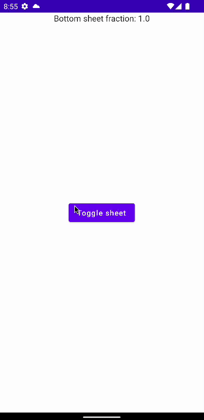

# How to Create a Bottom Sheet

Bottom Sheet는 Bottom에서 위로 드래그했을 때 나타나는 UI이다. 이를 Jetpack Compose를 통해 구현해본다.

`MainActivity`에 `BottomSheetScaffold`를 통해 Bottom Sheet를 구현할 수 있다.

```kotlin
@ExperimentalMaterialApi
class MainActivity : ComponentActivity() {
    override fun onCreate(savedInstanceState: Bundle?) {
        super.onCreate(savedInstanceState)
        setContent {
            BottomSheetComposeTheme {
                // BottomSheet를 제어하기 위한 BottomSheetState 선언
                val sheetState = rememberBottomSheetState(
                        initialValue = BottomSheetValue.Collapsed,
                        animationSpec = spring(
                                dampingRatio = Spring.DampingRatioHighBouncy
                        )
                )
                val scaffoldState = rememberBottomSheetScaffoldState(
                        bottomSheetState = sheetState
                )
                val scope = rememberCoroutineScope()
                BottomSheetScaffold(
                        scaffoldState = scaffoldState,
                        sheetContent = {
                            Box(
                                    modifier = Modifier
                                            .fillMaxWidth()
                                            .height(300.dp),
                                    contentAlignment = Alignment.Center
                            ) {
                                Text(
                                        text = "Bottom sheet",
                                        fontSize = 60.sp
                                )
                            }
                        },
                        sheetBackgroundColor = Color.Green
                ) {
                    Box(
                            modifier = Modifier
                                    .fillMaxSize(),
                            contentAlignment = Alignment.Center
                    ) {
                        Button(
                                onClick = {
                                    scope.launch {
                                        if (sheetState.isCollapsed) {
                                            sheetState.expand()
                                        } else {
                                            sheetState.collapse()
                                        }
                                    }
                                }
                        ) {
                            Text(
                                    text = "Toggle sheet"
                            )
                        }
                        Text(
                                text = "Bottom sheet fraction: ${sheetState.progress.fraction}",
                                modifier = Modifier.align(Alignment.TopCenter)
                        )
                    }
                }
            }
        }
    }
}
```

<div align="center">

</div>

## References

* [How to Create a Bottom Sheet With Jetpack Compose - Android Studio Tutorial](https://www.youtube.com/watch?v=6wnd4WF9V5E)
