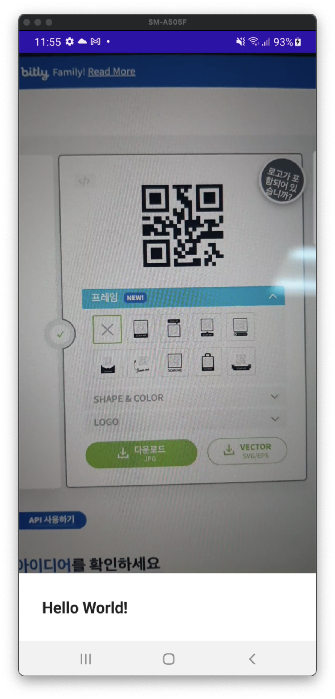

# How to Make a QR Code Scanner in Jetpack Compose

QR Code Scanner를 만들어보자. [여기서](https://github.com/philipplackner/QrCodeScannerCompose) initial 프로젝트를 클론한다.

root 패키지에 `QrCodeAnalyzer` 클래스를 생성하고 작성한다.

```kotlin
class QrCodeAnalyzer(
    private val onQrCodeScanned: (String) -> Unit
): ImageAnalysis.Analyzer {

    // QR 코드를 스캔하기 위한 3개의 포맷
    private val supportedImageFormats = listOf(
        ImageFormat.YUV_420_888,
        ImageFormat.YUV_422_888,
        ImageFormat.YUV_444_888,
    )

    override fun analyze(image: ImageProxy) {
        if (image.format in supportedImageFormats) {
            val bytes = image.planes.first().buffer.toByteArray()
            val source = PlanarYUVLuminanceSource(
                bytes,
                image.width,
                image.height,
                0,
                0,
                image.width,
                image.height,
                false
            )
            val binaryBmp = BinaryBitmap(HybridBinarizer(source))
            try {
                val result = MultiFormatReader().apply {
                    // we can define a map of all of our supported types of codes we would like to scan
                    setHints(
                        mapOf(
                            DecodeHintType.POSSIBLE_FORMATS to arrayListOf(
                                BarcodeFormat.QR_CODE
                            )
                        )
                    )
                }.decode(binaryBmp)
                onQrCodeScanned(result.text)
            } catch (e: Exception) {
                e.printStackTrace()
            } finally {
                image.close()
            }

        }
    }

    private fun ByteBuffer.toByteArray(): ByteArray {
        rewind() // position to zero
        return ByteArray(remaining()).also {
            get(it)
        }
    }
}
```

카메라 권한이 필요하므로 Manifest에 해당 권한을 추가한다.

`MainActivity`를 다음과 같이 구현해준다.

```kotlin
class MainActivity : ComponentActivity() {
    override fun onCreate(savedInstanceState: Bundle?) {
        super.onCreate(savedInstanceState)
        setContent {
            QrCodeScannerComposeTheme {
                var code by remember {
                    mutableStateOf("")
                }
                val context = LocalContext.current
                val lifecycleOwner = LocalLifecycleOwner.current
                val cameraProviderFuture = remember {
                    ProcessCameraProvider.getInstance(context)
                }
                var hasCameraPermission by remember {
                    mutableStateOf(
                        ContextCompat.checkSelfPermission(
                            context,
                            Manifest.permission.CAMERA
                        ) == PackageManager.PERMISSION_GRANTED
                    )
                }
                val launcher = rememberLauncherForActivityResult(
                    contract = ActivityResultContracts.RequestPermission(),
                    onResult = { granted ->
                        hasCameraPermission = granted
                    }
                )
                LaunchedEffect(key1 = true) {
                    launcher.launch(Manifest.permission.CAMERA)
                }
                Column(
                    modifier = Modifier.fillMaxSize()
                ) {
                    if (hasCameraPermission) {
                        AndroidView(
                            factory = { context ->
                                val previewView = PreviewView(context) // composable에 없으므로 AndroidView에서 사용
                                val preview = Preview.Builder().build()
                                val selector = CameraSelector.Builder()
                                    .requireLensFacing(CameraSelector.LENS_FACING_BACK)
                                    .build()
                                preview.setSurfaceProvider(previewView.surfaceProvider) // display in previce
                                val imageAnalysis = ImageAnalysis.Builder()
                                    .setTargetResolution(
                                        Size(
                                            previewView.width, previewView.height
                                        )
                                    )
                                    .setBackpressureStrategy(STRATEGY_KEEP_ONLY_LATEST) // 만약 화면이 60프레임인데 Analyzer가 30프레임 밖에 지원되지 않을 경우의 전략
                                    .build()
                                imageAnalysis.setAnalyzer(
                                    ContextCompat.getMainExecutor(context),
                                    QrCodeAnalyzer { result ->
                                        code = result
                                    }
                                )
                                try {
                                    cameraProviderFuture.get().bindToLifecycle(
                                        lifecycleOwner,
                                        selector,
                                        preview,
                                        imageAnalysis
                                    )
                                } catch (e: Exception) {

                                }
                                previewView
                            },
                            modifier = Modifier.weight(1f)
                        )
                        Text(
                            text = code,
                            fontSize = 20.sp,
                            fontWeight = FontWeight.Bold,
                            modifier = Modifier
                                .fillMaxWidth()
                                .padding(32.dp)
                        )
                    }
                }
            }
        }
    }
}
```

QR 코드 생성기를 이용해 생성한 후 카메라로 확인하면 QR Code를 읽어오는 것을 확인할 수 있다.

<div align="center">

</div>

## References

* [How to Make a QR Code Scanner in Jetpack Compose - Android Studio Tutorial](https://www.youtube.com/watch?v=asl1mFtkMkc&list=WL&index=4&t=3s)