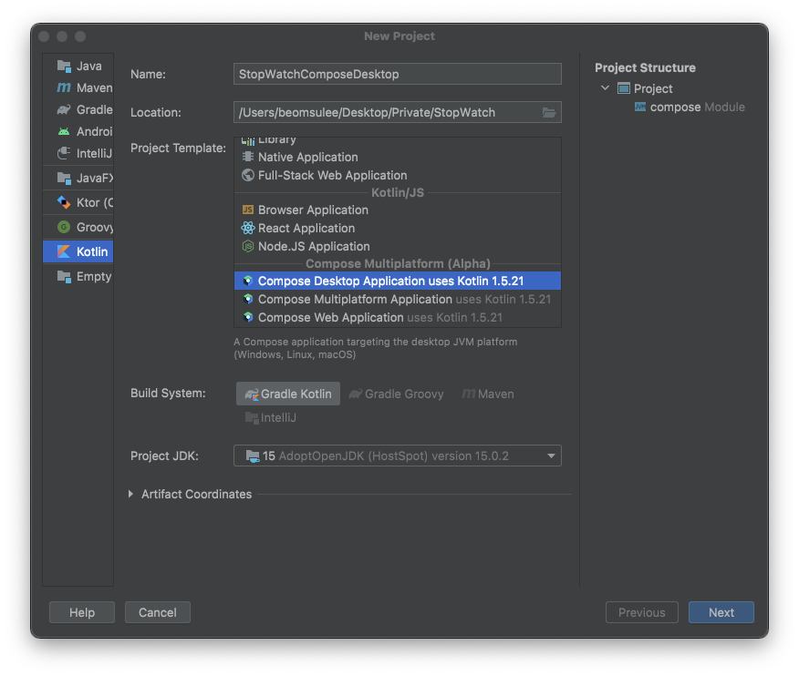
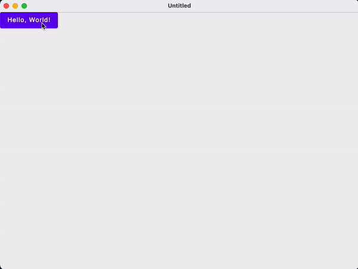
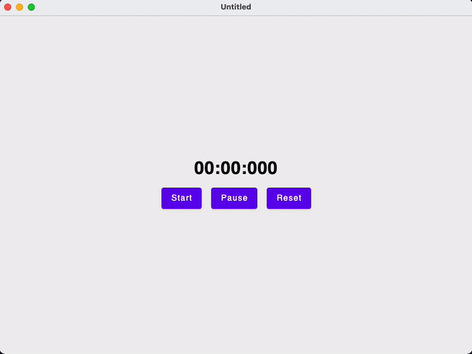

# How to Make a Stop Watch With Compose Desktop

Jetpack Compose를 통해 데스크톱 스톱워치 앱을 만들어보자.

아래와 같이 Compose Desktop Application 템플릿으로 프로젝트를 생성한다.

<div align="center">

</div>

`main.kt` 파일을 보면 entry point 인 `main()` 함수가 있다.

```kotlin
@Composable
@Preview
fun App() {
    var text by remember { mutableStateOf("Hello, World!") }

    DesktopMaterialTheme {
        Button(onClick = {
            text = "Hello, Desktop!"
        }) {
            Text(text)
        }
    }
}

fun main() = application {
    Window(onCloseRequest = ::exitApplication) {
        App()
    }
}
```

이를 실행하면 다음과 같이 동작하게 된다.

<div align="center">

</div>

만약 `@Preview`를 이용해 미리보기를 사용하고 싶다면 Compose Multiplatform IDE Support 플러그인을 추가하면 된다. `@Preview` 어노테이션이 붙은 함수 왼쪽의 Compose 아이콘을 클릭하면 미리보기를 볼 수 있다.

<div align="center">

</div>

단축키를 통해 Preview를 새로고침 하려면 Preferences의 Keymap으로 이동해 Compose Multiplatform IDE Support의 RefreshOrRunPreviewAction을 지정해주면 된다.

본격적으로 구현하기 위해 `StopWatch` 클래스를 생성한다.

```kotlin
class StopWatch {

    var formattedTime by mutableStateOf("00:00:000")
    private var coroutineScope = CoroutineScope(Dispatchers.Main)
    private var isActive = false

    private var timeMillis = 0L
    private var lastTimestamp = 0L

    fun start() {
        if (isActive) return

        coroutineScope.launch {
            lastTimestamp = System.currentTimeMillis()
            this@StopWatch.isActive = true // 코루틴 자체 isActive 변수가 있기 때문에 this 붙여준다.
            while (this@StopWatch.isActive) {
                delay(10L)
                timeMillis += System.currentTimeMillis() - lastTimestamp
                lastTimestamp = System.currentTimeMillis()
                formattedTime = formatTime(timeMillis)
            }
        }
    }

    fun pause() {
        isActive = false
    }

    fun reset() {
        coroutineScope.cancel()
        coroutineScope = CoroutineScope(Dispatchers.Main) // 취소된 경우 재사용할 수 없으므로 코루틴스코프 재할당
        timeMillis = 0L
        lastTimestamp = 0L
        formattedTime = "00:00:000"
        isActive = false
    }

    private fun formatTime(timeMillis: Long): String {
        val localDateTime = LocalDateTime.ofInstant(
            Instant.ofEpochMilli(timeMillis),
            ZoneId.systemDefault()
        )
        val formatter = DateTimeFormatter.ofPattern(
            "mm:ss:SSS",
            Locale.getDefault()
        )
        return localDateTime.format(formatter)
    }
}
```

이를 UI에 보여주기 위한 `StopWatchDisplay` composable을 생성한다.

```kotlin
@Composable
fun StopWatchDisplay(
    formattedTime: String,
    onStartClick: () -> Unit,
    onPauseClick: () -> Unit,
    onResetClick: () -> Unit,
    modifier: Modifier = Modifier
) {
    Column(
        modifier = modifier,
        verticalArrangement = Arrangement.Center,
        horizontalAlignment = Alignment.CenterHorizontally
    ) {
        Text(
            text = formattedTime,
            fontWeight = FontWeight.Bold,
            fontSize = 30.sp,
            color = Color.Black
        )
        Spacer(Modifier.height(16.dp))
        Row(
            horizontalArrangement = Arrangement.Center,
            verticalAlignment = Alignment.CenterVertically,
            modifier = Modifier.fillMaxWidth()
        ) {
            Button(onStartClick) {
                Text("Start")
            }
            Spacer(Modifier.width(16.dp))
            Button(onPauseClick) {
                Text("Pause")
            }
            Spacer(Modifier.width(16.dp))
            Button(onResetClick) {
                Text("Reset")
            }
        }
    }
}
```

이제 `Main.kt` 파일에 다음과 같이 구현해준다.

```kotlin
@Composable
@Preview
fun App() {
    DesktopMaterialTheme {
        Box(
            contentAlignment = Alignment.Center,
            modifier = Modifier.fillMaxSize()
        ) {
            val stopWatch = remember { StopWatch() }
            StopWatchDisplay(
                formattedTime = stopWatch.formattedTime,
                onStartClick = stopWatch::start,
                onPauseClick = stopWatch::pause,
                onResetClick = stopWatch::reset,
            )
        }
    }
}

fun main() = application {
    Window(onCloseRequest = ::exitApplication) {
        App()
    }
}
```

<div align="center">

</div>

## References

* [How to Make a Stop Watch With Compose Desktop](https://www.youtube.com/watch?v=Iw4qFryus4Q)