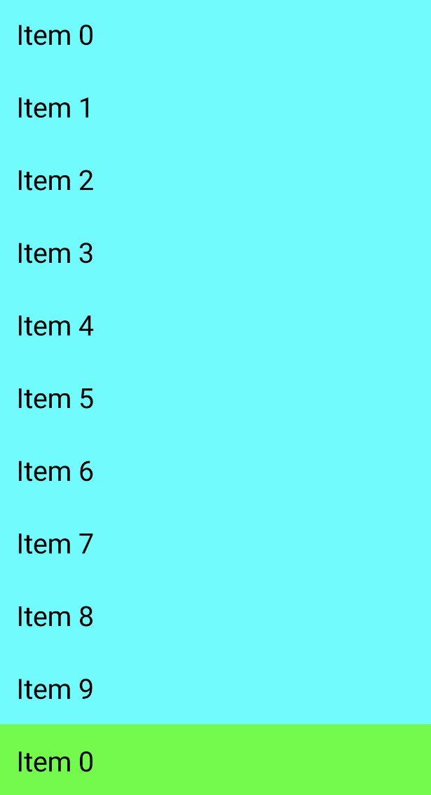
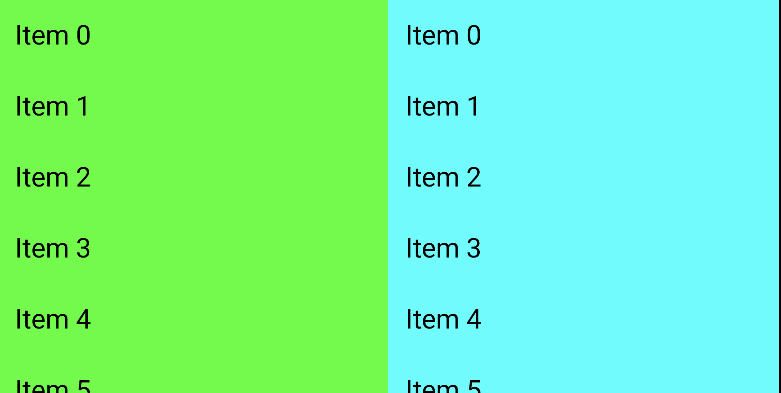

# How to Support All Screen Sizes

모든 스크린 사이즈에 맞게 이쁘게 표시되는 방법을 알아보자.

다음과 같이 `LazyColumn`에 타입이 다른 2개의 리스트가 있다고 가정하자.

```kotlin
class MainActivity : ComponentActivity() {

    override fun onCreate(savedInstanceState: Bundle?) {
        super.onCreate(savedInstanceState)
        setContent {
            LazyColumn(modifier = Modifier.fillMaxSize()) {
                // List 1
                items(10) {
                    Text(
                        text = "Item ${it}",
                        fontSize = 25.sp,
                        modifier = Modifier
                            .fillMaxWidth()
                            .background(Color.Cyan)
                            .padding(16.dp)
                    )
                }
                // List 2
                items(10) {
                    Text(
                        text = "Item ${it}",
                        fontSize = 25.sp,
                        modifier = Modifier
                            .fillMaxWidth()
                            .background(Color.Green)
                            .padding(16.dp)
                    )
                }
            }
        }
    }
}
```

보통 600dp 미만은 폰 스크린과 같은 compact screen이다. 600dp ~ 840dp는 전형적인 조그만 태블릿 스크린이며, 840dp 이상은 큰 태블릿 화면이다. 이는 안드로이드 문서에 나와있다.

`rememberWindowInfo.kt` 파일을 생성하고 다음과 같이 작성한다.

```kotlin
@Composable
fun rememberWindowInfo(): WindowInfo {
    val configuration = LocalConfiguration.current
    return WindowInfo(
        screenWidthInfo = when {
            configuration.screenWidthDp < 600 -> WindowInfo.WindowType.Compact
            configuration.screenWidthDp < 840 -> WindowInfo.WindowType.Medium
            else -> WindowInfo.WindowType.Expanded
        },
        screenHeightInfo = when {
            configuration.screenHeightDp < 480 -> WindowInfo.WindowType.Compact
            configuration.screenHeightDp < 900 -> WindowInfo.WindowType.Medium
            else -> WindowInfo.WindowType.Expanded
        },
        screenWidth = configuration.screenWidthDp.dp,
        screenHeight = configuration.screenHeightDp.dp
    )
}

data class WindowInfo(
    val screenWidthInfo: WindowType,
    val screenHeightInfo: WindowType,
    val screenWidth: Dp,
    val screenHeight: Dp
) {
    sealed class WindowType {
        object Compact: WindowType()
        object Medium: WindowType()
        object Expanded: WindowType()
    }
}
```

`rememberWindowInfo()`를 통해 윈도우 정보를 가져와 화면에 맞게 구성할 수 있다.

```kotlin
class MainActivity : ComponentActivity() {

    override fun onCreate(savedInstanceState: Bundle?) {
        super.onCreate(savedInstanceState)
        setContent {
            val windowInfo = rememberWindowInfo()
            if (windowInfo.screenWidthInfo is WindowInfo.WindowType.Compact) {
                LazyColumn(modifier = Modifier.fillMaxSize()) {
                    // List 1
                    items(10) {
                        Text(
                            text = "Item ${it}",
                            fontSize = 25.sp,
                            modifier = Modifier
                                .fillMaxWidth()
                                .background(Color.Cyan)
                                .padding(16.dp)
                        )
                    }
                    // List 2
                    items(10) {
                        Text(
                            text = "Item ${it}",
                            fontSize = 25.sp,
                            modifier = Modifier
                                .fillMaxWidth()
                                .background(Color.Green)
                                .padding(16.dp)
                        )
                    }
                }
            } else {
                Row(
                    modifier = Modifier.fillMaxWidth()
                ) {
                    LazyColumn(
                        modifier = Modifier.weight(1f)
                    )
                    {
                        // List 1
                        items(10) {
                            Text(
                                text = "Item ${it}",
                                fontSize = 25.sp,
                                modifier = Modifier
                                    .fillMaxWidth()
                                    .background(Color.Green)
                                    .padding(16.dp)
                            )
                        }
                    }
                    LazyColumn(
                        modifier = Modifier.weight(1f)
                    ) {
                        // List 1
                        items(10) {
                            Text(
                                text = "Item ${it}",
                                fontSize = 25.sp,
                                modifier = Modifier
                                    .fillMaxWidth()
                                    .background(Color.Cyan)
                                    .padding(16.dp)
                            )
                        }
                    }
                }
            }
        }
    }
}
```

<div align="center">


</div>

## References

* [How to Support All Screen Sizes in Jetpack Compose](https://www.youtube.com/watch?v=HmXgVBys7BU)