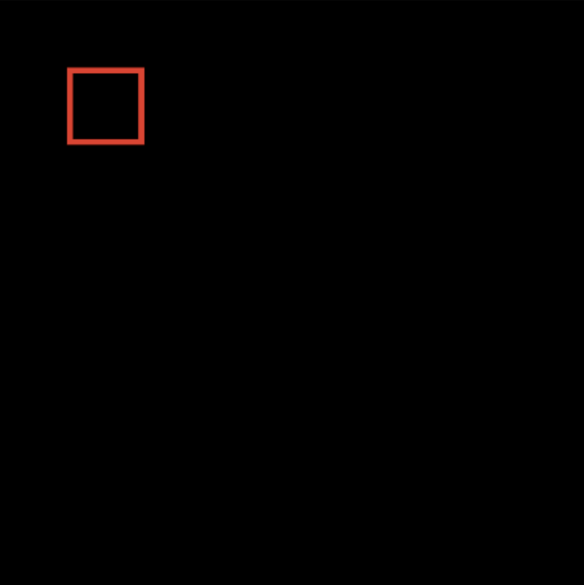
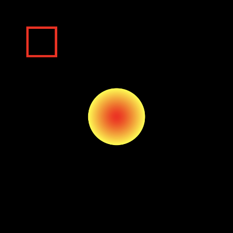
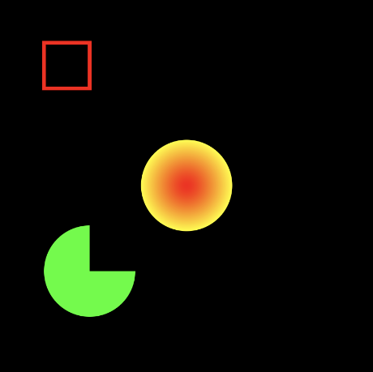
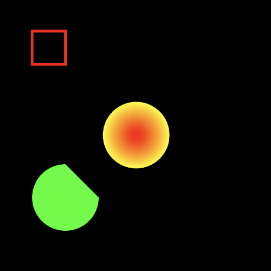
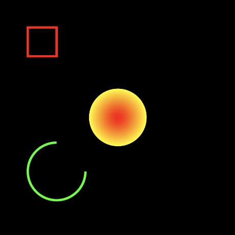
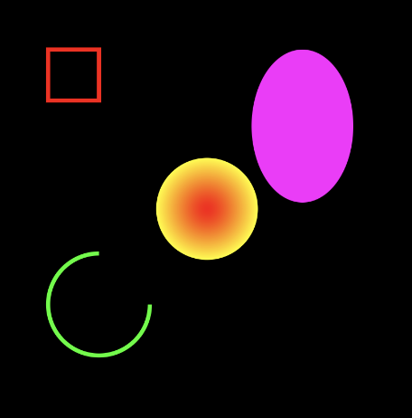
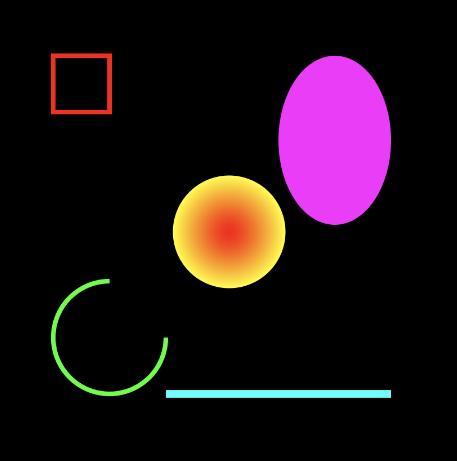

# Basic shapes

Jetpack Compose에서 Canvas에 대한 기본적인 부분들을 알아보자.

Canvas는 특정 구역에 그려야 하기 때문에 modifier가 필수적이다. DrawScope는 `drawline`, `drawCircle` 등 원하는 모형 그리기가 가능한 스코프인데, `Canvas` 블록과
modifier의 `.drawBehind` 블록에 나타난다. `Canvas`의 경우 오직 그리기만을 할 때 사용하고 `.drawBehind`의 경우는 특정 모양을 그려야할 때 사용한다.

`DrawScope`는 `center`라는 변수를 가지는데 이는 `Canvas`의 중앙을 나타내는 `Offset` 객체이다. 또한 `size` 변수도 가지고 있는데 `Canvas`의 `width`, `height`를
나타내는 `Size` 객체이다.

다음과 같은 코드를 작성하고 결과를 확인해보자.

```kotlin
@ExperimentalPermissionsApi
class MainActivity : ComponentActivity() {

    override fun onCreate(savedInstanceState: Bundle?) {
        super.onCreate(savedInstanceState)
        setContent {
            MyCanvas()
        }
    }
}

@Composable
fun MyCanvas() {
    Canvas(
        modifier = Modifier
            .padding(20.dp)
            .size(300.dp)
    ) {
        drawRect(
            color = Color.Black,
            size = size
        )
    }
}
```

<div align="center">

</div>

정사각형 하나를 추가하고 다시 실행해보자.

```kotlin
@Composable
fun MyCanvas() {
    Canvas(
        modifier = Modifier
            .padding(20.dp)
            .size(300.dp)
    ) {
        drawRect(
            color = Color.Black,
            size = size
        )
        drawRect(
            color = Color.Red,
            topLeft = Offset(100f, 100f),
            size = Size(100f, 100f),
            style = Stroke(
                width = 3.dp.toPx()
            )
        )
    }
}
```

<div align="center">

</div>

중앙에 원을 그려보자.

```kotlin
@Composable
fun MyCanvas() {
    Canvas(
        modifier = Modifier
            .padding(20.dp)
            .size(300.dp)
    ) {
        // ...
        drawCircle(
            brush = Brush.radialGradient(
                colors = listOf(Color.Red, Color.Yellow),
                center = center,
                radius = 100f
            ),
            radius = 100f,
            center = center
        )
    }
}
```

<div align="center">

</div>

다음은 원 호를 그려보자.

```kotlin
@Composable
fun MyCanvas() {
    Canvas(
        modifier = Modifier
            .padding(20.dp)
            .size(300.dp)
    ) {
        // ...
        drawArc(
            color = Color.Green,
            startAngle = 0f,
            sweepAngle = 270f,
            useCenter = true,
            topLeft = Offset(100f, 500f),
            size = Size(200f, 200f)
        )
    }
}
```

<div align="center">

</div>

`useCenter`를 `false`로 변경하면 다음과 같이 그려진다. 나머지 부분이 모두 채워지게 된다.

<div align="center">

</div>

style을 `Stroke`로 해서 사용하면 유용하게 사용될 수 있다.

```kotlin
@Composable
fun MyCanvas() {
    Canvas(
        modifier = Modifier
            .padding(20.dp)
            .size(300.dp)
    ) {
        // ...
        drawArc(
            color = Color.Green,
            startAngle = 0f,
            sweepAngle = 270f,
            useCenter = false,
            topLeft = Offset(100f, 500f),
            size = Size(200f, 200f),
            style = Stroke(width = 3.dp.toPx())
        )
    }
}
```

<div align="center">

</div>

다음은 타원을 그려보자.

```kotlin
@Composable
fun MyCanvas() {
    Canvas(
        modifier = Modifier
            .padding(20.dp)
            .size(300.dp)
    ) {
        //  ...
        drawOval(
            color = Color.Magenta,
            topLeft = Offset(500f, 100f),
            size = Size(200f, 300f)
        )
    }
}
```

<div align="center">

</div>

이번엔 선을 그려보자.

```kotlin
@Composable
fun MyCanvas() {
    Canvas(
        modifier = Modifier
            .padding(20.dp)
            .size(300.dp)
    ) {
        // ...
        drawLine(
            color = Color.Cyan,
            start = Offset(300f, 700f),
            end = Offset(700f, 700f),
            strokeWidth = 5.dp.toPx()
        )
    }
}
```

<div align="center">

</div>
