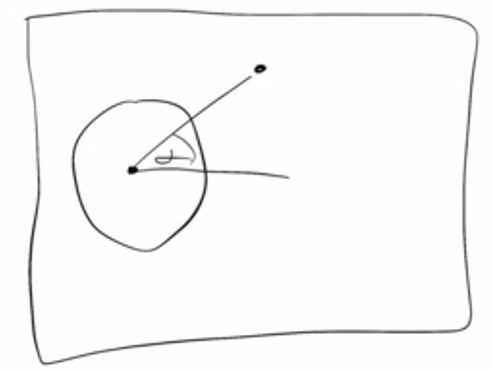
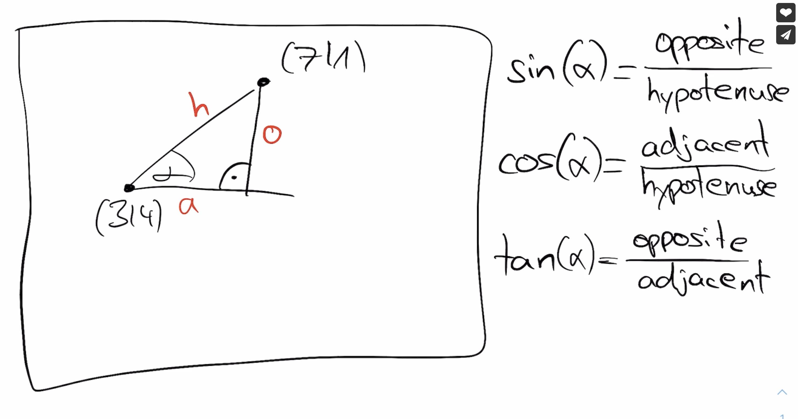

# Sin, Cos, Tan - Trigonometry Basics

이번엔 삼각함수에 대해 알아보자. 이는 각도를 계산하는데 사용된다.

아래의 그림에서 `a` 각도를 구해보자.

<div align="center">

</div>

아래와 같이 두 점만 있다면 각도를 구할 수 있다.

<div align="center">

</div>

```
o = 4 - 1 = 3
a = 7 - 3 = 4
tan(a) = 3 / 4 = 0.75
```


이제 `a` 각도를 얻기 위해 `arctan`을 구해야 한다. 코딩할 때 `atan()` 함수로 사용된다.

`a = atan(0.75) = 0.64 rad` → 이것이 각도이지만, 각도를 표현하는 방법은 여러가지이다. 여기서 표현된 방법은 radian이다. radian은 `sin`, `cos`과 깊은 관련이 있으며, 각도를 쉽게 계산할 수 있는 장점이 있다. 또한 쉽게 각도로 변환할 수 있는 공식이 있다.

```
0.64 rad * 180 / pi = 36 degree
```