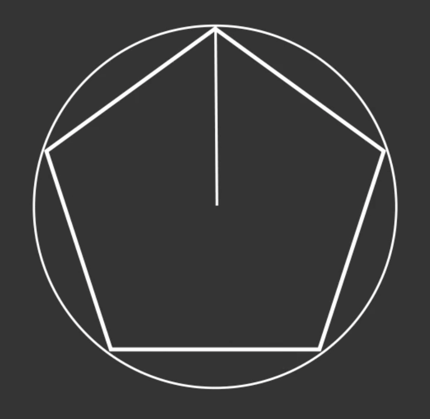
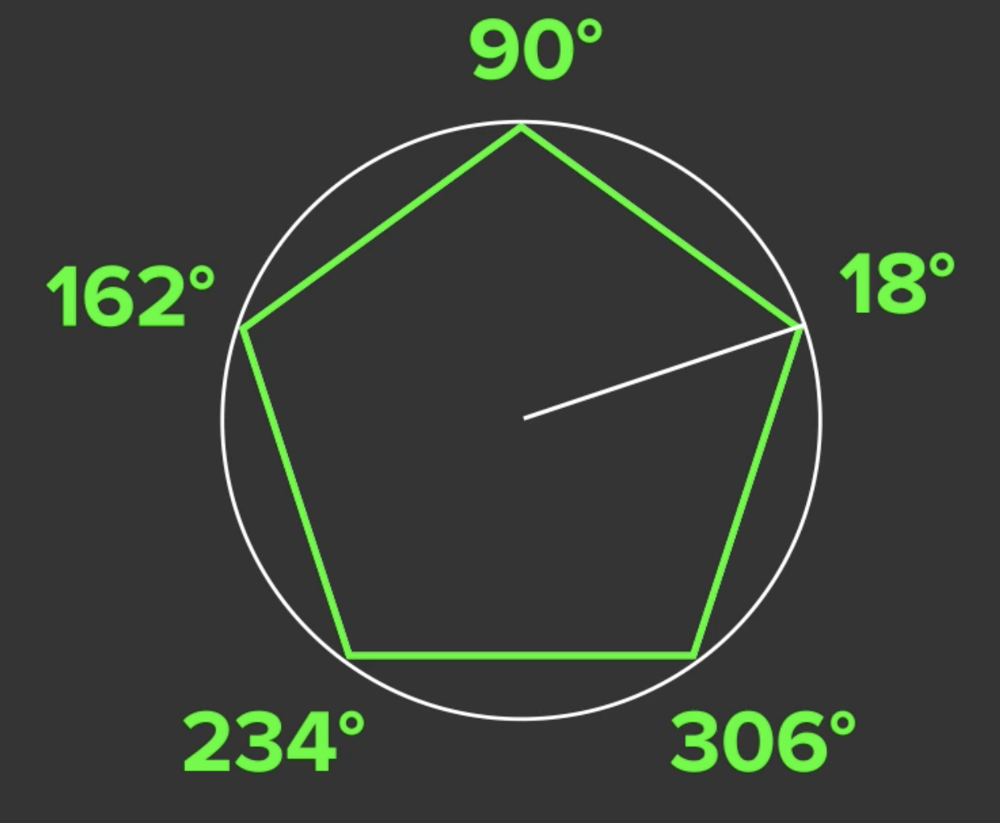

# Polar Coordinates

다음과 같은 오각형이 있다고 가정하자. 어떻게 저 꼭짓점들을 구할 수 있을까?

<div align="center">

</div>

Polar Coordinates를 사용하면 된다. Polar Coordinates는 x, y로 표현되지 않고 radius와 angle로 표현된다. 각 꼭짓점은 중심과의 거리가 동일하다. 이는 반지름이 된다.

<div align="center">

</div>

꼭짓점은 다음과  같이 36 degree씩 차이가 난다.

<div align="center">

</div>

이것은 도형을 다룰 때 편리하게 작동한다. Canvas는 일반 Coordinate로 동작하지만 radius와 angle로 x, y 좌표를 구하는 공식이 존재한다.

```
x = r * cos(a)
y = r * sin(a)
```
