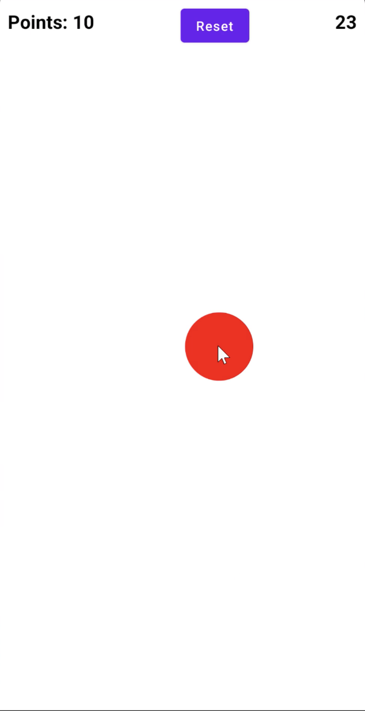
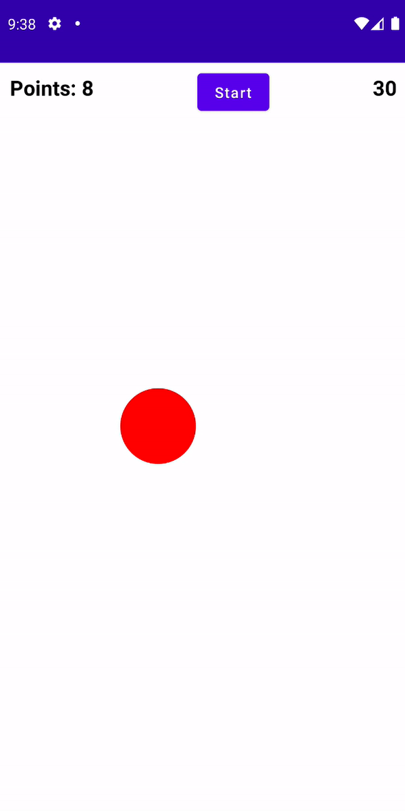

# Detecting Touch Input (Making a Ball Clicker Game)

볼을 클릭하면 점수가 올라가는 Ball Clicker 게임을 만들어보자. 오직 원만을 눌러야만 클릭이 적용된다.


<div align="center">

</div>


`MainAcitivty`에 다음과 같이 구현한다.

```kotlin
@ExperimentalPermissionsApi
class MainActivity : ComponentActivity() {

    override fun onCreate(savedInstanceState: Bundle?) {
        super.onCreate(savedInstanceState)
        setContent {
            MainScreen()
        }
    }
}

@Composable
fun MainScreen() {
    var points by remember {
        mutableStateOf(0)
    }
    var isTimerRunning by remember {
        mutableStateOf(false)
    }
    Column(
        modifier = Modifier.fillMaxSize()
    ) {
        Row(
            modifier = Modifier
                .fillMaxWidth()
                .padding(10.dp),
            horizontalArrangement = Arrangement.SpaceBetween
        ) {
            Text(
                text = "Points: ${points}",
                fontSize = 20.sp,
                fontWeight = FontWeight.Bold
            )
            Button(onClick = {
                isTimerRunning = !isTimerRunning
                points = 0
            }) {
                Text(text = if (isTimerRunning) "Reset" else "Start")
            }
            CountDownTimer(isTimerRunning = isTimerRunning) {
                isTimerRunning = false
            }
        }
        BallClicker(
            enabled = isTimerRunning
        ) {
            points++
        }
    }
}

@Composable
fun CountDownTimer(
    time: Int = 30000,
    isTimerRunning: Boolean = false,
    onTimerEnd: () -> Unit = {}
) {
    var curTime by remember {
        mutableStateOf(time)
    }
    LaunchedEffect(key1 = curTime, key2 = isTimerRunning) {
        if (!isTimerRunning) {
            curTime = time
            return@LaunchedEffect
        }
        if (curTime > 0) {
            // 1초 지난 후 curTime을 변경해준다
            delay(1000L)
            curTime -= 1000
        } else {
            onTimerEnd()
        }
    }
    Text(
        text = (curTime / 1000).toString(),
        fontSize = 20.sp,
        fontWeight = FontWeight.Bold
    )
}

@Composable
fun BallClicker(
    radius: Float = 100f,
    enabled: Boolean = false,
    ballColor: Color = Color.Red,
    onBallClick: () -> Unit = {}
) {
    // canvas 밖에서 사이즈에 대한 정보를 얻을 수 없기 때문에 BoxWithConstraints로 감싸준다.
    BoxWithConstraints(
        modifier = Modifier.fillMaxSize()
    ) {
        var ballPosition by remember {
            val w = constraints.maxWidth
            val h = constraints.maxHeight
            mutableStateOf(
                randomOffset(
                    radius = radius,
                    width = constraints.maxWidth, // box의 width
                    height = constraints.maxHeight // box의 height
                )
            )
        }
        Canvas(
            modifier = Modifier
                .fillMaxSize()
                .pointerInput(enabled) { // LaunchedEffect와 비슷
                    if (!enabled) {
                        return@pointerInput
                    }
                    detectTapGestures {
                        // circle center와 click한 좌표 간 거리를 계산해 원이 클릭됐는지 확인한다.
                        val distance = sqrt(
                            (it.x - ballPosition.x).pow(2) +
                                    (it.y - ballPosition.y).pow(2)
                        )
                        if (distance <= radius) {
                            ballPosition = randomOffset(
                                radius = radius,
                                width = constraints.maxWidth,
                                height = constraints.maxHeight
                            )
                            onBallClick()
                        }
                    }
                }
        ) {
            drawCircle(
                color = ballColor,
                radius = radius,
                center = ballPosition // random generate 하기 위해 스크린 사이즈를 알아야 한다.
            )
        }
    }
}

private fun randomOffset(radius: Float, width: Int, height: Int): Offset {
    return Offset(
        x = Random.nextInt(radius.roundToInt(), width - radius.roundToInt()).toFloat(),
        y = Random.nextInt(radius.roundToInt(), height - radius.roundToInt()).toFloat()
    )
}
```

<div align="center">

</div>