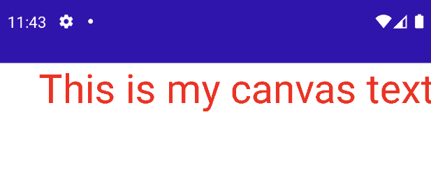

# Drawing Text

Text를 그리는 방법을 알아보자.

```kotlin
@ExperimentalPermissionsApi
class MainActivity : ComponentActivity() {

    override fun onCreate(savedInstanceState: Bundle?) {
        super.onCreate(savedInstanceState)
        setContent {
            Canvas(modifier = Modifier.fillMaxSize()) {
                // drawContext.canvas를 통해 텍스트를 그리는 등 더 많은 것들을 수행할 수 있다.
                drawContext.canvas.nativeCanvas.apply {
                    drawText(
                        "This is my canvas text",
                        100f,
                        100f,
                        Paint().apply { // android.graphics.Paint
                            color = Color.RED
                            textSize = 100f
                        }
                    )
                }
            }
        }
    }
}
```

<div align="center">

</div>