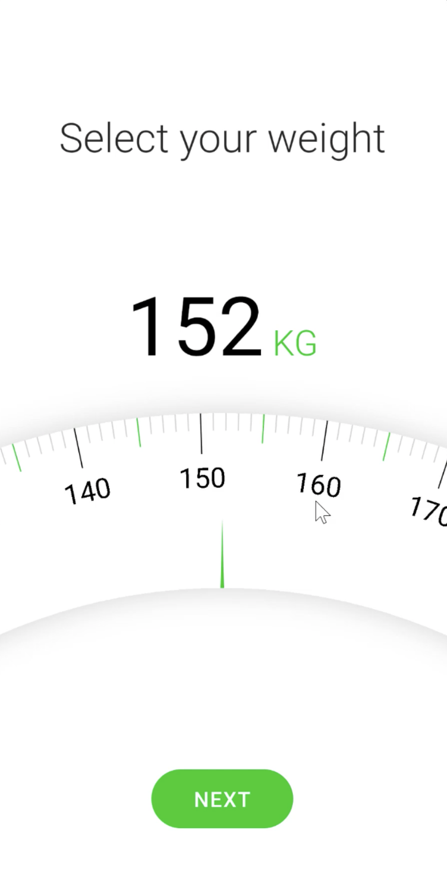
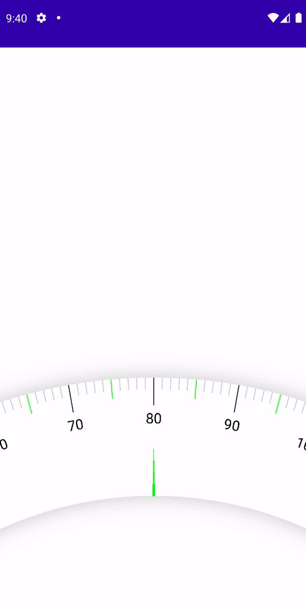

# Making a Weight Picker

이번엔 Weight Picker를 만들어보자. [여기](https://github.com/philipplackner/WeightPickerCompose) 레포지토리에서 initial 프로젝트를 클론한다.

<div align="center">

</div>

`Scale` composable로 전달하기 위한 `ScaleStyle` data class를 따로 생성한다.

```kotlin
data class ScaleStyle(
    val scaleWidth: Dp = 100.dp,
    val radius: Dp = 550.dp,
    val normalLineColor: Color = Color.LightGray,
    val fiveStepLineColor: Color = Color.Green,
    val tenStepLineColor: Color = Color.Black,
    val normalLineLength: Dp = 15.dp,
    val fiveStepLineLength: Dp = 25.dp,
    val tenStepLineLength: Dp = 35.dp,
    val scaleIndicatorColor: Color = Color.Green,
    val scaleIndicatorLength: Dp = 60.dp,
    val textSize: TextUnit = 18.sp
) 
```

그리고 선의 타입을 지정하기 위해 `LineType` sealed class를 생성한다.

```kotlin
sealed class LineType {
    object Normal : LineType()
    object FiveStep : LineType()
    object TenStep : LineType()
}
```

그리고 `WeightElements.kt` 파일을 생성하고 `Scale` composable을 작성한다.

```kotlin
@Composable
fun Scale(
    modifier: Modifier = Modifier,
    style: ScaleStyle = ScaleStyle(),
    minWeight: Int = 20,
    maxWeight: Int = 250,
    initialWeight: Int = 80,
    onWeightChange: (Int) -> Unit
) {
    val radius = style.radius
    val scaleWidth = style.scaleWidth
    var center by remember {
        mutableStateOf(Offset.Zero)
    }
    var circleCenter by remember {
        mutableStateOf(Offset.Zero)
    }
    var angle by remember {
        mutableStateOf(0f)
    }
    // drag하기 위한 변수
    var dragStartedAngle by remember {
        mutableStateOf(0f)
    }
    var oldAngle by remember {
        mutableStateOf(angle)
    }
    Canvas(
        modifier = modifier
            .pointerInput(true) {
                detectDragGestures(
                    onDragStart = { offset ->
                        dragStartedAngle = -atan2(
                            circleCenter.x - offset.x,
                            circleCenter.y - offset.y
                        ) * (180f / PI.toFloat())
                    },
                    onDragEnd = {
                        oldAngle = angle
                    }
                ) { change, _ ->
                    val touchAngle = -atan2(
                        circleCenter.x - change.position.x,
                        circleCenter.y - change.position.y
                    ) * (180f / PI.toFloat())
                    val newAngle = oldAngle + (touchAngle - dragStartedAngle)
                    angle = newAngle.coerceIn( // 회전되는 각도를 조절하기 위해 coerceIn 사용
                        minimumValue = initialWeight - maxWeight.toFloat(),
                        maximumValue = initialWeight - minWeight.toFloat()
                    )
                    onWeightChange((initialWeight - angle).roundToInt())
                }
            }
    ) {
        center = this.center
        circleCenter = Offset(
            center.x,
            scaleWidth.toPx() / 2f + radius.toPx()
        )
        val outerRadius = radius.toPx() + scaleWidth.toPx() / 2f
        val innerRadius = radius.toPx() - scaleWidth.toPx() / 2f

        // compose는 shadow를 그릴 수 없기 때문에 다른 방법으로 접근해야 한다.
        drawContext.canvas.nativeCanvas.apply {
            drawCircle(
                circleCenter.x,
                circleCenter.y,
                radius.toPx(),
                Paint().apply {
                    strokeWidth = scaleWidth.toPx()
                    color = Color.WHITE
                    setStyle(Paint.Style.STROKE)
                    setShadowLayer(
                        60f, // radius of shadow
                        0f,
                        0f,
                        Color.argb(50, 0, 0, 0)
                    )
                }
            )
        }

        // draw lines
        for (i in minWeight..maxWeight) {
            // sin, cos, tan를 사용하기 위해 radian으로 변환
            val angleInRad = (i - initialWeight + angle - 90) * (PI / 180f).toFloat()
            val lineType = when {
                i % 10 == 0 -> LineType.TenStep
                i % 5 == 0 -> LineType.FiveStep
                else -> LineType.Normal
            }
            val lineLength = when (lineType) {
                LineType.Normal -> style.normalLineLength.toPx()
                LineType.FiveStep -> style.fiveStepLineLength.toPx()
                LineType.TenStep -> style.tenStepLineLength.toPx()
            }
            val lineColor = when (lineType) {
                LineType.Normal -> style.normalLineColor
                LineType.FiveStep -> style.fiveStepLineColor
                LineType.TenStep -> style.tenStepLineColor
            }
            // 라인의 시작과 끝을 알기 위해 polar coordinate를 사용한다.
            val lineStart = Offset(
                x = (outerRadius - lineLength) * cos(angleInRad) + circleCenter.x,
                y = (outerRadius - lineLength) * sin(angleInRad) + circleCenter.y
            )
            val lineEnd = Offset(
                x = outerRadius * cos(angleInRad) + circleCenter.x,
                y = outerRadius * sin(angleInRad) + circleCenter.y
            )

            drawContext.canvas.nativeCanvas.apply {
                if (lineType is LineType.TenStep) {
                    val textRadius =
                        (outerRadius - lineLength - 5.dp.toPx() - style.textSize.toPx())
                    val x = textRadius * cos(angleInRad) + circleCenter.x
                    val y = textRadius * sin(angleInRad) + circleCenter.y

                    // 텍스트를 회전시켜 주기 위해 withRotation 사용
                    withRotation(
                        degrees = angleInRad * (180f / PI.toFloat()) + 90f,
                        pivotX = x,
                        pivotY = y
                    ) {
                        drawText(
                            abs(i).toString(),
                            x,
                            y,
                            Paint().apply {
                                textSize = style.textSize.toPx()
                                textAlign = Paint.Align.CENTER
                            }
                        )
                    }
                }
            }

            drawLine(
                color = lineColor,
                start = lineStart,
                end = lineEnd,
                strokeWidth = 1.dp.toPx()
            )

            // draw indicator
            val middleTop = Offset(
                x = circleCenter.x,
                y = circleCenter.y - innerRadius - style.scaleIndicatorLength.toPx()
            )
            val bottomLeft = Offset(
                x = circleCenter.x - 4f,
                y = circleCenter.y - innerRadius
            )
            val bottomRight = Offset(
                x = circleCenter.x + 4f,
                y = circleCenter.y - innerRadius
            )
            val indicator = Path().apply {
                moveTo(middleTop.x, middleTop.y)
                lineTo(bottomLeft.x, bottomLeft.y)
                lineTo(bottomRight.x, bottomRight.y)
                lineTo(middleTop.x, middleTop.y)
            }
            drawPath(
                path = indicator,
                color = style.scaleIndicatorColor
            )
        }
    }
}
```

`MainActivity`에 다음과 같이 작성한다.

```kotlin
@ExperimentalPermissionsApi
class MainActivity : ComponentActivity() {

    override fun onCreate(savedInstanceState: Bundle?) {
        super.onCreate(savedInstanceState)
        setContent {
            Box(
                modifier = Modifier
                    .fillMaxSize()
            ) {
                var weight by remember {
                    mutableStateOf(80)
                }
                Scale(
                    style = ScaleStyle(
                        scaleWidth = 150.dp
                    ),
                    modifier = Modifier
                        .fillMaxWidth()
                        .height(300.dp)
                        .align(Alignment.BottomCenter)
                ) {
                    weight = it
                }
            }
        }
    }
}
```

<div align="center">

</div>