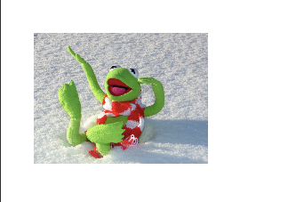
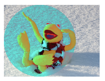

# Drawing Images & BlendModes

이미지에 대해 그리는 방법을 알아보자.

```kotlin
class MainActivity : ComponentActivity() {

    override fun onCreate(savedInstanceState: Bundle?) {
        super.onCreate(savedInstanceState)
        setContent {
            val kermit = ImageBitmap.imageResource(id = R.drawable.kermit)
            Canvas(modifier = Modifier.fillMaxSize()) {
                drawImage(
                    image = kermit,
                    dstOffset = IntOffset(100, 100),
                    dstSize = IntSize(
                        (400 * (kermit.width.toFloat() / kermit.height)).toInt(),
                        400
                    )
                )
            }
        }
    }
}
```

<div align="center">

</div>

`BlendMode`를 사용해보자.

```kotlin
class MainActivity : ComponentActivity() {

    override fun onCreate(savedInstanceState: Bundle?) {
        super.onCreate(savedInstanceState)
        setContent {
            val kermit = ImageBitmap.imageResource(id = R.drawable.kermit)
            Canvas(modifier = Modifier.fillMaxSize()) {
                drawImage(
                    image = kermit,
                    dstOffset = IntOffset(100, 100),
                    dstSize = IntSize(
                        (400 * (kermit.width.toFloat() / kermit.height)).toInt(),
                        400
                    )
                )
                drawCircle(
                    color = Color.Red,
                    radius = 200f,
                    center = Offset(300f, 300f),
                    blendMode = BlendMode.Color
                )
            }
        }
    }
}
```

`BlendMode.Color`의 경우 lower 그림의 픽셀과 합쳐진다.

<div align="center">

</div>

색상을 `Black`으로 설정하면 흑백 사진이 된다.

<div align="center">

</div>

`BlendMode.Screen`으로 설정하면 다음과 같이 화면의 색상을 곱해 출력된다.

<div align="center">

</div>

`BlendMode.Exclusion`으로 설정하면 다음과 같다.

<div align="center">

</div>

이미지와 Circle의 순서를 변경해보자.

```kotlin
class MainActivity : ComponentActivity() {

    override fun onCreate(savedInstanceState: Bundle?) {
        super.onCreate(savedInstanceState)
        setContent {
            val kermit = ImageBitmap.imageResource(id = R.drawable.kermit)
            Canvas(modifier = Modifier.fillMaxSize()) {
                drawCircle(
                    color = Color.Red,
                    radius = 200f,
                    center = Offset(300f, 300f)
                )
                drawImage(
                    image = kermit,
                    dstOffset = IntOffset(100, 100),
                    dstSize = IntSize(
                        (400 * (kermit.width.toFloat() / kermit.height)).toInt(),
                        400
                    ),
                    blendMode = BlendMode.Exclusion
                )
            }
        }
    }
}
```

<div align="center">

</div>