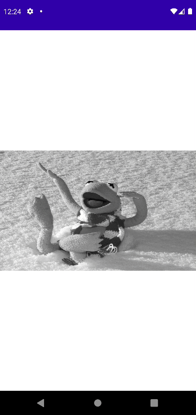

# Image Reveal

드래그할 때 흑백 이미지인 백그라운드에서 마우스 포인터가 있는 원에는 색상이 보여지도록 구현해보자.

```kotlin
class MainActivity : ComponentActivity() {

    override fun onCreate(savedInstanceState: Bundle?) {
        super.onCreate(savedInstanceState)
        setContent {
            val kermit = ImageBitmap.imageResource(id = R.drawable.kermit)
            var currentPos by remember {
                mutableStateOf(Offset.Zero)
            }
            Canvas(modifier = Modifier
                .fillMaxSize()
                .pointerInput(true) {
                    detectDragGestures(
                        onDragEnd = {

                        }
                    ) { change, dragAmount ->
                        currentPos = change.position
                    }
                }
            ) {
                drawImage(
                    image = kermit,
                    dstOffset = IntOffset(0, (size.height / 3).toInt()),
                    dstSize = IntSize(
                        size.width.toInt(),
                        (size.height / 3).toInt()
                    ),
                    colorFilter = ColorFilter.tint(Color.Black, BlendMode.Color)
                )
                val circlePath = Path().apply {
                    addOval(
                        Rect(
                            center = currentPos,
                            radius = 200f,
                        )
                    )
                }
                clipPath(circlePath, clipOp = ClipOp.Intersect) {
                    drawImage(
                        image = kermit,
                        dstOffset = IntOffset(0, (size.height / 3).toInt()),
                        dstSize = IntSize(
                            size.width.toInt(),
                            (size.height / 3).toInt()
                        )
                    )
                }
            }
        }
    }
}
```

<div align="center">

</div>
