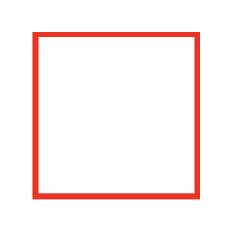
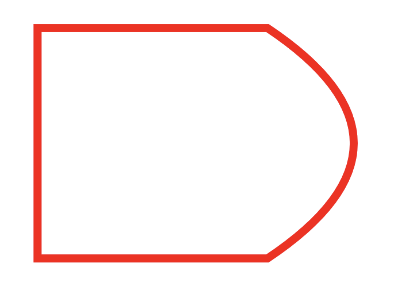
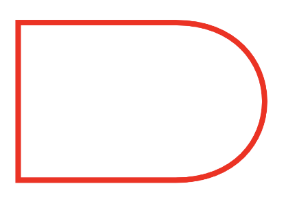
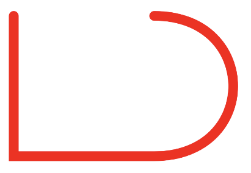
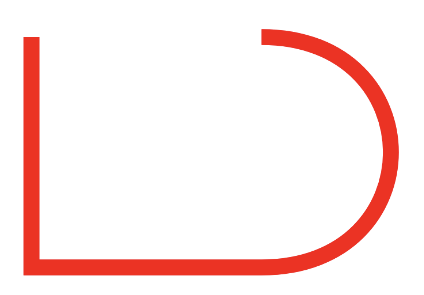
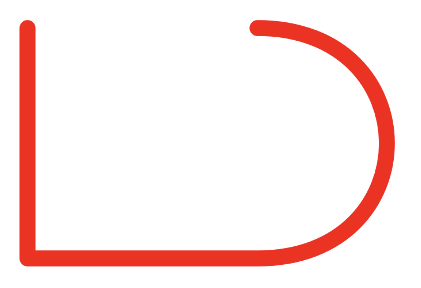
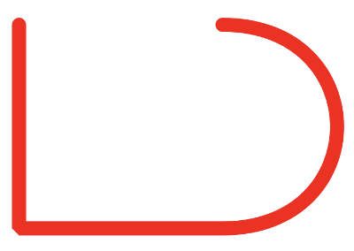
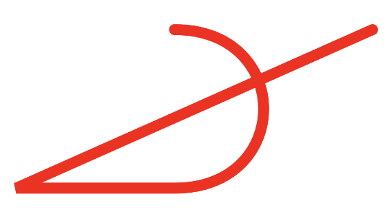
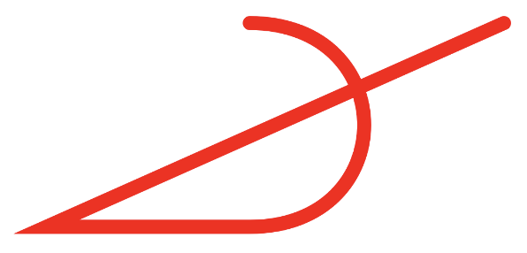

# Path Basics

Path의 기본을 알아보자. 간단한 빨간 박스를 그려보자.

```kotlin
class MainActivity : ComponentActivity() {

    override fun onCreate(savedInstanceState: Bundle?) {
        super.onCreate(savedInstanceState)
        setContent {
            Canvas(modifier = Modifier.fillMaxSize()) {
                val path = Path().apply {
                    moveTo(100f, 100f)
                    lineTo(100f, 500f)
                    lineTo(500f, 500f)
                    lineTo(500f, 100f)
                    lineTo(100f, 100f)
                }
                drawPath(
                    path = path,
                    color = androidx.compose.ui.graphics.Color.Red
                )
            }
        }
    }
}
```

`Path` 없이도 네모난 박스를 그릴 수 있지만 `Path`를 사용하면 더 많은 것들을 할 수 있다.

<div align="center">

</div>

`style`에 `Stroke`를 지정해보자.

```kotlin
class MainActivity : ComponentActivity() {

    override fun onCreate(savedInstanceState: Bundle?) {
        super.onCreate(savedInstanceState)
        setContent {
            Canvas(modifier = Modifier.fillMaxSize()) {
                val path = Path().apply {
                    moveTo(100f, 100f)
                    lineTo(100f, 500f)
                    lineTo(500f, 500f)
                    lineTo(500f, 100f)
                    lineTo(100f, 100f)
                }
                drawPath(
                    path = path,
                    color = androidx.compose.ui.graphics.Color.Red,
                    style = Stroke(width = 5.dp.toPx())
                )
            }
        }
    }
}
```

<div align="center">

</div>

오른쪽의 선을 커브드하게 만들어보자.

```kotlin
class MainActivity : ComponentActivity() {

    override fun onCreate(savedInstanceState: Bundle?) {
        super.onCreate(savedInstanceState)
        setContent {
            Canvas(modifier = Modifier.fillMaxSize()) {
                val path = Path().apply {
                    moveTo(100f, 100f)
                    lineTo(100f, 500f)
                    lineTo(500f, 500f)
                    // 첫 번째 점은 기준점, 두 번째 점은 해당 점까지 그려지게 할 점
                    quadraticBezierTo(800f, 300f, 500f, 100f)
                    close()
                }
                drawPath(
                    path = path,
                    color = androidx.compose.ui.graphics.Color.Red,
                    style = Stroke(width = 5.dp.toPx())
                )
            }
        }
    }
}
```

<div align="center">

</div>

2개의 control point를 사용해 부드럽게 만들어보자.

```kotlin
class MainActivity : ComponentActivity() {

    override fun onCreate(savedInstanceState: Bundle?) {
        super.onCreate(savedInstanceState)
        setContent {
            Canvas(modifier = Modifier.fillMaxSize()) {
                val path = Path().apply {
                    moveTo(100f, 100f)
                    lineTo(100f, 500f)
                    lineTo(500f, 500f)
                    // 첫 번째 점은 control point, 두 번째 점은 해당 점까지 그려지게 할 점
//                    quadraticBezierTo(800f, 300f, 500f, 100f)
                    cubicTo(800f, 500f, 800f, 100f, 500f, 100f)
                    close()
                }
                drawPath(
                    path = path,
                    color = androidx.compose.ui.graphics.Color.Red,
                    style = Stroke(width = 5.dp.toPx())
                )
            }
        }
    }
}
```

<div align="center">

</div>

StrokeCap을 설정해보자.

```kotlin
class MainActivity : ComponentActivity() {

    override fun onCreate(savedInstanceState: Bundle?) {
        super.onCreate(savedInstanceState)
        setContent {
            Canvas(modifier = Modifier.fillMaxSize()) {
                val path = Path().apply {
                    moveTo(100f, 100f)
                    lineTo(100f, 500f)
                    lineTo(500f, 500f)
                    // 첫 번째 점은 control point, 두 번째 점은 해당 점까지 그려지게 할 점
//                    quadraticBezierTo(800f, 300f, 500f, 100f)
                    cubicTo(800f, 500f, 800f, 100f, 500f, 100f)
                }
                drawPath(
                    path = path,
                    color = androidx.compose.ui.graphics.Color.Red,
                    style = Stroke(
                        width = 10.dp.toPx(),
                        cap = StrokeCap.Round
                    )
                )
            }
        }
    }
}
```

<div align="center">

</div>

`StrokeCap.Butt`의 경우 다음과 같다.

<div align="center">

</div>

`join`을 `StrokeJoin.Round`로 설정해보자. 각 꼭짓점들이 동그랗게 변한다.

```kotlin
class MainActivity : ComponentActivity() {

    override fun onCreate(savedInstanceState: Bundle?) {
        super.onCreate(savedInstanceState)
        setContent {
            Canvas(modifier = Modifier.fillMaxSize()) {
                val path = Path().apply {
                    moveTo(100f, 100f)
                    lineTo(100f, 500f)
                    lineTo(500f, 500f)
                    // 첫 번째 점은 control point, 두 번째 점은 해당 점까지 그려지게 할 점
//                    quadraticBezierTo(800f, 300f, 500f, 100f)
                    cubicTo(800f, 500f, 800f, 100f, 500f, 100f)
                }
                drawPath(
                    path = path,
                    color = androidx.compose.ui.graphics.Color.Red,
                    style = Stroke(
                        width = 10.dp.toPx(),
                        cap = StrokeCap.Round,
                        join = StrokeJoin.Round
                    )
                )
            }
        }
    }
}
```

<div align="center">

</div>

`StrokeJoin.Bevel`로 설정하면 끝이 약각 깍이는 것을 확인할 수 있다.

<div align="center">

</div>

`StrokeJoin.Miter`는 끝을 얼마나 sharp 하게 하는지를 설정한다.

```kotlin
class MainActivity : ComponentActivity() {

    override fun onCreate(savedInstanceState: Bundle?) {
        super.onCreate(savedInstanceState)
        setContent {
            Canvas(modifier = Modifier.fillMaxSize()) {
                val path = Path().apply {
                    moveTo(1000f, 100f)
                    lineTo(100f, 500f)
                    lineTo(500f, 500f)
                    // 첫 번째 점은 control point, 두 번째 점은 해당 점까지 그려지게 할 점
//                    quadraticBezierTo(800f, 300f, 500f, 100f)
                    cubicTo(800f, 500f, 800f, 100f, 500f, 100f)
                }
                drawPath(
                    path = path,
                    color = androidx.compose.ui.graphics.Color.Red,
                    style = Stroke(
                        width = 10.dp.toPx(),
                        cap = StrokeCap.Round,
                        join = StrokeJoin.Miter,
                        miter = 0f
                    )
                )
            }
        }
    }
}
```

`miter` 값이 0f 일 때는 끝 부분을 그냥 잘라낸다.

<div align="center">

</div>

`miter` 값을 20f으로 설정하면 끝이 뾰족하게 변한다.

<div align="center">

</div>