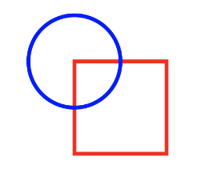
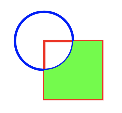
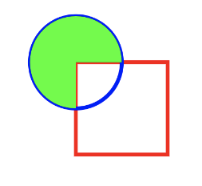
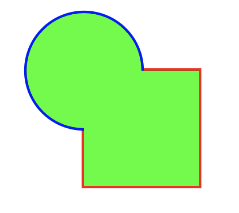
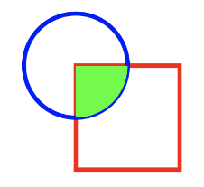
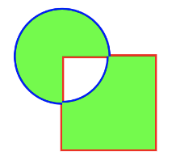

# Path Operations

Path를 합치는 등의 Path Operations를 알아보자.

```kotlin
class MainActivity : ComponentActivity() {

    override fun onCreate(savedInstanceState: Bundle?) {
        super.onCreate(savedInstanceState)
        setContent {
            Canvas(modifier = Modifier.fillMaxSize()) {
                val squareWithoutOp = Path().apply {
                    addRect(Rect(Offset(200f, 200f), Size(200f, 200f)))
                }
                val circle = Path().apply {
                    addOval(Rect(Offset(200f, 200f), 100f))
                }
                drawPath(
                    path = squareWithoutOp,
                    color = Color.Red,
                    style = Stroke(width = 3.dp.toPx())
                )
                drawPath(
                    path = circle,
                    color = Color.Blue,
                    style = Stroke(width = 3.dp.toPx())
                )
            }
        }
    }
}
```

<div align="center">

</div>

이제 이 두개의 모형을 합쳐보자.

```kotlin
class MainActivity : ComponentActivity() {

    override fun onCreate(savedInstanceState: Bundle?) {
        super.onCreate(savedInstanceState)
        setContent {
            Canvas(modifier = Modifier.fillMaxSize()) {
                val squareWithoutOp = Path().apply {
                    addRect(Rect(Offset(200f, 200f), Size(200f, 200f)))
                }
                val circle = Path().apply {
                    addOval(Rect(Offset(200f, 200f), 100f))
                }
                val pathWidthOp = Path().apply { 
                    op(squareWithoutOp, circle, PathOperation.Difference)
                }
                drawPath(
                    path = squareWithoutOp,
                    color = Color.Red,
                    style = Stroke(width = 3.dp.toPx())
                )
                drawPath(
                    path = circle,
                    color = Color.Blue,
                    style = Stroke(width = 3.dp.toPx())
                )
                drawPath(
                    path = pathWidthOp,
                    color = Color.Green
                )
            }
        }
    }
}
```

`PathOperation.Difference`의 경우 1번째로 전달한 모형을 제외하고 2번째로 전달한 모형을 모두 포함한다.

<div align="center">

</div>

`PathOperation.ReverseDifference`의 경우 `PathOperation.Difference`와 반대이다.

<div align="center">

</div>

`PathOperation.Union`의 경우 모든 모형을 포함한다.

<div align="center">

</div>

`PathOperation.Intersect`는 교집합이다.

<div align="center">

</div>

`PathOperation.Xor`의 경우 교집합을 제외한 나머지 영역이다.

<div align="center">

</div>