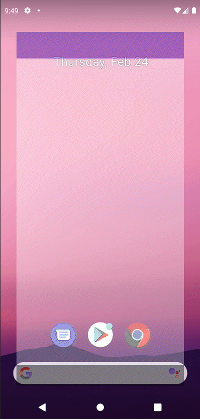

# Animating a Path Arrow

Canvas에서 애니메이션되는 화살표를 만들어보자. xml의 `PathMeasure`에 Path 끝의 각도를 알 수 있는 기능이 있다.

```kotlin
class MainActivity : ComponentActivity() {

    override fun onCreate(savedInstanceState: Bundle?) {
        super.onCreate(savedInstanceState)
        setContent {
            val pathPortion = remember {
                androidx.compose.animation.core.Animatable(initialValue = 0f)
            }
            LaunchedEffect(key1 = true) {
                pathPortion.animateTo(
                    targetValue = 1f,
                    animationSpec = tween(
                        durationMillis = 5000
                    )
                )
            }
            val path = Path().apply {
                moveTo(100f, 100f)
                quadraticBezierTo(400f, 400f, 100f, 400f)
            }
            val outPath = android.graphics.Path()
            val pos = FloatArray(2)
            val tan = FloatArray(2)
            android.graphics.PathMeasure().apply {
                setPath(path.asAndroidPath(), false)
                getSegment(0f, pathPortion.value * length, outPath, true)
                // get the position and the tan value of our given path
                getPosTan(pathPortion.value * length, pos, tan)
            }
            Canvas(modifier = Modifier.fillMaxSize()) {
                drawPath(
                    path = outPath.asComposePath(),
                    color = Red,
                    style = Stroke(width = 5.dp.toPx())
                )
                val x = pos[0]
                val y = pos[1]
                val degrees = -atan2(tan[0], tan[1]) * (180f / PI.toFloat()) - 180f
                rotate(degrees = degrees, pivot = Offset(x, y)) {
                    drawPath(
                        path = Path().apply {
                            moveTo(x, y - 30)
                            lineTo(x - 30f, y + 60f)
                            lineTo(x + 30f, y + 60f)
                            close()
                        },
                        color = Color.Red
                    )
                }
            }
        }
    }
}
```

<div align="center">

</div>