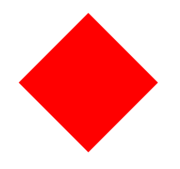
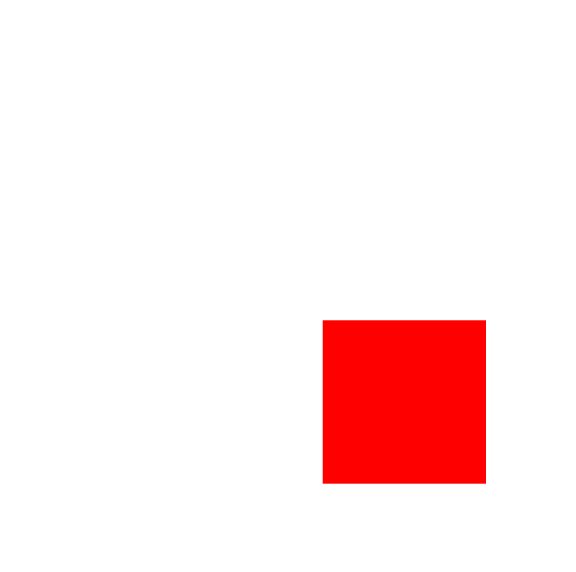
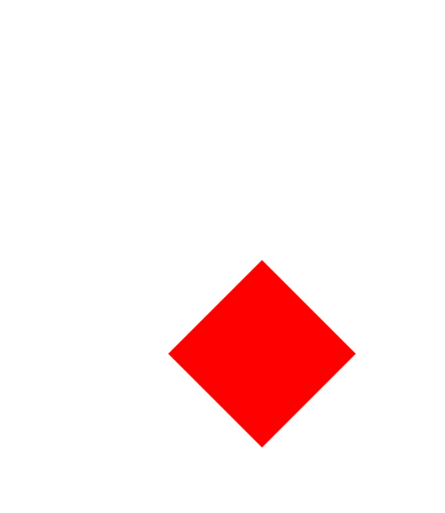
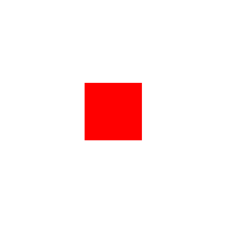
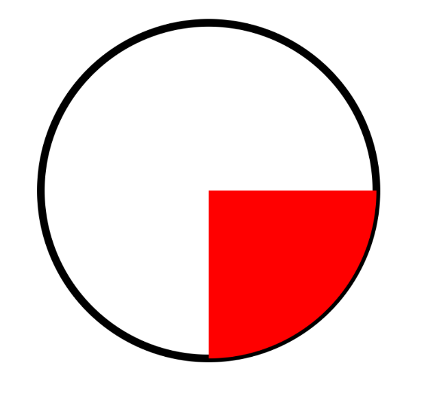

# Transformations And Clipping

Transformation과 Clipping에 대해 알아보자.

## Transformations

사각형을 45도 회전시켜보자.

```kotlin
class MainActivity : ComponentActivity() {

    override fun onCreate(savedInstanceState: Bundle?) {
        super.onCreate(savedInstanceState)
        setContent {
            Canvas(modifier = Modifier.fillMaxSize()) {
                // animation value로 애니메이션 동작을 수행할 수 있다.
                rotate(45f, pivot = Offset(200f, 200f)) {
                    drawRect(
                        color = Color.Red,
                        topLeft = Offset(100f, 100f),
                        size = Size(200f, 200f)
                    )
                }
            }
        }
    }
}
```

<div align="center">

</div>

`translate` 블럭을 사용해 왼쪽 300f, 위 300f 띄어진 곳에 사각형을 위치시켜보자.

```kotlin
class MainActivity : ComponentActivity() {

    override fun onCreate(savedInstanceState: Bundle?) {
        super.onCreate(savedInstanceState)
        setContent {
            Canvas(modifier = Modifier.fillMaxSize()) {
                translate(left = 300f, top = 300f) {
                    drawRect(
                        color = Color.Red,
                        topLeft = Offset(100f, 100f),
                        size = Size(200f, 200f)
                    )
                }
            }
        }
    }
}
```

<div align="center">

</div>

`translate` 블럭과 `rotate` 블럭을 함께 사용해보자.

```kotlin
class MainActivity : ComponentActivity() {

    override fun onCreate(savedInstanceState: Bundle?) {
        super.onCreate(savedInstanceState)
        setContent {
            Canvas(modifier = Modifier.fillMaxSize()) {
                translate(left = 300f, top = 300f) {
                    rotate(45f, pivot = Offset(100f, 100f)) {
                        drawRect(
                            color = Color.Red,
                            topLeft = Offset(100f, 100f),
                            size = Size(200f, 200f)
                        )
                    }
                }
            }
        }
    }
}
```

<div align="center">

</div>

이번엔 사각형의 scale을 50%로 변경해보자.

```kotlin
class MainActivity : ComponentActivity() {

    override fun onCreate(savedInstanceState: Bundle?) {
        super.onCreate(savedInstanceState)
        setContent {
            Canvas(modifier = Modifier.fillMaxSize()) {
                scale(0.5f, pivot = Offset(200f, 200f)) {
                    drawRect(
                        color = Color.Red,
                        topLeft = Offset(100f, 100f),
                        size = Size(200f, 200f)
                    )
                }
            }
        }
    }
}
```

<div align="center">

</div>

## Clipping

Cilpping은 어떤 모형을 잘라 다른 모형으로 만들 수 있다.

```kotlin
class MainActivity : ComponentActivity() {

    override fun onCreate(savedInstanceState: Bundle?) {
        super.onCreate(savedInstanceState)
        setContent {
            Canvas(modifier = Modifier.fillMaxSize()) {
                val circle = Path().apply {
                    addOval(
                        Rect(center = Offset(400f, 400f), radius = 300f)
                    )
                }
                drawPath(
                    path = circle,
                    color = Color.Black,
                    style = Stroke(width = 5.dp.toPx())
                )
                // circle 밖은 clip 된다.
                clipPath(
                    path = circle
                ) {
                    drawRect(
                        color = Color.Red,
                        topLeft = Offset(400f, 400f),
                        size = Size(400f, 400f)
                    )
                }
            }
        }
    }
}
```

<div align="center">

</div>