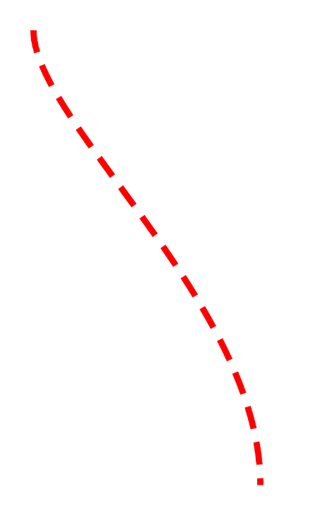
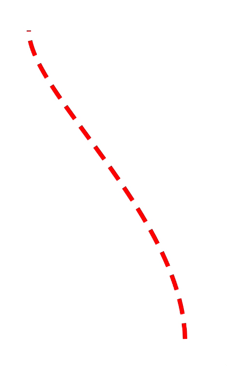
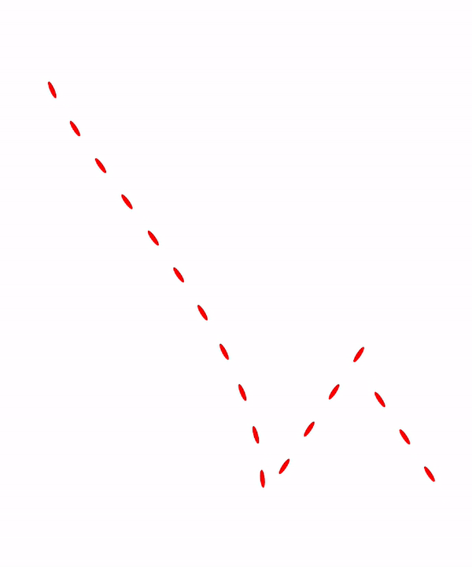
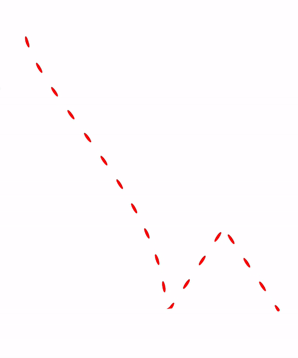
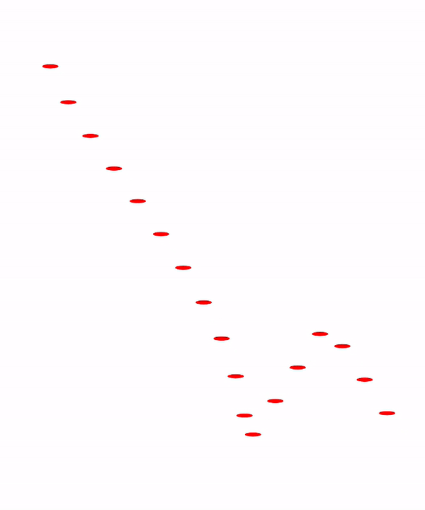
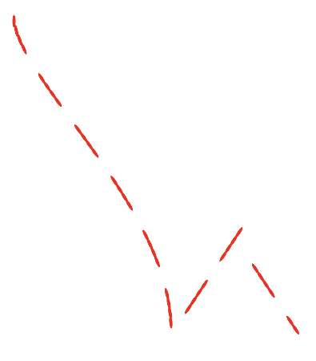

# Path Effects

Path Effect를 알아보자.

`PathEffect.dashPathEffect`를 이용해 점선을 그려보자.

```kotlin
class MainActivity : ComponentActivity() {

    override fun onCreate(savedInstanceState: Bundle?) {
        super.onCreate(savedInstanceState)
        setContent {
            Canvas(modifier = Modifier.fillMaxSize()) {
                val path = Path().apply {
                    moveTo(100f, 100f)
                    cubicTo(100f, 300f, 600f, 700f, 600f, 1100f)
                }
                drawPath(
                    path = path,
                    color = Color.Red,
                    style = Stroke(
                        width = 5.dp.toPx(),
                        pathEffect = PathEffect.dashPathEffect(
                            intervals = floatArrayOf(50f, 30f) // 50f 그리고, 30f 띄고
                        )
                    )
                )
            }
        }
    }
}
```

<div align="center">

</div>

이제 점선이 움직이도록 애니메이션을 해보자.

```kotlin
class MainActivity : ComponentActivity() {

    override fun onCreate(savedInstanceState: Bundle?) {
        super.onCreate(savedInstanceState)
        setContent {
            val infiniteTransition = rememberInfiniteTransition()
            val phase by infiniteTransition.animateFloat(
                initialValue = 0f,
                targetValue = 10000f,
                animationSpec = infiniteRepeatable(
                    animation = tween(60000, easing = LinearEasing)
                )
            )
            Canvas(modifier = Modifier.fillMaxSize()) {
                val path = Path().apply {
                    moveTo(100f, 100f)
                    cubicTo(100f, 300f, 600f, 700f, 600f, 1100f)
                }
                drawPath(
                    path = path,
                    color = Color.Red,
                    style = Stroke(
                        width = 5.dp.toPx(),
                        pathEffect = PathEffect.dashPathEffect(
                            intervals = floatArrayOf(50f, 30f), // 50f 그리고, 30f 띄고
                            phase = phase
                        )
                    )
                )
            }
        }
    }
}
```

<div align="center">

</div>

`PathEffect.cornerPathEffect`를 사용해 코너를 부드럽게 그려보자.

```kotlin
class MainActivity : ComponentActivity() {

    override fun onCreate(savedInstanceState: Bundle?) {
        super.onCreate(savedInstanceState)
        setContent {
            val infiniteTransition = rememberInfiniteTransition()
            val phase by infiniteTransition.animateFloat(
                initialValue = 0f,
                targetValue = 100f,
                animationSpec = infiniteRepeatable(
                    animation = tween(600, easing = LinearEasing)
                )
            )
            Canvas(modifier = Modifier.fillMaxSize()) {
                val path = Path().apply {
                    moveTo(100f, 100f)
                    cubicTo(100f, 300f, 600f, 700f, 600f, 1100f)
                    lineTo(800f, 800f) // 여기를 경유할 때 radius 값 만큼 부드럽게 경유
                    lineTo(1000f, 1100f)
                }
                drawPath(
                    path = path,
                    color = Color.Red,
                    style = Stroke(
                        width = 5.dp.toPx(),
                        pathEffect = PathEffect.cornerPathEffect(
                            radius = 1000f
                        )
                    )
                )
            }
        }
    }
}
```

<div align="center">

</div>

`PathEffect.stampedPathEffect`를 이용해 그려보자.

```kotlin
class MainActivity : ComponentActivity() {

    override fun onCreate(savedInstanceState: Bundle?) {
        super.onCreate(savedInstanceState)
        setContent {
            val infiniteTransition = rememberInfiniteTransition()
            val phase by infiniteTransition.animateFloat(
                initialValue = 0f,
                targetValue = 100f,
                animationSpec = infiniteRepeatable(
                    animation = tween(600, easing = LinearEasing)
                )
            )
            Canvas(modifier = Modifier.fillMaxSize()) {
                val path = Path().apply {
                    moveTo(100f, 100f)
                    cubicTo(100f, 300f, 600f, 700f, 600f, 1100f)
                    lineTo(800f, 800f)
                    lineTo(1000f, 1100f)
                }
                val oval = Path().apply {
                    addOval(Rect(topLeft = Offset.Zero, bottomRight = Offset(40f, 10f)))
                }
                drawPath(
                    path = path,
                    color = Color.Red,
                    style = Stroke(
                        width = 5.dp.toPx(),
                        pathEffect = PathEffect.stampedPathEffect(
                            shape = oval,
                            advance = 100f, // how much space between different stamps
                            phase = phase,  // same
                            style = StampedPathEffectStyle.Rotate // 코너 스타일
                        )
                    )
                )
            }
        }
    }
}
```

<div align="center">

</div>

`StampedPathEffectStyle.Morph`일 때는 다음과 같다.

<div align="center">

</div>

`StampedPathEffectStyle.Translate`일 때는 다음과 같다.

<div align="center">

</div>

`PathEffect.chainPathEffect`를 통해 2개의 `PathEffect`를 합쳐보자.

```kotlin
class MainActivity : ComponentActivity() {

    override fun onCreate(savedInstanceState: Bundle?) {
        super.onCreate(savedInstanceState)
        setContent {
            val infiniteTransition = rememberInfiniteTransition()
            val phase by infiniteTransition.animateFloat(
                initialValue = 0f,
                targetValue = 100f,
                animationSpec = infiniteRepeatable(
                    animation = tween(600, easing = LinearEasing)
                )
            )
            Canvas(modifier = Modifier.fillMaxSize()) {
                val path = Path().apply {
                    moveTo(100f, 100f)
                    cubicTo(100f, 300f, 600f, 700f, 600f, 1100f)
                    lineTo(800f, 800f)
                    lineTo(1000f, 1100f)
                }
                val oval = Path().apply {
                    addOval(Rect(topLeft = Offset.Zero, bottomRight = Offset(40f, 10f)))
                }
                drawPath(
                    path = path,
                    color = Color.Red,
                    style = Stroke(
                        width = 5.dp.toPx(),
                        pathEffect = PathEffect.chainPathEffect(
                            // 하나의 대시라인의 stampedPathEffect
                            outer = PathEffect.stampedPathEffect(
                                shape = oval,
                                advance = 30f,
                                phase = 0f,
                                style = StampedPathEffectStyle.Rotate
                            ),
                            // 대시라인
                            inner = PathEffect.dashPathEffect(
                                intervals = floatArrayOf(100f, 100f)
                            )
                        )
                    )
                )
            }
        }
    }
}
```

<div align="center">

</div>