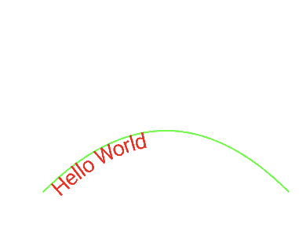
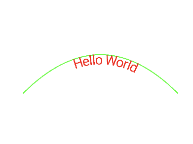

# Writing Text on a Path

Path에 따라 텍스트를 작성하는 방법을 알아보자.

```kotlin
class MainActivity : ComponentActivity() {

    override fun onCreate(savedInstanceState: Bundle?) {
        super.onCreate(savedInstanceState)
        setContent {
            val path = Path().apply {
                moveTo(200f, 800f)
                quadTo(600f, 400f, 1000f, 800f)
            }
            Canvas(modifier = Modifier.fillMaxSize()) {
                drawContext.canvas.nativeCanvas.apply {
                    drawPath(
                        path,
                        Paint().apply {
                            color = GREEN
                            style = Paint.Style.STROKE
                            strokeWidth = 5f
                        }
                    )
                    drawTextOnPath(
                        "Hello World",
                        path,
                        30f,
                        50f,
                        Paint().apply {
                            color = Color.RED
                            textSize = 70f
//                            textAlign = Paint.Align.CENTER
                        }
                    )
                }
            }
        }
    }
}
```

<div align="center">

</div>

`textAlign = Paint.Align.CENTER`로 설정하는 경우 중앙에 위치하게 된다.

<div align="center">

</div>