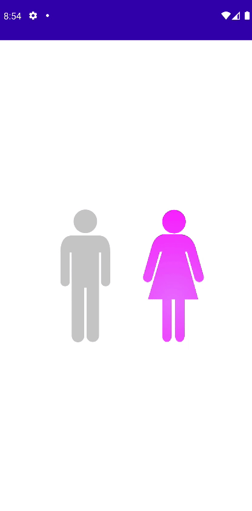

# Making a Gender Picker

지금까지 배운 것들을 이용해 Gender Picker를 만들어보자.

Gender를 선택하기 위한 `Gender` sealed class를 만든다.

```kotlin
sealed class Gender {
    object Male : Gender()
    object Female : Gender()
}
```

`drawable`디렉토리에 [여기서](https://github.com/philipplackner/GenderPicker/tree/master/app/src/main/res/drawable-v24) `ic_man`
과 `ic_woman`를 받아 붙여 넣는다. 그리고 `strings`에 `pathData`를 복사한다.

```xml

<resources>
    <string name="app_name">Compose</string>
    <string name="female_path">M25.67,7.06a7.06,7.06 0,1 0,-7.06 7.05A7.06,7.06 0,0 0,25.67 7.06ZM2,43.19a2.8,2.8 0,0
        0,3.45 -1.92l4.63,-16.22L11.5,25 3,53.59l8.53,0V75.46c0,2.05 1.26,3.72 2.8,3.72h0.06c1.55,0 2.81,-1.67
        2.81,-3.72V53.64h2.09V75.46c0,2.05 1.25,3.72 2.8,3.72h0.06c1.55,0 2.8,-1.67 2.8,-3.72V53.66l8.24,0
        -8,-28.64h1.26l4.63,16.22a2.79,2.79 0,1 0,5.37 -1.53l-4.94,-17.3c-0.81,-2.84 -3.41,-7.73 -9.23,-7.73 -0.42,0
        -6.74,-0.1 -9,-0.1 -5.59,0 -7.45,5.16 -8.21,7.83L0.11,39.74A2.79,2.79 0,0 0,2 43.19Z
    </string>
    <string name="male_path">M22.05,7.08A7.08,7.08 0,1 0,15 14.16,7.08 7.08,0 0,0 22.05,7.08ZM0,25.2V43.25a2.8,2.8 0,0
        0,5.6 0V25.67H6.71l0.06,21.16v29a3.73,3.73 0,0 0,3.73 3.74h0.08a3.73,3.73 0,0 0,3.73
        -3.74v-29h1.33V75.69a3.73,3.73 0,0 0,3.73 3.73h0.08a3.73,3.73 0,0 0,3.73 -3.73v-50h1.17V43.25a2.8,2.8 0,0 0,5.6
        0v-18c0,-2.95 -0.78,-9.64 -6.77,-9.64H6.69C0.77,15.62 0,22.26 0,25.2Z
    </string>
</resources>
```

```kotlin
@Composable
fun GenderPicker(
    modifier: Modifier = Modifier,
    maleGradient: List<Color> = listOf(Color(0xff6d6dff), Color.Blue),
    femaleGradient: List<Color> = listOf(Color(0xffea76ff), Color.Magenta),
    distanceBetweenGenders: Dp = 50.dp,
    pathScaleFactor: Float = 7f,
    onGenderSelected: (Gender) -> Unit
) {
    var selectedGender by remember {
        mutableStateOf<Gender>(Gender.Female)
    }
    var center by remember {
        mutableStateOf(Offset.Unspecified)
    }

    val malePathString = stringResource(id = R.string.male_path)
    val femalePathString = stringResource(id = R.string.female_path)

    val malePath = remember {
        PathParser().parsePathString(malePathString).toPath()
    }
    val femalePath = remember {
        PathParser().parsePathString(femalePathString).toPath()
    }

    val malePathBounds = remember {
        malePath.getBounds()
    }
    val femalePathBounds = remember {
        femalePath.getBounds()
    }

    var maleTranslationOffset by remember {
        mutableStateOf(Offset.Zero)
    }
    var femaleTranslationOffset by remember {
        mutableStateOf(Offset.Zero)
    }

    var currentClickOffset by remember {
        mutableStateOf(Offset.Zero)
    }

    val maleSelectionRadius = animateFloatAsState(
        targetValue = if (selectedGender is Gender.Male) 80f else 0f,
        animationSpec = tween(durationMillis = 500)
    )

    val femaleSelectionRadius = animateFloatAsState(
        targetValue = if (selectedGender is Gender.Female) 80f else 0f,
        animationSpec = tween(durationMillis = 500)
    )

    Canvas(modifier = modifier
        .pointerInput(true) {
            detectTapGestures {
                val transformedMaleRect = Rect(
                    offset = maleTranslationOffset,
                    size = malePathBounds.size * pathScaleFactor
                )
                val transformedFemaleRect = Rect(
                    offset = femaleTranslationOffset,
                    size = femalePathBounds.size * pathScaleFactor
                )
                if (selectedGender !is Gender.Male && transformedMaleRect.contains(it)) {
                    currentClickOffset = it
                    selectedGender = Gender.Male
                    onGenderSelected(Gender.Male)
                } else if (selectedGender !is Gender.Female && transformedFemaleRect.contains(it)) {
                    currentClickOffset = it
                    selectedGender = Gender.Female
                    onGenderSelected(Gender.Female)
                }
            }
        }
    ) {
        center = this.center

        maleTranslationOffset = Offset(
            x = center.x - malePathBounds.width * pathScaleFactor - distanceBetweenGenders.toPx() / 2f,
            y = center.y - pathScaleFactor * malePathBounds.height / 2f
        )
        femaleTranslationOffset = Offset(
            x = center.x + distanceBetweenGenders.toPx() / 2f,
            y = center.y - pathScaleFactor * femalePathBounds.height / 2f
        )

        val untransformedMaleClickOffset = if (currentClickOffset == Offset.Zero) {
            malePathBounds.center
        } else {
            (currentClickOffset - maleTranslationOffset) / pathScaleFactor
        }

        val untransformedFemaleClickOffset = if (currentClickOffset == Offset.Zero) {
            femalePathBounds.center
        } else {
            (currentClickOffset - femaleTranslationOffset) / pathScaleFactor
        }

        translate(
            left = maleTranslationOffset.x,
            top = maleTranslationOffset.y
        ) {
            scale(
                scale = pathScaleFactor,
                pivot = malePathBounds.topLeft
            ) {
                drawPath(
                    path = malePath,
                    color = Color.LightGray
                )
                clipPath(
                    path = malePath
                ) {
                    drawCircle(
                        brush = Brush.radialGradient(
                            colors = maleGradient,
                            center = untransformedMaleClickOffset,
                            radius = maleSelectionRadius.value + 1f
                        ),
                        radius = maleSelectionRadius.value,
                        center = untransformedMaleClickOffset
                    )
                }
            }
        }
        translate(
            left = femaleTranslationOffset.x,
            top = femaleTranslationOffset.y
        ) {
            scale(
                scale = pathScaleFactor,
                pivot = femalePathBounds.topLeft   // center로 둘 수 있지만 scale에 대한 계산이 어렵기 때문에 topLeft로 둔다.
            ) {
                drawPath(
                    path = femalePath,
                    color = Color.LightGray
                )
                clipPath(
                    path = femalePath
                ) {
                    drawCircle(
                        brush = Brush.radialGradient(
                            colors = femaleGradient,
                            center = untransformedFemaleClickOffset,
                            radius = femaleSelectionRadius.value + 1f
                        ),
                        radius = femaleSelectionRadius.value,
                        center = untransformedFemaleClickOffset
                    )
                }
            }
        }
    }
}
```

<div align="center">

</div>
