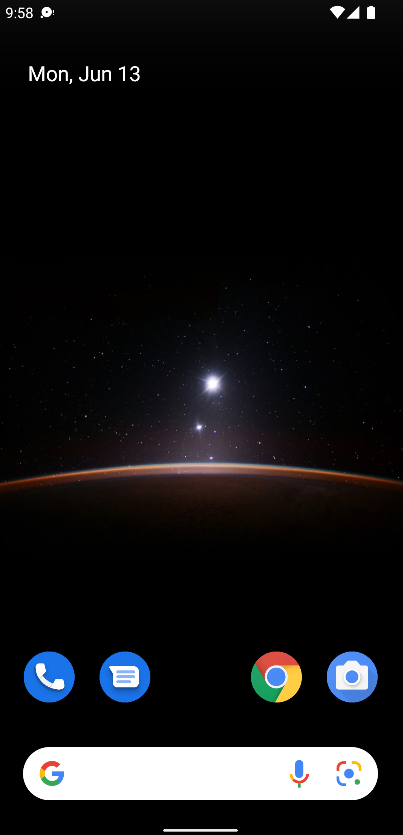
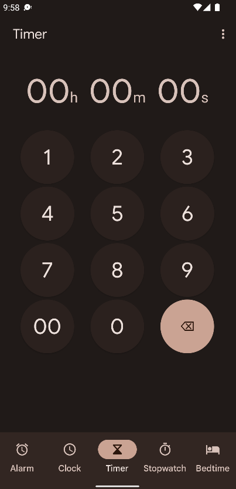
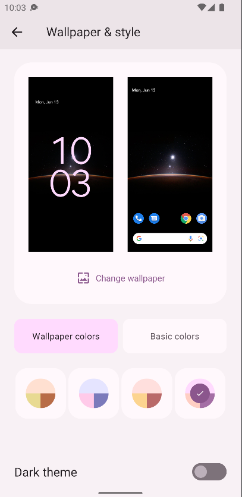
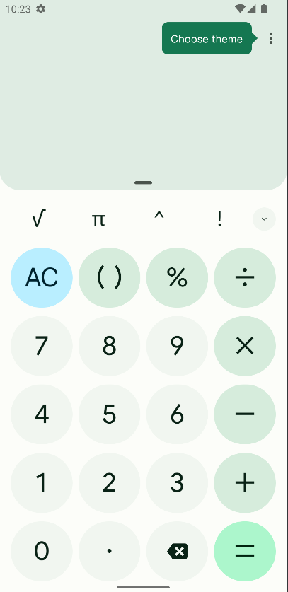
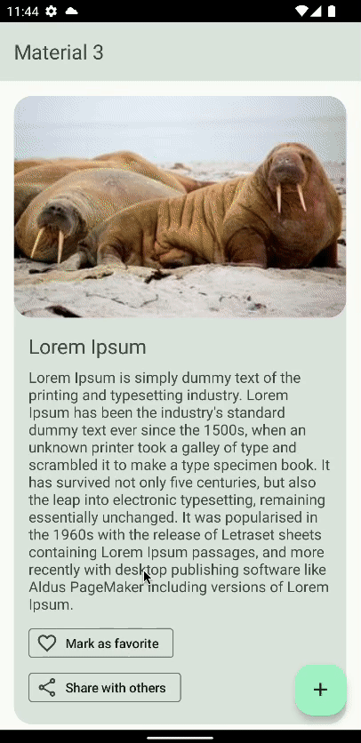

# Introduction to Material 3

Material 3에 대해 알아보자. Material 3는 구글의 새로운 표준이다. 기존에 사용되던 Material 2에 비해 Material 3에 새로운 기능들이 많이 추가되었다.

## Why is Material 3?

구글은 자신들의 앱의 대부분을 Material 3로 변경했고, 최신 안드로이드 버전의 계산기를 보면 확인할 수 있다.

### Color

dynamic colors라는 새로운 기능이 추가되었다. 안드로이드 12기기가 있다면 이에 대해 알 수도 있다. dynamic colors는 기기의 wallpaper에 따라 앱의 색상이 변경된다. 다음 wallpaper와 clock 앱을 확인해보면, 색상이 유사한 것을 알 수 있다.  

<div align="center">


</div>

즉, 안드로이드에서 wallpaper 또는 지정한 색상으로 color theme을 생성하여 앱에 적용한다. 설정에서 Basic colors를 적용해 원하는 색상을 지정할 수도 있다.

<div align="center">

</div>

### [Material 3 Color theming](https://m3.material.io/libraries/mdc-android/color-theming)
#### [key-colors-tones](https://m3.material.io/styles/color/the-color-system/key-colors-tones)

* Primary Key Color
  * 일반적으로 밝은 색상. 앱의 주요 색상. 초록이나 오렌지 등. 액션 버튼 등에 사용됨.
  * OnPrimary
    * Primary 위에서 보여주고 싶은 경우에 사용. 
  * Primary Container
    * Material 3에 새로 등장. Primary보다 밝은 색상.
* Secondary Key Color
  * Primary Key Color와 유사하지만 약간 다른 색상. 좀 더 어둡거나 밝거나 하지만 Primary Key Color보다 덜 눈에띄는 색상.
* Tertiary Key Color
  * 3번째 색상. 선택 사항. 계산기의 `AC` 버튼에 사용됨.
* `=`가 해당 UI에서 주요한 역할을 하므로 Primary Key Color가 사용되며, `AC` 버튼은 값을 삭제하는 역할이기 때문에 눈에 띄어야 하지만 Primary Key Color보다는 덜 띄어야 한다. 이럴 때 Tertiary Key Color를 사용한다.  

<div align="center">

</div>

#### [Color Roles](https://m3.material.io/styles/color/the-color-system/color-roles)

* Inverse Surface
  * 선택 사항이며, 일반적이 Surface에 반대의 색상.
* Neutral varaint
  * Surface와 차이점을 두는 색상.
  * Outline
    * TextField 등의 Outline 색상.


[HTML Color Picker](https://a.atmos.washington.edu/~ovens/javascript/colorpicker.html)를 사용해 색상을 결정할 수 있다. 지정된 색상에 대한 밝기도 확인할 수 있다. 

### Shape

* [Shape](https://m3.material.io/styles/shape/overview)

### Typography

* [Typography](https://m3.material.io/styles/typography/overview)

## How to Build Stunning Material 3 Apps with Jetpack Compose

Material 3를 이용한 샘플 앱을 만들어보자.

### Dependencies

Material 3 관련 디펜던시를 추가한다. 기존 Material 디펜던시는 제거한다.

```groovy
dependencies {
    // ...
    implementation "androidx.compose.material3:material3:1.0.0-alpha12"
    implementation "androidx.compose.material3:material3-window-size-class:1.0.0-alpha12"
    implementation "com.google.accompanist:accompanist-flowlayout:0.24.8-beta" // 공간을 초과하면 multiple rows, columns로 만들어주기 위함
    
    implementation "io.coil-kt:coil:2.0.0"
    implementation "io.coil-kt:coil-compose:2.0.0"
}
```

### Theme

`ui` 패키지 내 `Theme.kt`에서 `Material3AppTheme()`을 다음과 같이 변경한다. API가 31 이상인 경우 Dynamic colors를 적용한다.

```kotlin
// ...
@Composable
fun Material3AppTheme(darkTheme: Boolean = isSystemInDarkTheme(), content: @Composable () -> Unit) {
    val useDynamicColors = Build.VERSION.SDK_INT >= Build.VERSION_CODES.S
    val colors = when {
        useDynamicColors && darkTheme -> dynamicDarkColorScheme(LocalContext.current)
        useDynamicColors && !darkTheme -> dynamicLightColorScheme(LocalContext.current)
        darkTheme -> DarkColorPalette // 나중에 구현
        else -> LightColorPalette
    }

    MaterialTheme(
            colorScheme = colors,
            typography = Typography,
            shapes = Shapes,
            content = content
    )
}
```

`Color.kt`에서 색상을 설정한다.

```kotlin
// Primary
val Green10 = Color(0xff003314)
val Green20 = Color(0xff006627)
val Green30 = Color(0xff00993b)
val Green40 = Color(0xff00cc4e)
val Green80 = Color(0xff99ffc0)
val Green90 = Color(0xffccffe0)

// Secondary
val DarkGreen10 = Color(0xff0d260d)
val DarkGreen20 = Color(0xff194d19)
val DarkGreen30 = Color(0xff267326)
val DarkGreen40 = Color(0xff339933)
val DarkGreen80 = Color(0xffb3e6b3)
val DarkGreen90 = Color(0xffd9f2d9)

// Tertiary
val Violet10 = Color(0xff330033)
val Violet20 = Color(0xff660066)
val Violet30 = Color(0xff990099)
val Violet40 = Color(0xffcc00cc)
val Violet80 = Color(0xffff99ff)
val Violet90 = Color(0xffffccff)

// Error
val Red10 = Color(0xFF410001)
val Red20 = Color(0xFF680003)
val Red30 = Color(0xFF930006)
val Red40 = Color(0xFFBA1B1B)
val Red80 = Color(0xFFFFB4A9)
val Red90 = Color(0xFFFFDAD4)

// Inverse 
val Grey10 = Color(0xFF191C1D)
val Grey20 = Color(0xFF2D3132)
val Grey90 = Color(0xFFE0E3E3)
val Grey95 = Color(0xFFEFF1F1)
val Grey99 = Color(0xFFFBFDFD)

// Neutral
val GreenGrey30 = Color(0xFF316847)
val GreenGrey50 = Color(0xFF52ad76)
val GreenGrey60 = Color(0xFF74be92)
val GreenGrey80 = Color(0xFFbadec8)
val GreenGrey90 = Color(0xFFdcefe4)
```

`Theme.kt` 내 `Color.kt`에서 선언한 색상들을 가이드에 맞게 설정해준다. Dark, Light에 따라 설정할 색상이 약간 다르다.

```kotlin
private val DarkColorPalette = darkColorScheme(
    primary = Green80,
    onPrimary = Green20,
    primaryContainer = Green30,
    onPrimaryContainer = Green90,
    inversePrimary = Green40,
    secondary = DarkGreen80,
    onSecondary = DarkGreen20,
    secondaryContainer = DarkGreen30,
    onSecondaryContainer = DarkGreen90,
    tertiary = Violet80,
    onTertiary = Violet20,
    tertiaryContainer = Violet30,
    onTertiaryContainer = Violet90,
    error = Red80,
    onError = Red20,
    errorContainer = Red30,
    onErrorContainer = Red90,
    background = Grey10,
    onBackground = Grey90,
    surface = GreenGrey30,
    onSurface = GreenGrey80,
    inverseSurface = Grey90,
    inverseOnSurface = Grey10,
    surfaceVariant = GreenGrey30,
    onSurfaceVariant = GreenGrey80,
    outline = GreenGrey80
)

private val LightColorPalette = lightColorScheme(
    primary = Green40,
    onPrimary = Color.White,
    primaryContainer = Green90,
    onPrimaryContainer = Green10,
    inversePrimary = Green80,
    secondary = DarkGreen40,
    onSecondary = Color.White,
    secondaryContainer = DarkGreen90,
    onSecondaryContainer = DarkGreen10,
    tertiary = Violet40,
    onTertiary = Color.White,
    tertiaryContainer = Violet90,
    onTertiaryContainer = Violet10,
    error = Red40,
    onError = Color.White,
    errorContainer = Red90,
    onErrorContainer = Red10,
    background = Grey99,
    onBackground = Grey10,
    surface = GreenGrey90,
    onSurface = GreenGrey30,
    inverseSurface = Grey20,
    inverseOnSurface = Grey95,
    surfaceVariant = GreenGrey90,
    onSurfaceVariant = GreenGrey30,
    outline = GreenGrey50
)
// ...
```

`Shape.kt`과 `Type.kt`를 다음과 같이 수정한다.

```kotlin
val Shapes = Shapes(
    small = RoundedCornerShape(4.dp),
    medium = RoundedCornerShape(4.dp),
    large = RoundedCornerShape(20.dp)
)
```

```kotlin
val Typography = Typography(
    bodyMedium = TextStyle(
        fontFamily = FontFamily.Default,
        fontWeight = FontWeight.Normal,
        fontSize = 16.sp
    )
)
```

`ImageCard` Composable을 다음과 같이 생성 및 작성한다. 

```kotlin

@ExperimentalMaterial3Api
@Composable
fun ImageCard(
        title: String,
        description: String,
        modifier: Modifier = Modifier
) {
    Card(
            modifier = modifier,
            colors = CardDefaults.cardColors(
                    containerColor = MaterialTheme.colorScheme.surfaceVariant,
            ),
            shape = MaterialTheme.shapes.large
    ) {
        Image(
                painter = rememberAsyncImagePainter(
                        model = "https://picsum.photos/seed/${Random.nextInt()}/300/200"
                ),
                contentDescription = null,
                modifier = Modifier
                        .clip(MaterialTheme.shapes.large)
                        .fillMaxWidth()
                        .aspectRatio(3f / 2f)
        )
        Column(
                modifier = Modifier.padding(16.dp)
        ) {
            Text(
                    text = title,
                    style = MaterialTheme.typography.titleLarge
            )
            Spacer(modifier = Modifier.height(8.dp))
            Text(
                    text = description,
                    style = MaterialTheme.typography.bodyMedium
            )
            Spacer(modifier = Modifier.height(8.dp))
            FlowRow(
                    modifier = Modifier.fillMaxWidth(),
                    mainAxisSpacing = 8.dp,
                    mainAxisSize = SizeMode.Wrap
            ) {
                AssistChip(
                        onClick = { },
                        colors = AssistChipDefaults.assistChipColors(
                                leadingIconContentColor = MaterialTheme.colorScheme.onSurfaceVariant
                        ),
                        leadingIcon = {
                            Icon(
                                    imageVector = Icons.Outlined.FavoriteBorder,
                                    contentDescription = null
                            )
                        },
                        label = {
                            Text(text = "Mark as favorite")
                        }
                )
                AssistChip(
                        onClick = { },
                        colors = AssistChipDefaults.assistChipColors(
                                leadingIconContentColor = MaterialTheme.colorScheme.onSurfaceVariant
                        ),
                        leadingIcon = {
                            Icon(
                                    imageVector = Icons.Outlined.Share,
                                    contentDescription = null
                            )
                        },
                        label = {
                            Text(text = "Share with others")
                        }
                )
            }
        }
    }
}
```

마지막으로 `MainActivity`를 다음과 같이 작성한다.

```kotlin
@ExperimentalMaterial3Api
class MainActivity : ComponentActivity() {
    override fun onCreate(savedInstanceState: Bundle?) {
        super.onCreate(savedInstanceState)
        setContent {
            Material3AppTheme {
                Surface(
                    modifier = Modifier.fillMaxSize(),
                    color = MaterialTheme.colorScheme.background
                ) {
                    Scaffold(
                        floatingActionButton = {
                            FloatingActionButton(onClick = { /*TODO*/ }) {
                                Icon(
                                    imageVector = Icons.Default.Add,
                                    contentDescription = null,
                                    tint = MaterialTheme.colorScheme.onPrimaryContainer
                                )
                            }
                        },
                        topBar = {
                            SmallTopAppBar(
                                title = {
                                    Text(text = "Material 3")
                                },
                                colors = TopAppBarDefaults.smallTopAppBarColors(
                                    containerColor = MaterialTheme.colorScheme.surfaceVariant,
                                    titleContentColor = MaterialTheme.colorScheme.onSurfaceVariant
                                )
                            )
                        }
                    ) { values ->
                        LazyColumn(
                            contentPadding = values
                        ) {
                            items(20) {
                                ImageCard(
                                    title = "Lorem Ipsum",
                                    description = "Lorem Ipsum is simply dummy text of the printing and typesetting industry. Lorem Ipsum has been the industry's standard dummy text ever since the 1500s, when an unknown printer took a galley of type and scrambled it to make a type specimen book. It has survived not only five centuries, but also the leap into electronic typesetting, remaining essentially unchanged. It was popularised in the 1960s with the release of Letraset sheets containing Lorem Ipsum passages, and more recently with desktop publishing software like Aldus PageMaker including versions of Lorem Ipsum.",
                                    modifier = Modifier.padding(16.dp)
                                )
                            }
                        }
                    }
                }
            }
        }
    }
}
```

Dynamic colors가 적용된 것을 확인할 수 있다.

<div align="center">

</div>

## Referenecs

* [Introduction to Material 3 (Color Theming, Typography, Shapes)](https://www.youtube.com/watch?v=I3eT32LXAKc)
* [How to Build Stunning Material 3 Apps with Jetpack Compose - Android Studio Tutorial](https://www.youtube.com/watch?v=h7K4n9C2jkI&t=4s)