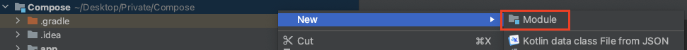
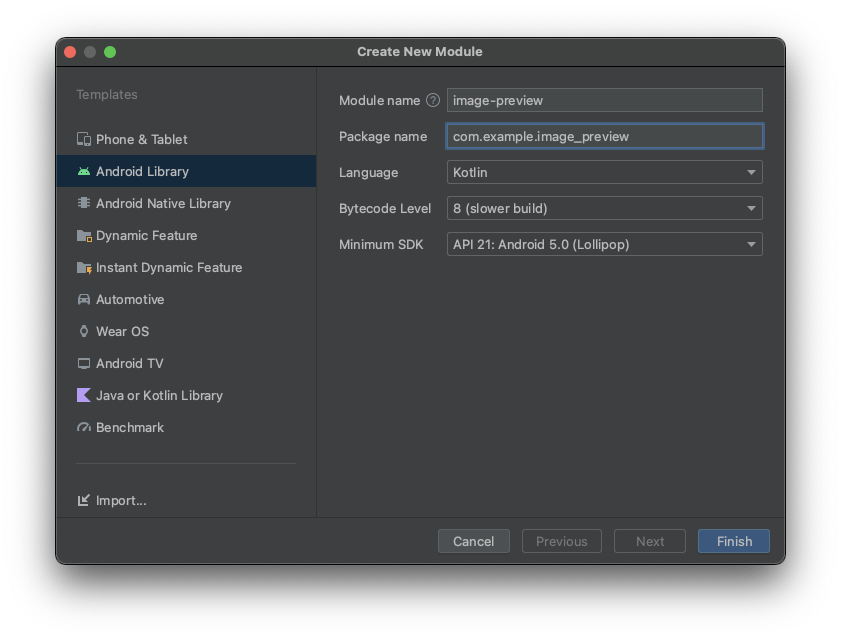
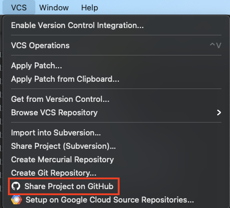
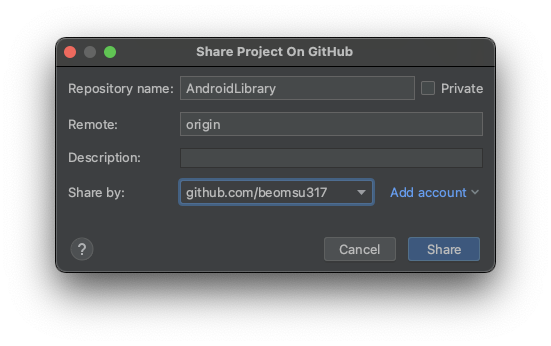
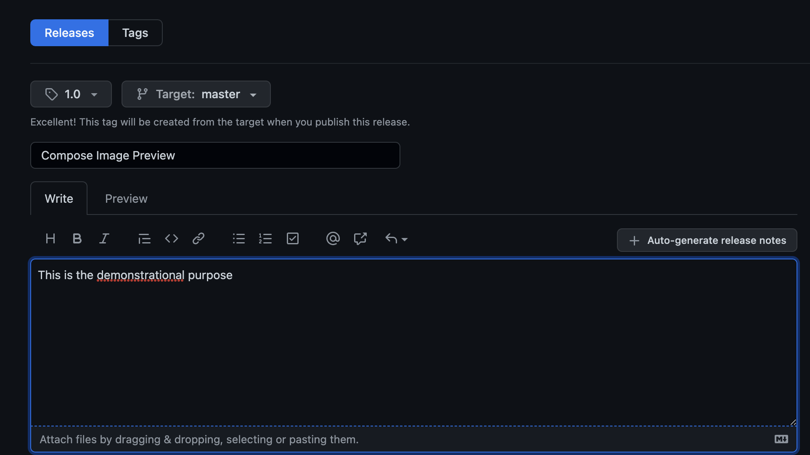
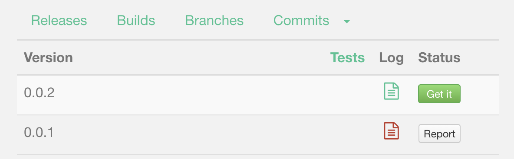
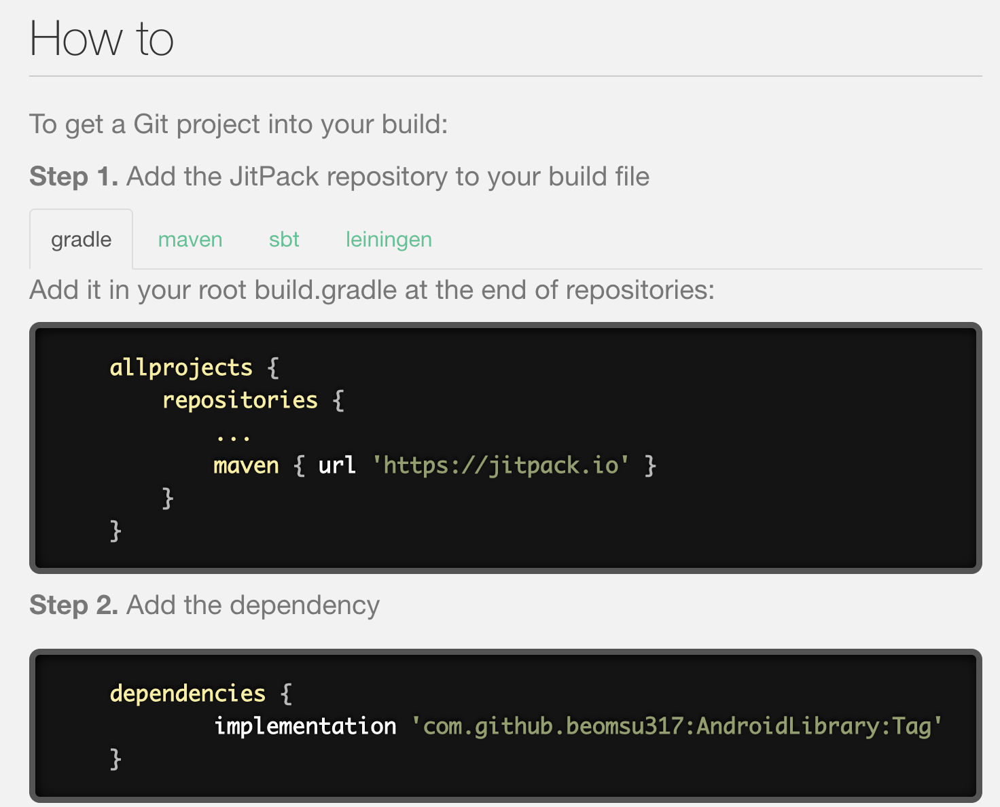

# How to Build & Publish An Android Library

자신의 라이브러리를 빌드하는 방법과 이를 디펜던시를 추가하여 다른 사람들에게 제공하는 방법을 알아보자.

라이브러리에서 제공할 `ImagePreview`를 [여기서](https://github.com/philipplackner/AndroidLibrary/blob/master/image-preview/src/main/java/com/plcoding/image_preview/ImagePreview.kt) 가져오자.

```kotlin
@Composable
fun ImagePreview(
    image: Painter,
    modifier: Modifier = Modifier,
    description: String = "",
    contentDescription: String = "",
    onImageClick: () -> Unit = {}
) {
    Box(
        modifier = modifier
            .aspectRatio(1f)
            .clip(RoundedCornerShape(10.dp))
            .shadow(15.dp, RoundedCornerShape(15.dp))
            .clickable { onImageClick() }
    ) {
        Image(
            painter = image,
            contentDescription = contentDescription,
            contentScale = ContentScale.Crop,
            modifier = Modifier
                .fillMaxSize()
        )
        Text(
            text = description,
            style = MaterialTheme.typography.body1,
            color = Color.White,
            overflow = TextOverflow.Ellipsis,
            maxLines = 1,
            modifier = Modifier
                .fillMaxWidth()
                .background(
                    Brush.verticalGradient(
                        listOf(
                            Color.Transparent,
                            Color.Black
                        )
                    )
                )
                .align(Alignment.BottomStart)
                .padding(8.dp)
        )
    }
}
```

## Build library locally

우선 첫 번째로 할 일은 module을 만들어 라이브러리를 로컬에서 빌드하는 것이다. Project hierarchy로 보면 `app` 모듈이 있는 것을 확인할 수 있다. 이는 모든 모듈들을 사용하여 최종적으로 실행 가능한 앱 모듈이다. 그러나 앱 모듈이 아닌 모듈을 제공하기 위해선 모듈을 `app`에서 분리하여야 한다. 루트 디렉토리를 오른쪽 클릭하고 새로운 Module을 만든다.

<div align="center">

</div>

Android Library는 안드로이드 디펜던시를 포함한다. 만약 안드로이드 디펜던시를 가진 Composable을 빌드한다면 Android Library를 선택해야 한다.

하지만 안드로이드 디펜던시 없이 Java 또는 Kotlin 코드만 포함되는 경우 Java or Kotlin Library를 포함하면 된다.

여기선 Composable을 빌드하므로 Android Library를 선택한다.

<div align="center">

</div>

각 모듈은 자체적인 `build.gradle` 파일을 갖게 된다. 기존에 생성한 `ImagePreview.kt`를 모듈의 루트에 붙여넣고 `build.gradle`을 다음과 같이 수정한다. 모듈에 Compose 디펜던시만 필요하므로 해당 디펜던시만 추가한다.

```groovy
plugins {
    id 'com.android.library'
    id 'org.jetbrains.kotlin.android'
}

android {
    compileSdk 32

    defaultConfig {
        minSdk 21
        targetSdk 32

        testInstrumentationRunner "androidx.test.runner.AndroidJUnitRunner"
        consumerProguardFiles "consumer-rules.pro"
    }

    buildTypes {
        release {
            minifyEnabled false
            proguardFiles getDefaultProguardFile('proguard-android-optimize.txt'), 'proguard-rules.pro'
        }
    }
    kotlinOptions {
        jvmTarget = '1.8'
        useIR = true
    }
    buildFeatures {
        compose true
    }
    composeOptions {
        kotlinCompilerExtensionVersion compose_version
        kotlinCompilerVersion '1.5.21'
    }
    compileOptions {
        sourceCompatibility JavaVersion.VERSION_1_8
        targetCompatibility JavaVersion.VERSION_1_8
    }
}

dependencies {

    implementation "androidx.compose.ui:ui:$compose_version"
    implementation "androidx.compose.material:material:$compose_version"
}
```

이제 모듈에 대한 설정은 끝났으며 로컬 `app` 모듈에서 빌드해보자. `app`의 `build.gradle`에 로컬 모듈인 `image-preview` 모듈을 추가하고 싱크한다. 이제 `app` 모듈에서 `ImagePreview` composable 함수를 사용할 수 있다.

```groovy
dependencies {
    // ...
    implementation project(':image-preview')
}
```

## Publish library to remote repository

이제 레포지토리에 라이브러리를 출시하는 방법을 알아보자. mavenCentral을 이용하는 방법은 검증 과정 등 복잡하므로, jitpack.io에서 라이브러리를 제공하는 방법을 알아보자.

`image-preview` 모듈의 `build.gradle`에 다음과 같이 작성하자.

```groovy
plugins {
    // ...
    id 'maven-publish'
}

// ...

afterEvaluate {
    publishing {
        publications {
            release(MavenPublication) {
                from components.release

                groupId = 'com.github.beomsu317'
                artifactId = 'image-preview'
                version = '0.0.2'
            }
        }
    }
}
```

그리고 Project hierarchy로 변경하여 루트에 `jitpack.yml` 파일을 생성한다. 그리고 다음과 같이 작성한다. 그러면 jitpack은 자동으로 빌드 설정을 수행할 것이다.

```
jdk:
  - openjdk11
before_install:
  - ./scripts/prepareJitpackEnvironment.sh
```

툴바의 VCS 메뉴에 접근해 Shared Project on GitHub을 클릭한다.

<div align="center">

</div>

그리고 다음과 같이 설정한 후 `Share`를 클릭한다. 그리고 모든 파일을 push 한다.

<div align="center">

</div>

그리고 GitHub 레포지토리로 이동하고 Release를 다음과 같이 생성해준다.

<div align="center">

</div>

이제 [JitPack](https://jitpack.io/) 사이트에 접근해 레포지토리 url을 입력하면 다음과 같이 진행된다.

<div align="center">

</div>

`Get it`을 클릭하면 어떻게 디펜던시를 추가해야 하는지 가이드를 알려준다.

<div align="center">

</div>

이제 `app` 모듈에 로컬 모듈이 아닌 리모트 레포지토리와 디펜던시를 추가한다.

```groovy
dependencyResolutionManagement {
    repositoriesMode.set(RepositoriesMode.FAIL_ON_PROJECT_REPOS)
    repositories {
        google()
        mavenCentral()
        maven { url 'https://jitpack.io' }
        jcenter() // Warning: this repository is going to shut down soon
    }
}
```

```groovy
dependencies {
    // ...
    implementation 'com.github.beomsu317:AndroidLibrary:0.0.2'
}
```

`app` 모듈에서 `ImagePreview`를 호출할 수 있는 것을 확인할 수 있다.

```kotlin
class MainActivity : ComponentActivity() {

    override fun onCreate(savedInstanceState: Bundle?) {
        super.onCreate(savedInstanceState)
        setContent {
            Box(
                modifier = Modifier.fillMaxSize()
            ) {
                ImagePreview(image = )
            }
        }
    }
}
```

## References

* [How to Build & Publish An Android Library](https://www.youtube.com/watch?v=EzC-FXeZiIk)