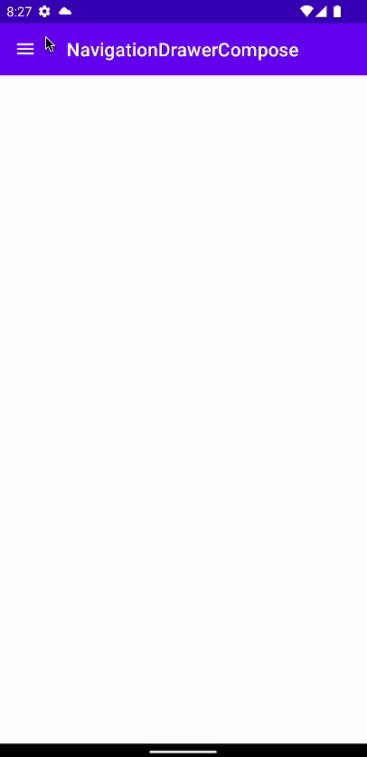

# how-to-create-a-navigation-drawer-in-jetpack-compose

Jetpack Compose를 통해 navigtaion drawer를 구현해본다.

메뉴 아이템을 보여주기 위한 `MenuItem` data class를 구현한다.

```kotlin
data class MenuItem(
        val id: String,
        val title: String,
        val contentDescription: String,
        val icon: ImageVector
)

```

`NavigationDrawer.kt` 파일 생성 후 navigation drawer에 필요한 헤더와 바디를 구현한다.

```kotlin
@Composable
fun DrawerHeader() {
    Box(
        modifier = Modifier
            .fillMaxWidth()
            .padding(vertical = 64.dp),
        contentAlignment = Alignment.Center
    ) {
        Text(
            text = "Header",
            fontSize = 60.sp
        )
    }
}

@Composable
fun DrawerBody(
    items: List<MenuItem>,
    modifier: Modifier = Modifier,
    itemTextStyle: TextStyle = TextStyle(fontSize = 18.sp),
    onItemClick: (MenuItem) -> Unit
) {
    LazyColumn(modifier = modifier) {
        items(items) { item ->
            Row(
                modifier = Modifier
                    .fillMaxWidth()
                    .clickable {
                        onItemClick(item)
                    }
                    .padding(16.dp)
            ) {
                Icon(
                    imageVector = item.icon,
                    contentDescription = item.contentDescription
                )
                Spacer(modifier = Modifier.width(16.dp))
                Text(
                    text = item.title,
                    style = itemTextStyle,
                    modifier = Modifier.weight(1f)
                )
            }
        }
    }
}
```

햄버거 메뉴를 표시하는 `AppBar` Composable을 만들어준다. 

```kotlin
@Composable
fun AppBar(
    onNavigationIconClick: () -> Unit
) {
    TopAppBar(
        title = {
            Text(text = stringResource(id = R.string.app_name))
        },
        backgroundColor = MaterialTheme.colors.primary,
        contentColor = MaterialTheme.colors.onPrimary,
        navigationIcon = {
            IconButton(
                onClick = onNavigationIconClick
            ) {
                Icon(
                    imageVector = Icons.Default.Menu,
                    contentDescription = "Toggle drawer"
                )
            }
        }
    )
}
```

이제 `MainActivity`에 `topBar`와 `drawerContent`가 구현된 `Scaffold`를 구현해준다.

```kotlin
class MainActivity : ComponentActivity() {
    override fun onCreate(savedInstanceState: Bundle?) {
        super.onCreate(savedInstanceState)
        setContent {
            NavigationDrawerComposeTheme {
                val scaffoldState = rememberScaffoldState() // drawerState를 통해 drawer를 open 할 수 있음
                val scope = rememberCoroutineScope()
                // navigation drawer를 구현하기 위해 Scaffold 필요
                // Scaffold는 흔히 사용되는 UI 아이템들이 있는 컨테이너이다.
                Scaffold(
                    scaffoldState = scaffoldState,
                    topBar = {
                        AppBar(
                            onNavigationIconClick = {
                                scope.launch {
                                    scaffoldState.drawerState.open()
                                }
                            }
                        )
                    },
                    drawerContent = {
                        DrawerHeader()
                        DrawerBody(
                            items = listOf(
                                MenuItem(
                                    id = "home",
                                    title = "Home",
                                    contentDescription = "Go to home screen",
                                    icon = Icons.Default.Home
                                ),
                                MenuItem(
                                    id = "settings",
                                    title = "Settings",
                                    contentDescription = "Go to settings screen",
                                    icon = Icons.Default.Settings
                                ),
                                MenuItem(
                                    id = "help",
                                    title = "Help",
                                    contentDescription = "Go to help screen",
                                    icon = Icons.Default.Info
                                ),
                            ),
                            onItemClick = {
                                println("Clicked on ${it.title}")
                            }
                        )
                    }
                ) {

                }
            }
        }
    }
}
```

Jetpack Compose의 Drawer의 경우 왼쪽 edge에서 드래그하지 않고 중간에서 드래그해도 drawer가 나타나게 된다. 이를 원치 않는 경우 `Scaffold`에 `drawerGesturesEnabled = scaffoldState.drawerState.isOpen` 파라미터를 전달해 drawer가 열려있을 때만 동작하게 하도록 할 수 있다.

<div align="center">

</div>
 

## References

* [How to Create a Navigation Drawer With Jetpack Compose - Android Studio Tutorial](https://www.youtube.com/watch?v=JLICaBEiJS0)